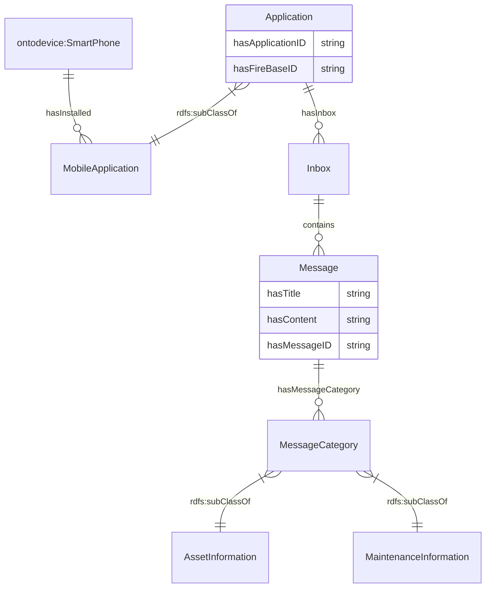

# Ontology for Application
## 1. Introduction
OntoApplication is developed to represent software applications and their services. 

## 2. Data Model
This diagram includes all relationships in this ontology.
