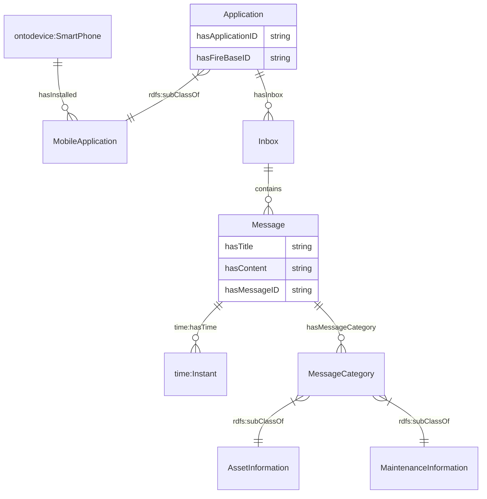

# Ontology for Application
## 1. Introduction
OntoApplication is developed to represent software applications and their services. 

## 2. Legend
| Prefix                                                                                                                  | Namespace                                           |
|---------------------------------------------------------------------------------------------------------------------------|--------------------------------------------------------------|
| [ontodevice](https://github.com/cambridge-cares/TheWorldAvatar/tree/main/JPS_Ontology/ontology/ontodevice) | `https://www.theworldavatar.com/kg/ontodevice/`      |
| [rdfs](https://www.w3.org/TR/rdf12-schema/)                      | `http://www.w3.org/2000/01/rdf-schema#` |
| [time](https://www.w3.org/TR/owl-time/)                      | `http://www.w3.org/2006/time#` |

## 3. Data Model
This diagram includes all relationships in this ontology.

