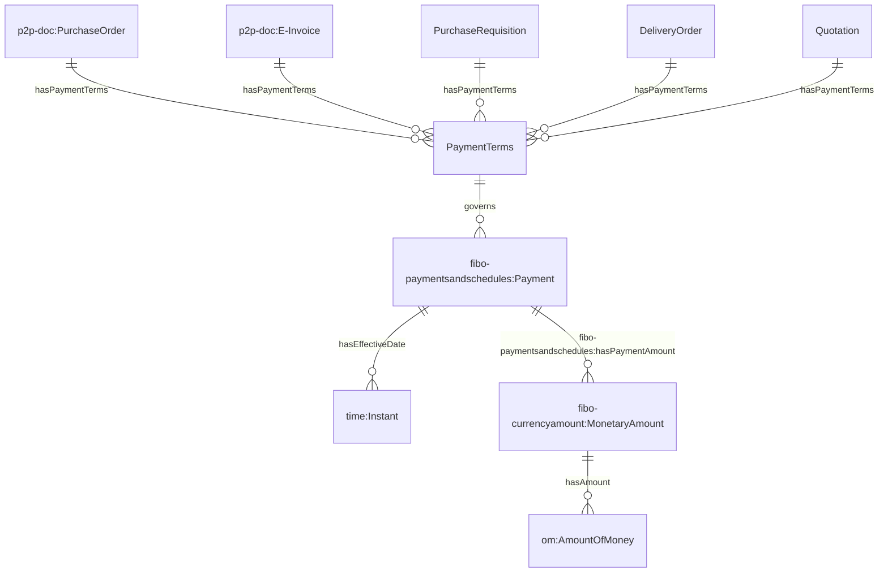

# Ontology for Asset Management
## 1. Introduction
OntoApplication is developed to represent assets and its related information (e.g. purchase documents, location).

## 2. Data Model
The ontology can be divided into these respective domains:

#### 2.1 Document and Document Line

```mermaid
    erDiagram
    "foaf:Document" ||--o{ "time:Instant" : createdOn
    "foaf:Document" ||--o{ "foaf:Document" : references
    "foaf:Document" ||--o{ "Attachment" : hasAttachment
    "foaf:Document" ||--o{ "fibo-parties:PartyInRole" : hasConcernedParty
    "foaf:Document" {
        hasExternalRemarks string
        hasInternalRemarks string
    }
    "fibo-parties:PartyInRole" }|--|| "ApprovingParty" : "rdfs:subClassOf"
    "fibo-parties:PartyInRole" }|--|| "ValidatingParty" : "rdfs:subClassOf"
    "Attachment" {
        availableAt anyURI
    }
    "foaf:Document" }|--|| "p2p-doc:PurchaseOrder" : "rdfs:subClassOf"
    "p2p-doc:PurchaseOrder" {
        purchaseOrderNumber string
    }
    "foaf:Document" }|--|| "p2p-doc:E-Invoice" : "rdfs:subClassOf"
    "foaf:Document" }|--|| "Quotation" : "rdfs:subClassOf"
    "Quotation" {
        quotationNumber string
    }
    "foaf:Document" }|--|| "PurchaseRequisition" : "rdfs:subClassOf"
    "PurchaseRequisition" {
        purchaseRequisitionNumber string
    }
    "foaf:Document" }|--|| "DeliveryOrder" : "rdfs:subClassOf"
    "DeliveryOrder" {
        deliveryOrderNumber string
    }
    "foaf:Document" }|--|| "DataSheet" : "rdfs:subClassOf"
    "p2p-doc:E-Invoice" }|--|| "ProformaInvoice" : "rdfs:subClassOf"
    "p2p-docLine:DocumentLine" }|--|| "p2p-docLine:InvoiceLine" : "rdfs:subClassOf"
    "p2p-docLine:DocumentLine" }|--|| "p2p-docLine:PurchaseOrderLine" : "rdfs:subClassOf"
    "p2p-docLine:DocumentLine" }|--|| "QuotationLine" : "rdfs:subClassOf"
    "p2p-docLine:DocumentLine" }|--|| "PurchaseRequisitionLine" : "rdfs:subClassOf"
    "p2p-docLine:DocumentLine" }|--|| "DeliveryOrderLine" : "rdfs:subClassOf"
    "Quotation" ||--o{ "QuotationLine" : hasQuotationLine
    "p2p-doc:PurchaseOrder" ||--o{ "p2p-docLine:PurchaseOrderLine" : hasPurchaseOrderLine
    "PurchaseRequisition" ||--o{ "PurchaseRequisitionLine" : hasPurchaseRequisitionLine
    "DeliveryOrder" ||--o{ "DeliveryOrderLine" : hasDeliveryOrderLine
    "p2p-doc:E-Invoice" ||--o{ "p2p-docLine:InvoiceLine" : "p2p-invoice:hasInvoiceLine" 
```


#### 2.2 Payment terms


#### 2.3 Delivery details

```mermaid
    erDiagram
    "p2p-doc:PurchaseOrder" ||--o{ "DeliveryDetails" : hasDeliveryDetails
    "p2p-doc:E-Invoice" ||--o{ "DeliveryDetails" : hasDeliveryDetails
    "PurchaseRequisition" ||--o{ "DeliveryDetails" : hasDeliveryDetails
    "DeliveryOrder" ||--o{ "DeliveryDetails" : hasDeliveryDetails
    "Quotation" ||--o{ "DeliveryDetails" : hasDeliveryDetails
    "DeliveryDetails" ||--o{ "time:Instant" : estimatedDateOfDelivery
    "DeliveryDetails" ||--o{ "time:Instant" : actualDateOfDelivery
    "DeliveryDetails" ||--o{ "ImportDuties" : hasImportDuties
    "DeliveryDetails" ||--o{ "DeliveryMethod" : hasDeliveryMethod
    "DeliveryDetails" ||--o{ "fibo-parties:IndependentParty" : hasCourier
    "DeliveryDetails" ||--o{ "icontact:Address" : deliverTo
    "DeliveryDetails" ||--o{ "icontact:Address" : deliverFrom