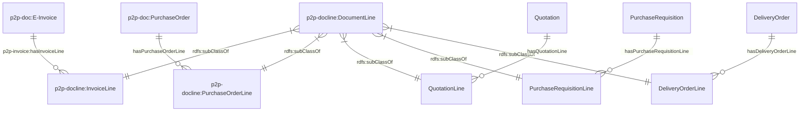
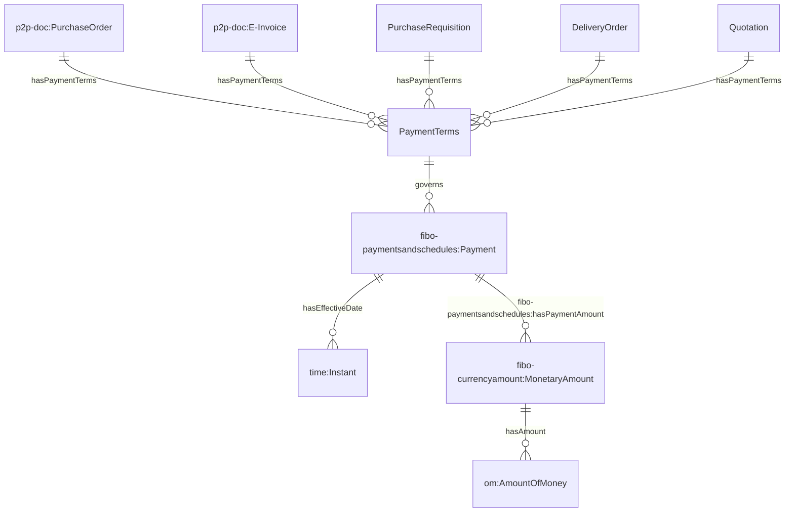
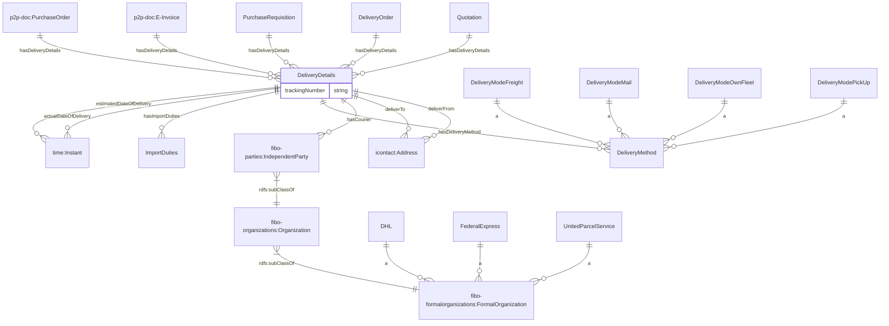
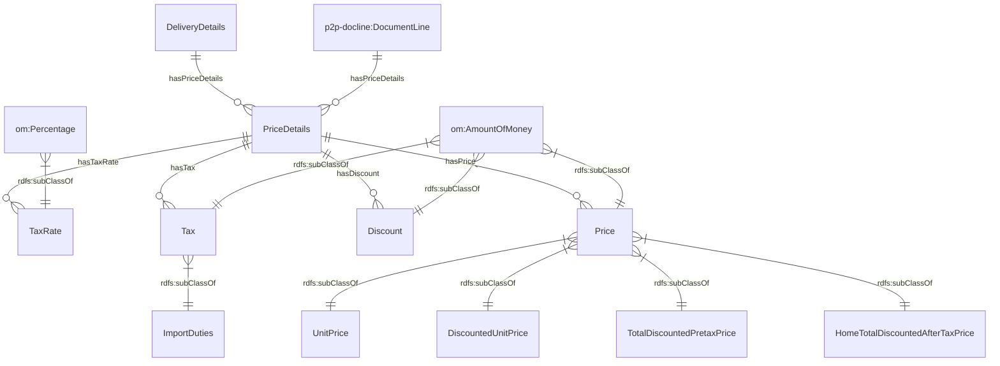
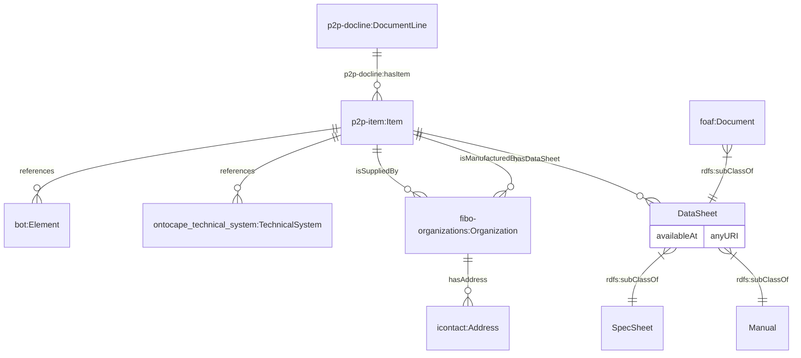
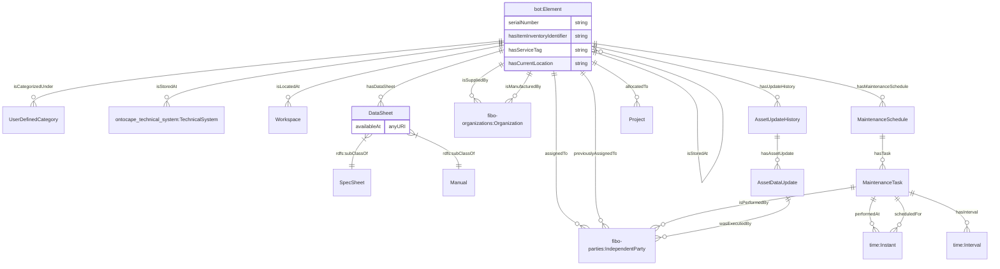
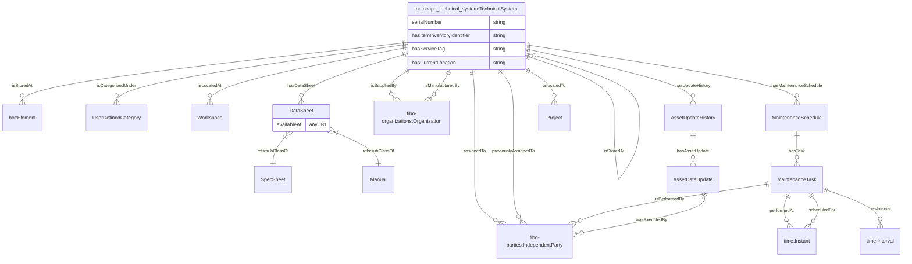
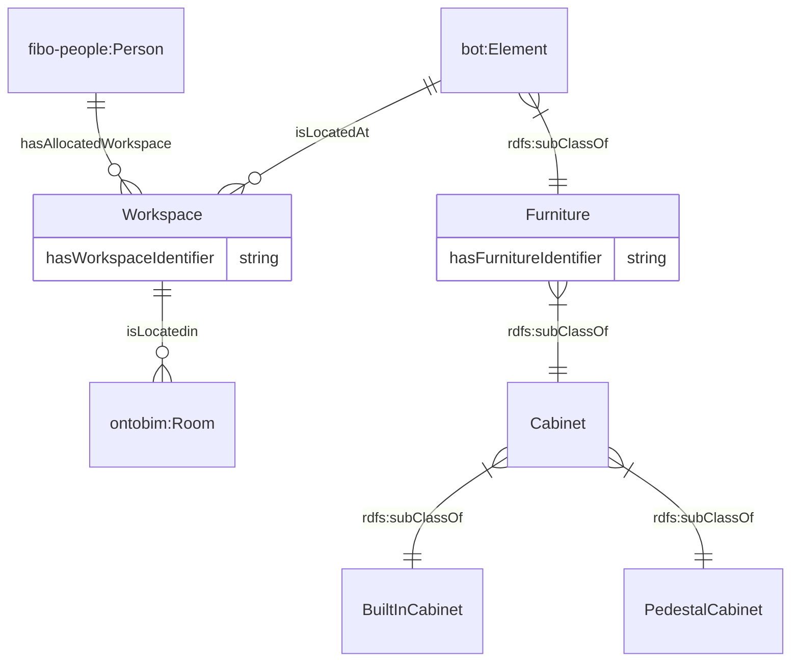
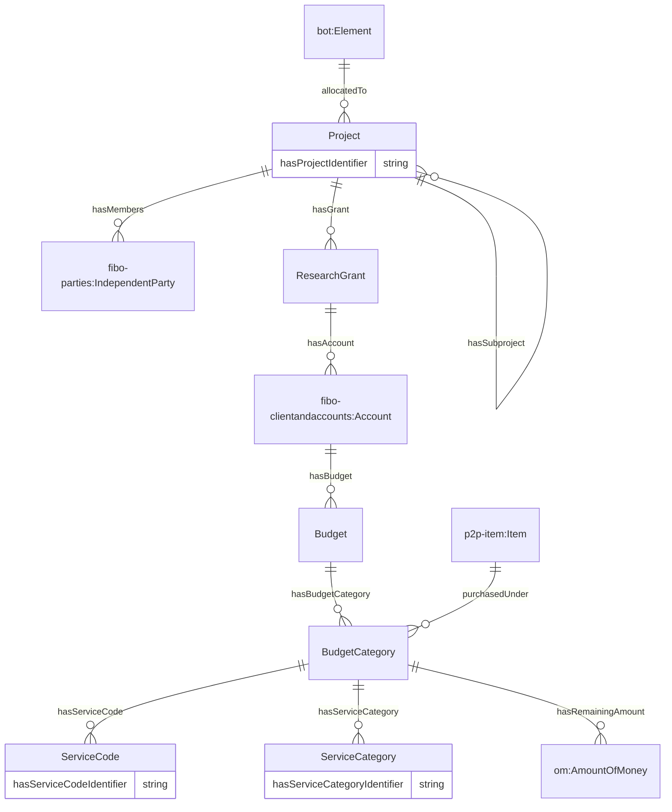

# Ontology for Asset Management
## 1. Introduction
OntoApplication is developed to represent assets and its related information (e.g. purchase documents, location).

## 2. Legend
| Prefix                                                                                                                  | Namespace                                           |
|---------------------------------------------------------------------------------------------------------------------------|--------------------------------------------------------------|
| [foaf](http://xmlns.com/foaf/0.1/) | `http://xmlns.com/foaf/0.1/`     |
| [rdfs](https://www.w3.org/TR/rdf12-schema/)                      | `http://www.w3.org/2000/01/rdf-schema#` |
| [time](https://www.w3.org/TR/owl-time/)                      | `http://www.w3.org/2006/time#` |
| [bot](https://w3c-lbd-cg.github.io/bot/)                      | `https://w3id.org/bot#` |
| [om](https://github.com/HajoRijgersberg/OM)                      | `http://www.ontology-of-units-of-measure.org/resource/om-2/` |
| [icontact](http://ontology.eil.utoronto.ca/icontact.html)                      | `http://ontology.eil.utoronto.ca/icontact.owl#` |
| [fibo-parties](https://spec.edmcouncil.org/fibo/ontology/FND/Parties/Parties/)                      | `https://spec.edmcouncil.org/fibo/ontology/FND/Parties/Parties/` |
| [fibo-clientandaccounts](https://spec.edmcouncil.org/fibo/ontology/FBC/ProductsAndServices/ClientsAndAccounts/)                      | `https://spec.edmcouncil.org/fibo/ontology/FBC/ProductsAndServices/ClientsAndAccounts/` |
| [fibo-paymentsandschedules](https://spec.edmcouncil.org/fibo/ontology/FND/ProductsAndServices/PaymentsAndSchedules/)                      | `https://spec.edmcouncil.org/fibo/ontology/FND/ProductsAndServices/PaymentsAndSchedules/` |
| [fibo-currencyamount](https://spec.edmcouncil.org/fibo/ontology/FND/Accounting/CurrencyAmount/)                      | `https://spec.edmcouncil.org/fibo/ontology/FND/Accounting/CurrencyAmount/` |
| [fibo-organizations](https://spec.edmcouncil.org/fibo/ontology/FND/Organizations/Organizations/)                      | `https://spec.edmcouncil.org/fibo/ontology/FND/Organizations/Organizations/` |
| [fibo-formalorganizations](https://spec.edmcouncil.org/fibo/ontology/FND/Organizations/FormalOrganizations/)                      | `https://spec.edmcouncil.org/fibo/ontology/FND/Organizations/FormalOrganizations/` |
| [fibo-people](https://spec.edmcouncil.org/fibo/ontology/FND/AgentsAndPeople/People/)                      | `https://spec.edmcouncil.org/fibo/ontology/FND/AgentsAndPeople/People/` |
| [p2p-doc](https://purl.org/p2p-o/document)                      | `https://purl.org/p2p-o/document#` |
| [p2p-docline](https://purl.org/p2p-o/documentline)                      | `https://purl.org/p2p-o/documentline#` |
| [p2p-invoice](https://purl.org/p2p-o/invoice)                      | `https://purl.org/p2p-o/invoice#` |
| [p2p-item](https://purl.org/p2p-o/item)                      | `https://purl.org/p2p-o/item#` |
| [ontobim](https://github.com/cambridge-cares/TheWorldAvatar/tree/main/JPS_Ontology/ontology/ontobim)                      | `https://www.theworldavatar.com/kg/ontobim/` |
| [ontocape_technical_system](https://github.com/cambridge-cares/TheWorldAvatar/blob/main/JPS_Ontology/ontology/ontocape/upper_level/technical_system.owl) | `http://www.theworldavatar.com/ontology/ontocape/upper_level/technical_system.owl#`     |

## 3. Data Model
The ontology can be divided into these respective domains:

### 3.1. Purchase Document

### 3.2. Document Line

### 3.3. Payment Terms

### 3.4. Delivery Details

### 3.5. Price Details

### 3.6. Item

### 3.7. Element

### 3.8. Technical System

### 3.9. Furniture and Workspace

### 3.10. Project, Research Grant, Budget and Budget Category
