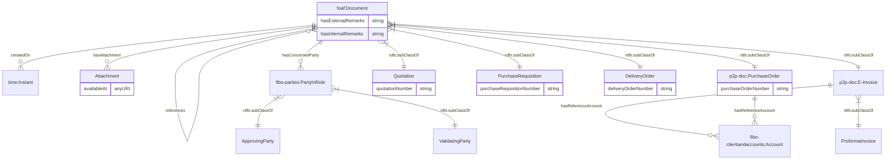
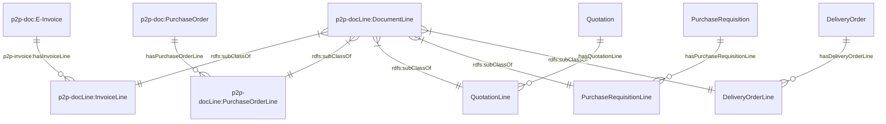
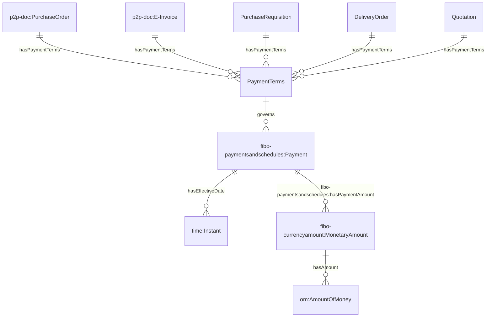
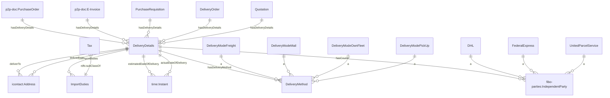
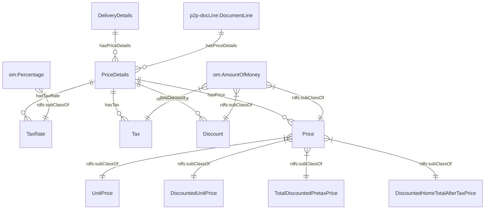
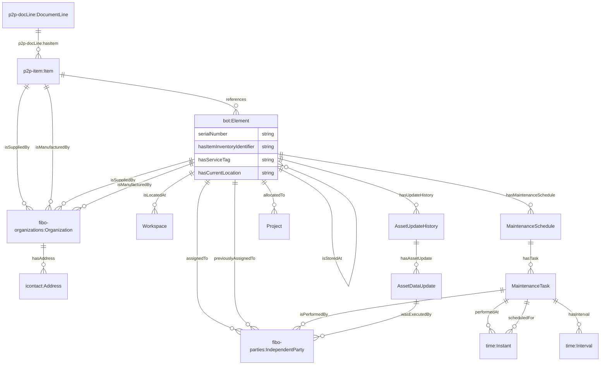
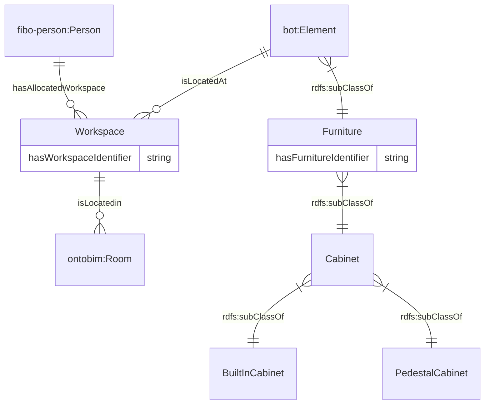
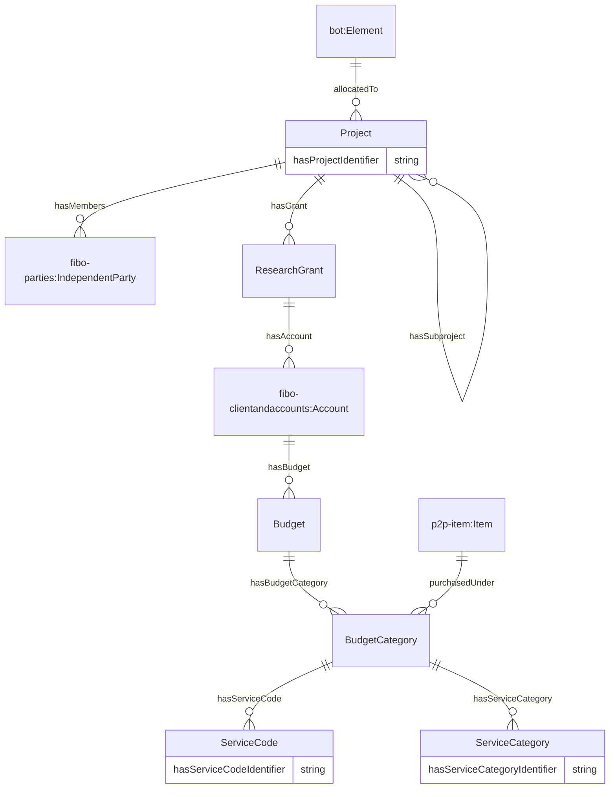

# Ontology for Asset Management
## 1. Introduction
OntoApplication is developed to represent assets and its related information (e.g. purchase documents, location).

## 2. Data Model
The ontology can be divided into these respective domains:

#### 2.1 Purchase Document

#### 2.2 Document Line

#### 2.3 Payment Terms

#### 2.4 Delivery Details

#### 2.5 Price Details

#### 2.6 Item and Element

#### 2.7 Furniture and Workspaces

#### 2.8 Project, Research Grant, Budget and Budget Categories

