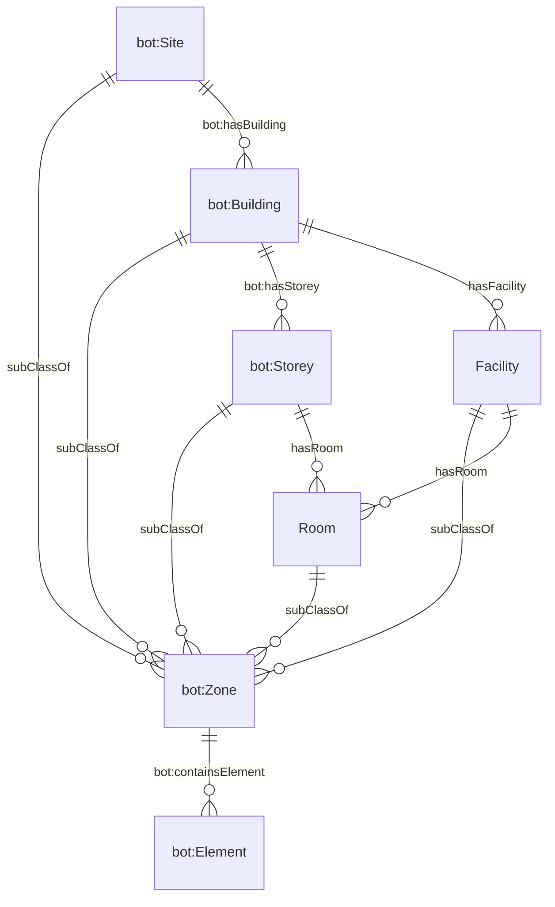
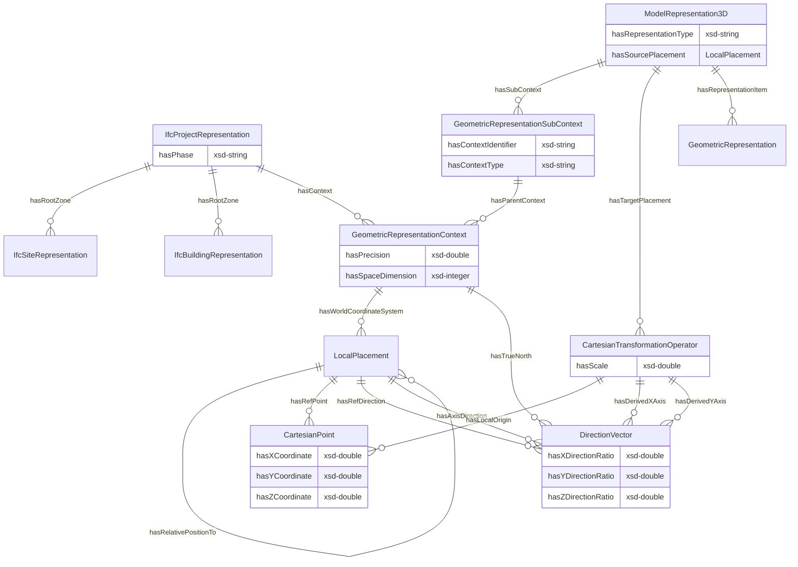
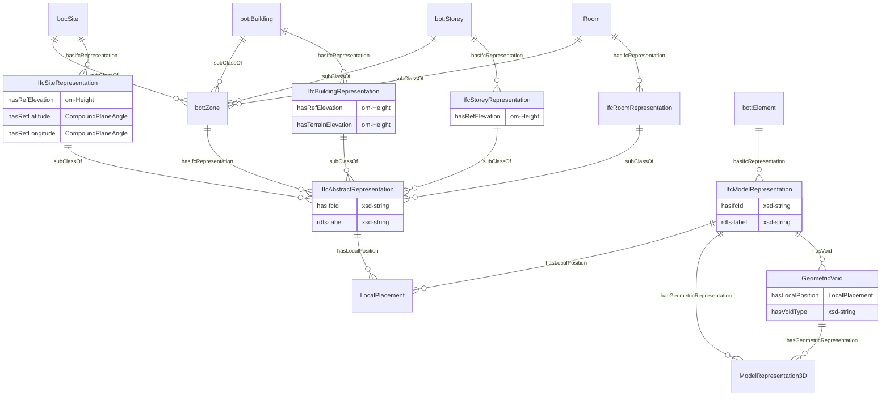
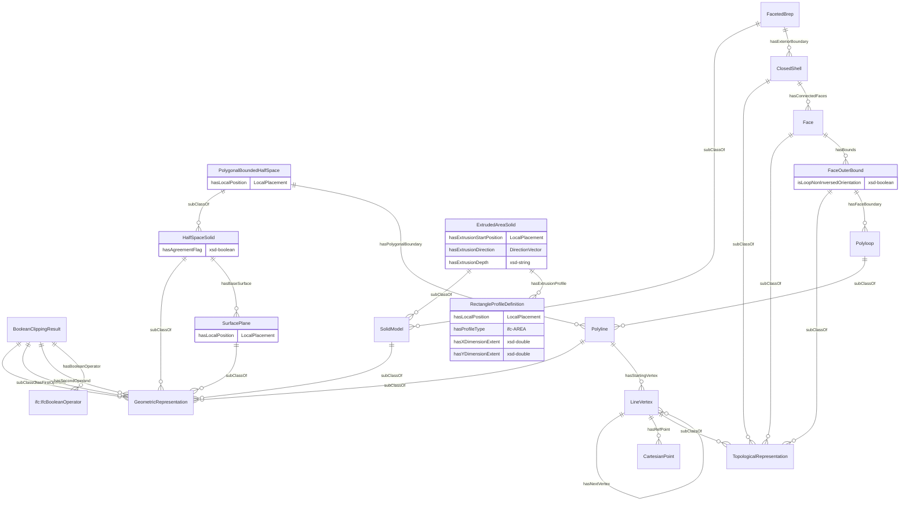

# Building Information Modelling ontology
## 1. Introduction
OntoBIM is an ontology developed to represent the detailed information and topological relationships of buildings and their components (walls, doors, roofs, funiture, equipment) that is available in the Industry Foundation Classes (IFC) data schema. Briefly, IFC is an exchange standard between BIM users and software but more information can be found on their [website](https://technical.buildingsmart.org/standards/ifc/ifc-schema-specifications/). Information about their individual characteristics such as material, readings, and dimensions is combined from IFC or other data sources. The following subsections feature the two categories of semantic representations offered by OntoBIM.

### 1.1 Topological Relationship

This ontology offers a semantic representation of the topological hierarchy at the building level. It establishes connections between individual products and the overarching structure of a building, including rooms, facilities, and storeys. Refer to Figure 1 for a visual depiction of the concepts and relationships that form the basis of this topological hierarchy representation. 

Do note that these `Zone` and `Element` concepts can be linked to other ontologies to leverage the related semantic attributes. For example, both `ontodevice:Device` and `ontobuildingstructure:BuildingStructureComponent` is a subclass of `bot:Element`. Users are then able to detect the topological position of these elements as well as harness the related functional information such as their costs, measurements, and maintenance schedule.

The primary objective of this representation is to empower users to scale and aggregate data at diverse granularities, ranging from product, room, facility, building, and site scales.

*Figure 1. Data model for topological relationships in OntoBIM*

### 1.2 IFC Representation

This ontology also offers a simplified semantic representation of the IFC modelling paradigm to enhance data retrieval speeds. The ontology is designed to be a version-agnostic representation of IFC, but it is still a work-in-progress and non-exhaustive. Generally, an IFC model is stored as a project for each file. This concept of project is defined as the `IfcProject` that set the modelling context for all geometry models and is rooted in either the site or building. Figure 2 depicts this overview for the IFC representation. Effectively, an object could have a `ModelRepresentation3D` that is defined within the context of the entire project. This context is required to position the object in relation to the room, storey, building, or site.

*Figure 2. Data model for an overview of IFC representation*

The IFC modelling paradigm and parameters has developed its unique syntax for the BIM domain. However, there are also other geometry representations available in different formats such as CityGML and GLB. Although these geometry representation differs, their functional attributes such as utility consumption and costs do not. Accordingly, we should intentionally separate the semantic and geometric representations to allow the retrieval of functional information even in the absence of geometry models. Figure 3 visually outlines this separation of concerns and highlights the attributes assigned to these IFC representation concepts. 

*Figure 3. Data model for connecting functional representation to their IFC representation*

The IFC schema has its own syntax and concepts to achieve its 3D modelling paradigm. At the moment, OntoBIM has yet to fully represent all the available types but the commonly used geometries have been represented. Figure 4 illustrates the available geometry representation concepts in OntoBIM.

*Figure 4. Data model for IFC geometric representation*
