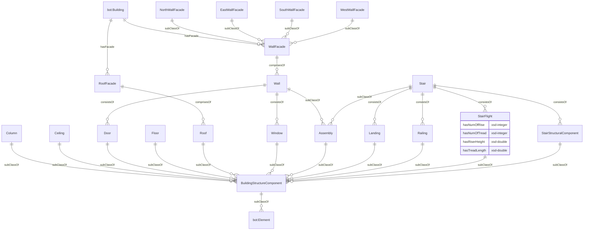
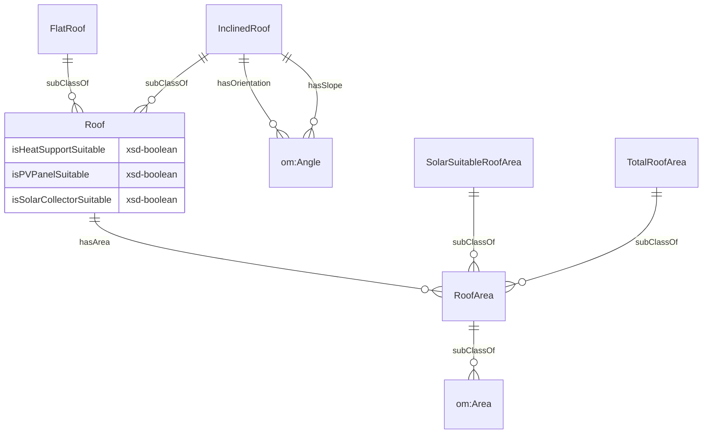

# Building Structure ontology
## 1. Introduction
OntoBuildingStructure is an ontology developed to represent the building structural components (walls, doors, slabs, roofs, stairs) and their individual characteristics such as dimensions and qualities. 

The namespace for this ontology is:

<i>https://www.theworldavatar.com/kg/ontobuildingstructure/</i>

## 2. Modelling Decisions
Figure 1 depicts an overview of the building structural components currently available. Generally, these components are subclasses of the core concept, `BuildingStructureComponent`, directly linked to [OntoBIM](https://github.com/cambridge-cares/TheWorldAvatar/tree/main/JPS_Ontology/ontology/ontobim) as a subclass of `bot:Element`. 

A notable concept is `Assembly`, where the assembly component may consists of subcomponents. For example, a wall could include a door and a window, or none of these. Considering that the assembly component may or may not have all its subcomponents available, users are given flexibility to create an accurate representation.

Additionally, there are concepts of roof and wall facades directly linked to the building instance. These prove valuable in representing less granular building models, such as in CityGML, which doesn't separate wall geometry into individual instances. Accordingly, these facades serve as a representation that can be assigned attributes for any applications.

*Figure 1. Data model for overview of building structural components in OntoBuildingStructure*

Each of the structural components represented in Figure 1 can be extended to incorporate their respective attributes. Figure 2 provides an example specifically focusing on the roof. 

*Figure 2. Data model for attributes associated with the roof*
