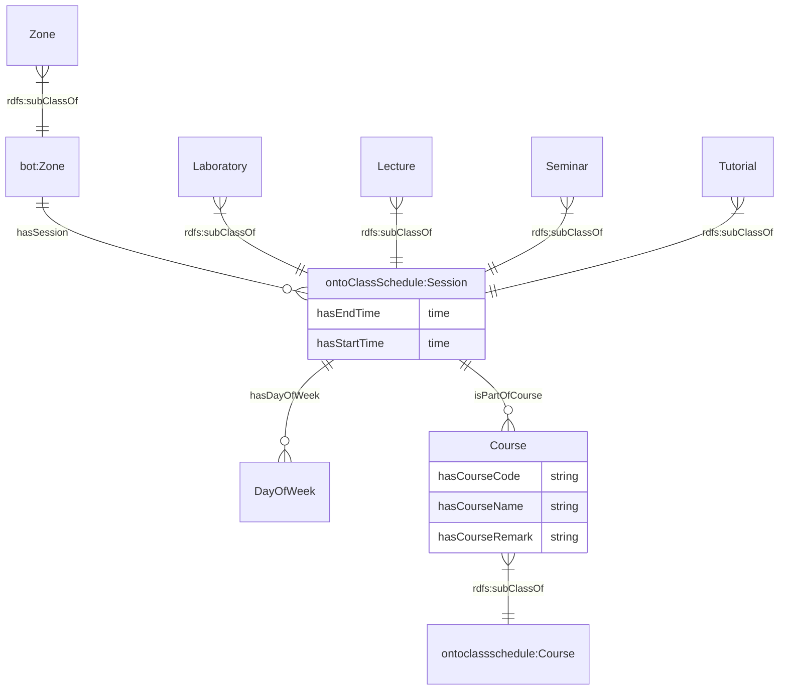

# Ontology for Class Schedule
## 1. Introduction
OntoClassSchedule is designed to represent and manage class schedules in an educational setting. It captures the relationships between sessions, courses, and various types of course offerings.
**bot: <**[**https://w3id.org/bot#>**](https://w3id.org/bot#%3E) **(Building Topology Ontology)**

**ontobim: <**[**https://www.theworldavatar.com/kg/ontobim#>**](https://www.theworldavatar.com/kg/ontobim#%3E)

**ontoTimeseries: <**[**https://www.theworldavatar.com/kg/ontotimeseries/>**](https://www.theworldavatar.com/kg/ontotimeseries/%3E)

**ontoClassSchedule: <**[**http://www.theworldavatar.com/ontology/ontoClassSchedule.owl>**](http://www.theworldavatar.com/ontology/ontoClassSchedule.owl%3E)

**time: <**[**http://www.w3.org/2006/time#>**](http://www.w3.org/2006/time#>)

## 2. Legend
| Prefix                                                                                                                  | Namespace                                           |
|---------------------------------------------------------------------------------------------------------------------------|--------------------------------------------------------------|
| [bot](https://w3id.org/bot#) | `https://w3id.org/bot#`     |
| [ontobim](https://www.theworldavatar.com/kg/ontobim#)                      | `https://www.theworldavatar.com/kg/ontobim#` |
| [ontoTimeseries](https://www.theworldavatar.com/kg/ontotimeseries/)                      | `https://www.theworldavatar.com/kg/ontotimeseries/` |
| [ontoClassSchedule](http://www.theworldavatar.com/ontology/ontoClassSchedule.owl)                      | `http://www.theworldavatar.com/ontology/ontoClassSchedule.owl` | |

## 3. Data Model
The ontology can be divided into these respective domains:
