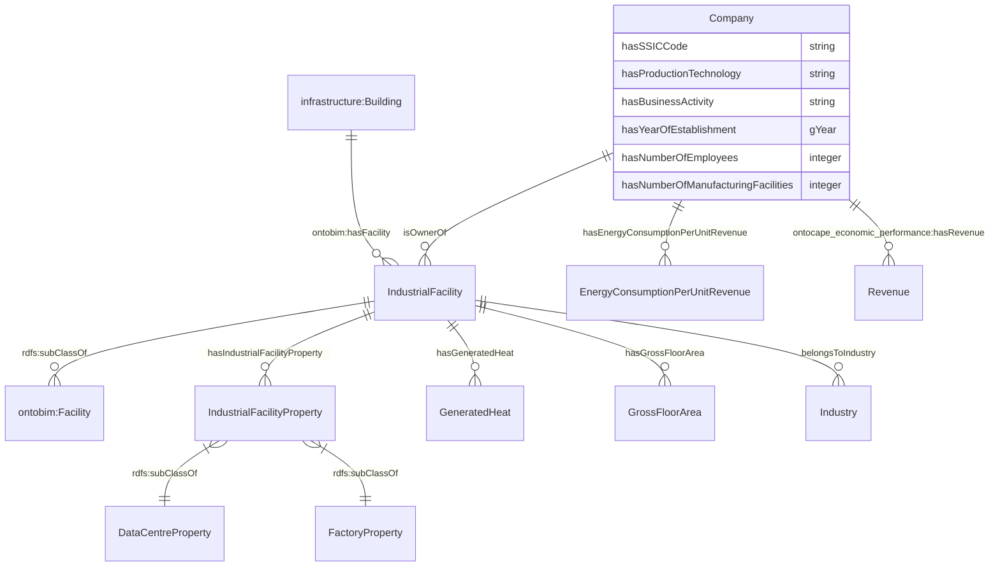
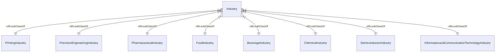
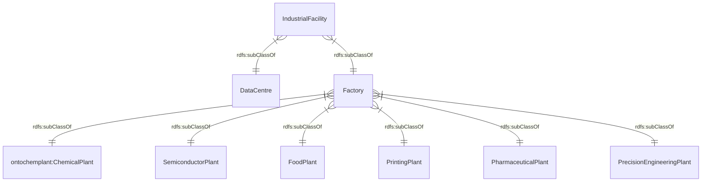
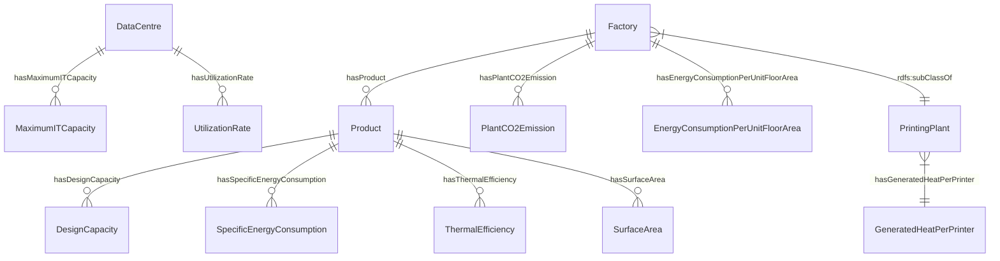
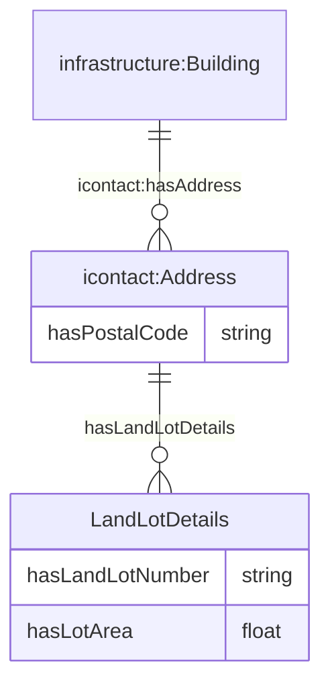

# Ontology for Companies and Industrial Facilities
## 1. Introduction
The OntoCompany ontology has been developed to describe the properties of companies and the operations of the industrial facilities they own. It contains several classes and relations specifically included for the purpose of calculating the waste heat emissions of the industrial facilities.

## 2. Legend
| Prefix                                                                                                                  | Namespace                                           |
|---------------------------------------------------------------------------------------------------------------------------|--------------------------------------------------------------|
| [ontobim](https://github.com/cambridge-cares/TheWorldAvatar/tree/main/JPS_Ontology/ontology/ontobim)                      | `https://www.theworldavatar.com/kg/ontobim/` |
| [ontocape_technical_system](https://github.com/cambridge-cares/TheWorldAvatar/blob/main/JPS_Ontology/ontology/ontocape/upper_level/technical_system.owl) | `http://www.theworldavatar.com/ontology/ontocape/upper_level/technical_system.owl#`     |
| [rdfs](https://www.w3.org/TR/rdf12-schema/)                      | `http://www.w3.org/2000/01/rdf-schema#` |
| [om](https://github.com/HajoRijgersberg/OM)                      | `http://www.ontology-of-units-of-measure.org/resource/om-2/` |
| [icontact](http://ontology.eil.utoronto.ca/icontact.html)                      | `http://ontology.eil.utoronto.ca/icontact.owl#` |
| [ontochemplant](https://github.com/cambridge-cares/TheWorldAvatar/tree/main/JPS_Ontology/ontology/ontochemplant)                      | `https://www.theworldavatar.com/kg/ontochemplant/` |
| [infrastructure](https://innoweb.mondragon.edu/ontologies/oema/infrastructure/1.1/index-en.html) | `http://www.purl.org/oema/infrastructure/` |
| [ontocape_economic_performance](https://github.com/cambridge-cares/TheWorldAvatar/blob/main/JPS_Ontology/ontology/ontocape/chemical_process_system/CPS_performance/economic_performance.owl) | `http://www.theworldavatar.com/kg/ontocape/chemicalprocesssystem/cpsperformance/economicperformance/hasRevenue` | 

## 3. Data Model
The ontology can be divided into these respective domains:

### 3.1. Top-level Classes

### 3.2. Subclasses of Industry

### 3.3. Subclasses of IndustrialFacility

### 3.4. Properties of Industrial Facilities

### 3.5. Address details

## Why was the OntoCompany.owl file produced by the TBox Generator edited ##

The generated OWL file was edited to describe the fact that a chemical plant belongs to the chemical industry, a beverage plant belongs to the beverage industry, a food plant belongs to the food industry, and so on. Suppose we put the union of the classes Chemical Plant, Beverage Plant and Food Plant in the domain and the union of the classes Chemical Industry, Beverage Industry and Food Industry in the range of the object property belongs to. In that case, it can be interpreted that a chemical plant belongs to the chemical, beverage, or food industries (or all these industry classes). In order to stop this interpretation, we added the belongs to property in the definition of each plant class.
