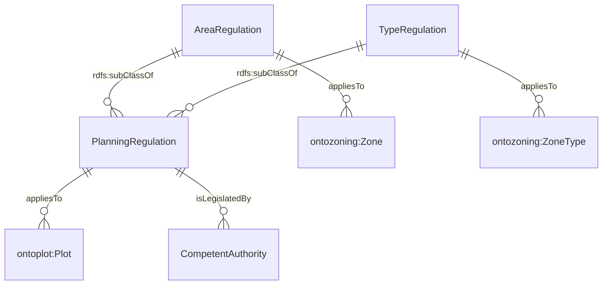

# Ontology for Planning Regulations
## 1. Introduction
OntoPlanningRegulations is an ontology developed to describe the regulations imposed for urban planning purposes. A simple overview of the data model is illustrated in Figure 1. There are three types of regulations - standard planning regulations, area and type regulations. **Area regulations** are specific regulations that takes precedence within a specific zone to address unique localised requirements or designs. **Type regulations** are guidelines for different zone types that should be followed if standard regulations are not available for specific plots. Specific regulations can be found within the ontology.

*Figure 1. Data model for OntoPlanningRegulation*

## 2. Legend
Prefix | Namespace
--- | ---
[OntoPlot](https://github.com/cambridge-cares/TheWorldAvatar/tree/main/JPS_Ontology/ontology/ontoplot) | `https://www.theworldavatar.com/kg/ontoplot/`
[OntoPlanningRegulation](https://github.com/cambridge-cares/TheWorldAvatar/tree/main/JPS_Ontology/ontology/ontoplanningregulation) | `https://www.theworldavatar.com/kg/ontoplanningregulation/`
[OntoZoning](https://github.com/cambridge-cares/TheWorldAvatar/tree/main/JPS_Ontology/ontology/ontozoning) | `https://www.theworldavatar.com/kg/ontozoning/`

## 2. Modelling Decisions
>PlanningRegulation

- Planning regulations are typically, enforced on all land plots. The introduction of this concept allows regulations such as Site Coverage, Gross Plot Ratio, and setbacks to be tailored to each plot's unique requirements.
- However, planners have the flexibility to prioritise specific regulations in designated zones or for different zone uses to address their localised needs. In such scenarios, the `AreaRegulation` and `TypeRegulation` concepts offer a structured way to encompass and manage these regulations.

>CompetentAuthority

- As planning regulations differ in various cities, a generalisable concept of a competent authority is included. These allows the planning regulations instantiated in an ABox to be linked to their specific context in which their competent authority operates. For example, a competent authority instance can be created for URA, with a name and description.