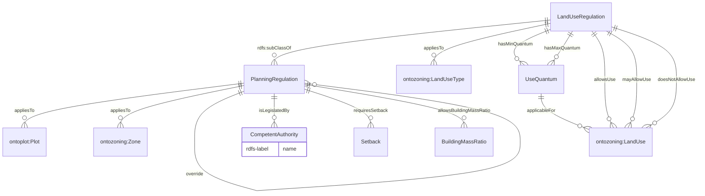
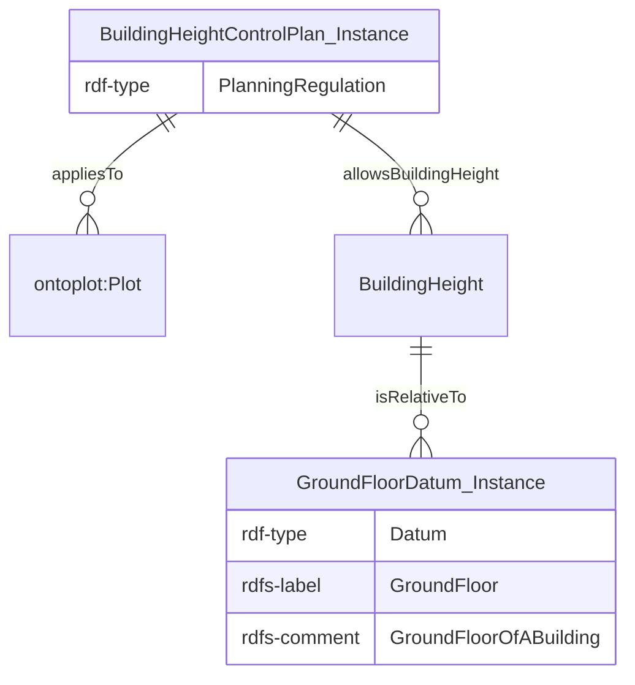

# Ontology for Planning Regulations
## 1. Introduction
OntoPlanningRegulation is an ontology developed to describe the regulations imposed for urban planning purposes. A simple overview of the data model is illustrated in Figure 1. There are two types of regulations - standard planning regulations and land use regulations. **Land use regulations** are general guidelines for plots based on their land use type, but are more concerned with the allowable land uses in these plots. Specific regulations can be found within the ontology.

The namespace for this ontology is:

<i>https://www.theworldavatar.com/kg/ontoplanningregulation/</i>

*Figure 1. Data model for OntoPlanningRegulation*

## 2. Legend
Prefix | Namespace
--- | ---
[ontoplot](https://github.com/cambridge-cares/TheWorldAvatar/tree/main/JPS_Ontology/ontology/ontoplot) | `https://www.theworldavatar.com/kg/ontoplot/`
[ontozoning](https://github.com/cambridge-cares/TheWorldAvatar/tree/main/JPS_Ontology/ontology/ontozoning) | `https://www.theworldavatar.com/kg/ontozoning/`

## 2. Modelling Decisions
>PlanningRegulation

- Planning regulations are typically enforced on all land plots. The introduction of this concept allows regulations such as Site Coverage, Gross Plot Ratio, and setbacks to be tailored to each plot's unique requirements.
- However, planners have the flexibility to prioritise specific regulations in designated zones or for various land uses to address their localised needs. In such scenarios, the `override` property is at their disposal to signify which regulations take precedence over others, providing the flexibility to adjust the priority representation in accordance with local planning policies.
- The `LandUseRegulation` concept is available to depict the regulations governing permissible land uses and their corresponding use quantums within a given plot.
- All definitions of the regulated attributes are available in the ontology. This non-exhaustive list of planning regulations includes:
    - AbsoluteHeight
    - BuildingHeight
    - BuildingMassRatio
    - FloorToFloorHeight 
    - GrossPlotRatio
    - Setback
    - SiteCoverage

>CompetentAuthority

- As planning regulations differ in various cities, a generalisable concept of a competent authority is included. These allows the planning regulations instantiated in an ABox to be linked to their specific context in which their competent authority operates. For example, a competent authority instance can be created for URA, with a name and description.

>GrossPlotRatio

- Gross Plot Ratio serves as a planning parameter, imposing a limit on the maximum allowable Gross Floor Area in relation to the plot area.
- However, its relevance is primarily confined to plots designated for infrastructure development. It may not be universally applicable to all land use types.
- Plot ratios may not be mandated on some plots designated for infrastructure development. This can be attributed to various factors, such as the absence of a well-defined long-term vision for the neighborhood character and design. Generally, these plots are subjected to a case-by-case detailed evaluation, a status that can be indicated by utilising the `isAwaitingDetailedGPREvaluation` property.

>Datum

- Datum is a reference point or baseline used as a starting point for measurements or calculations.
- This concept has been adopted for the building height restrictions as each city have localised restrictions that have different reference points. A sample ABox usage is illustrated in Figure 2.

*Figure 2. Snippet of datum and building height ABox*
