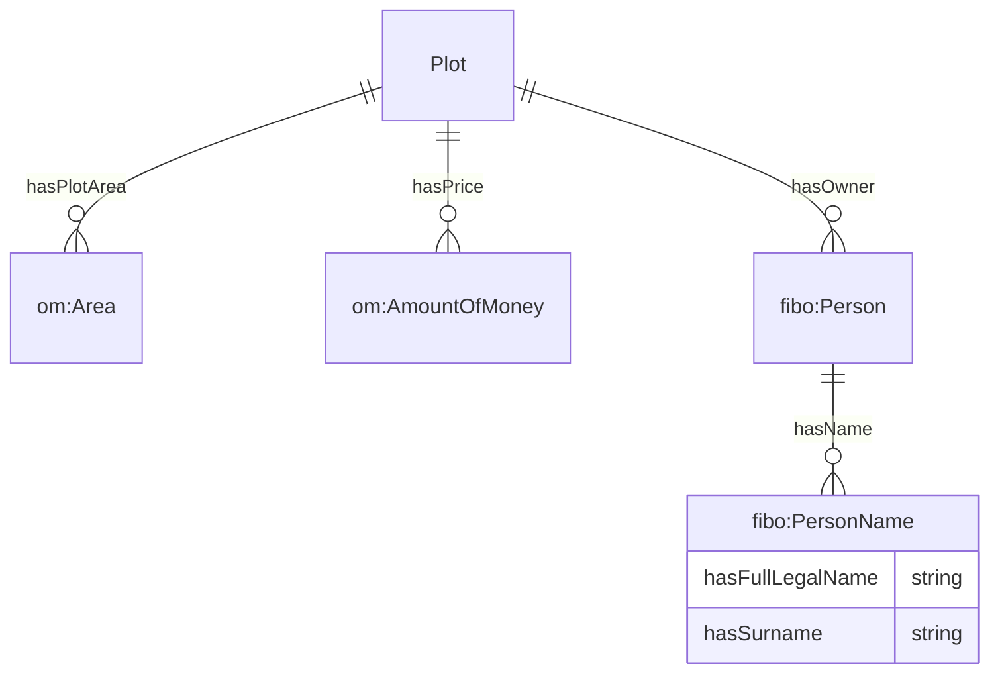

# Ontology for Plots
## 1. Introduction
OntoPlot is an ontology developed to describe the attributes of land plots and their buildable spaces.  A simple overview of the key attributes of the plot data model is illustrated in Figure 1. 

*Figure 1. Data model of plot attributes in OntoPlot*

## 2. Legend
Prefix | Namespace
--- | ---
[OntoPlot](https://github.com/cambridge-cares/TheWorldAvatar/tree/main/JPS_Ontology/ontology/ontoplot) | `https://www.theworldavatar.com/kg/ontoplot/`
[OntoPlanningRegulation](https://github.com/cambridge-cares/TheWorldAvatar/tree/main/JPS_Ontology/ontology/ontoplanningregulation) | `https://www.theworldavatar.com/kg/ontoplanningregulation/`
[OntoZoning](https://github.com/cambridge-cares/TheWorldAvatar/tree/main/JPS_Ontology/ontology/ontozoning) | `https://www.theworldavatar.com/kg/ontozoning/`
[om](https://github.com/HajoRijgersberg/OM) | `http://www.ontology-of-units-of-measure.org/resource/om-2/`
[fibo](https://spec.edmcouncil.org/fibo/ontology/FND/AgentsAndPeople/People/Person) | `https://spec.edmcouncil.org/fibo/ontology/FND/AgentsAndPeople/People/`

## 2. Modelling Decisions
>Plot

- Plot are parcels of land delineated with a physical boundary to denote land ownership rights.

>BuildableSpace

- Buildable Space is the maximum allowable space on a plot that can be built up according to applicable planning regulations. 
- Currently this concept only covers regulations governing built form at LOD1, as regulations governing configurational building design require computational design generation to evaluate and is out of the scope.
