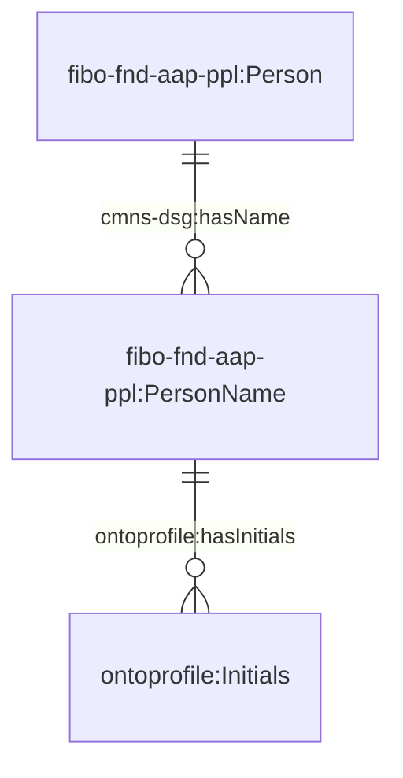
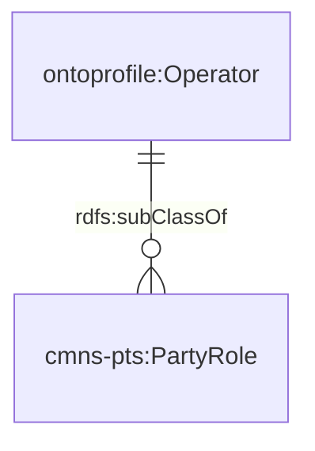

# Ontology for the Profiles of Organizations and People
## Introduction
OntoProfile is an ontology that extends [Financial Industry Business Ontology (FIBO)](https://spec.edmcouncil.org/fibo/) and focuses on concepts regarding organizations, people and the roles they play.

## Legend
| Prefix                                                                                                                  | Namespace                                           |
|---------------------------------------------------------------------------------------------------------------------------|--------------------------------------------------------------|
| cmns-col | `https://www.omg.org/spec/Commons/Collections/`     |
| cmns-dt | `https://www.omg.org/spec/Commons/DatesAndTimes/`     |
| cmns-dsg | `https://www.omg.org/spec/Commons/Designators/`     |
| cmns-pts | `https://www.omg.org/spec/Commons/PartiesAndSituations/`     |
| cmns-rlcmp | `https://www.omg.org/spec/Commons/RolesAndCompositions/`     |
| fibo-fnd-agr-ctr | `https://spec.edmcouncil.org/fibo/ontology/FND/Agreements/Contracts/`     |
| fibo-fnd-arr-rep | `https://spec.edmcouncil.org/fibo/ontology/FND/Arrangements/Reporting/`     |
| fibo-fnd-aap-ppl | `https://spec.edmcouncil.org/fibo/ontology/FND/AgentsAndPeople/People/`     |
| fibo-fnd-pas-pas | `https://spec.edmcouncil.org/fibo/ontology/FND/ProductsAndServices/ProductsAndServices/`     |
| fibo-fnd-pas-psch | `https://spec.edmcouncil.org/fibo/ontology/FND/ProductsAndServices/PaymentsAndSchedules/`     |
| fibo-fnd-plc-adr | `https://spec.edmcouncil.org/fibo/ontology/FND/Places/Addresses/`     |
| fibo-fnd-plc-fac | `https://spec.edmcouncil.org/fibo/ontology/FND/Places/Facilities/`     |
| fibo-fnd-plc-loc | `https://spec.edmcouncil.org/fibo/ontology/FND/Places/Locations/`     |
| fibo-fnd-pty-pty | `https://spec.edmcouncil.org/fibo/ontology/FND/Parties/Parties/`     |
| fibo-fnd-rel-rel | `https://spec.edmcouncil.org/fibo/ontology/FND/Relations/Relations`     |
| fibo-fnd-org-fm | `https://spec.edmcouncil.org/fibo/ontology/FND/Organizations/FormalOrganizations/`     |
| lcc-cr | `https://www.omg.org/spec/LCC/Countries/CountryRepresentation/`     |
| om | `http://www.ontology-of-units-of-measure.org/resource/om-2/`     |
| sf | `http://www.opengis.net/ont/sf#`     |
| geo | `http://opengis.net/ont/geosparql#`     |
| time | `http://www.w3.org/2006/time#`     |
| vcard | `https://www.w3.org/2006/vcard/ns#`     |
| vc | `https://spec.edmcouncil.org/auto/ontology/VC/VehicleCore/`     |
| rdfs | `http://www.w3.org/2000/01/rdf-schema#`     |
| ontoderivation | `https://www.theworldavatar.com/kg/ontoderivation/`     |
| ontoprofile | `https://www.theworldavatar.com/kg/ontoprofile/`     |

## Data Model
The ontology can be divided into these respective domains:
### Person

### Party Role
