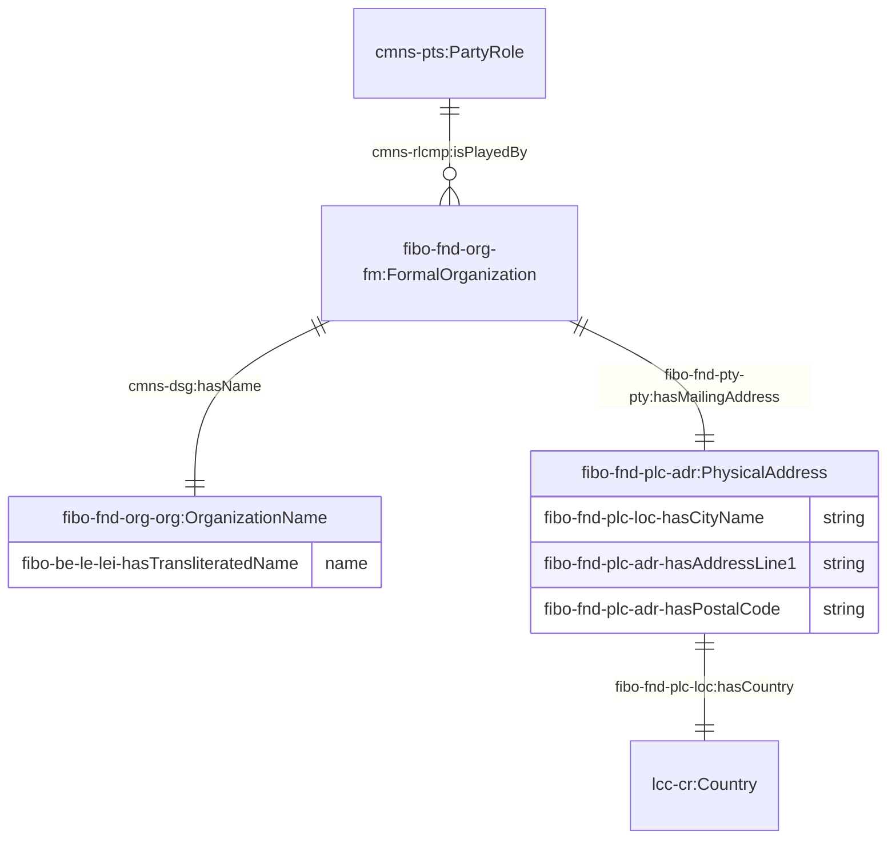
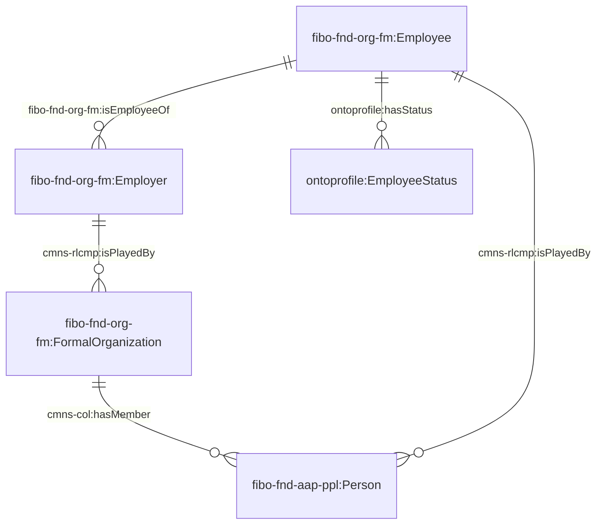
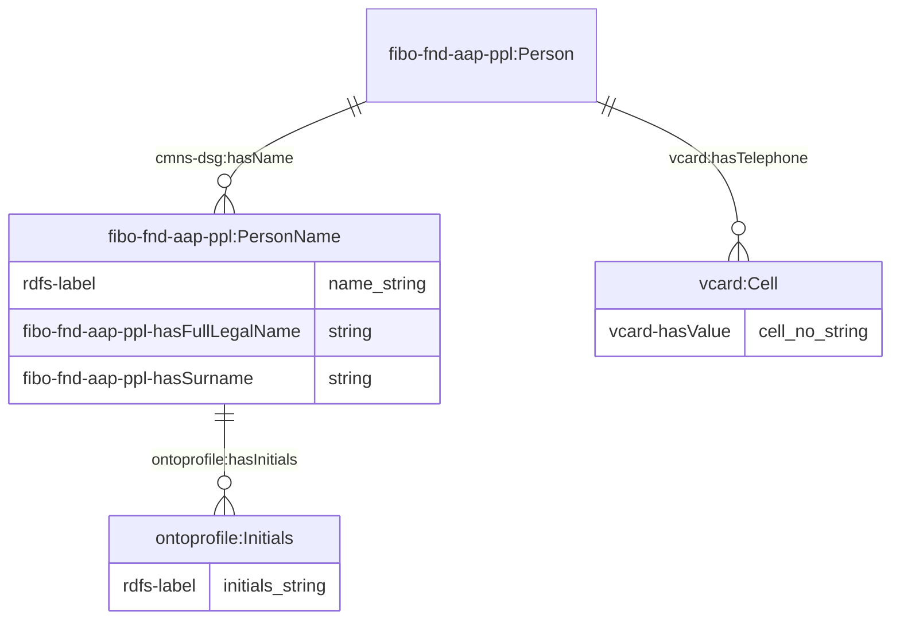
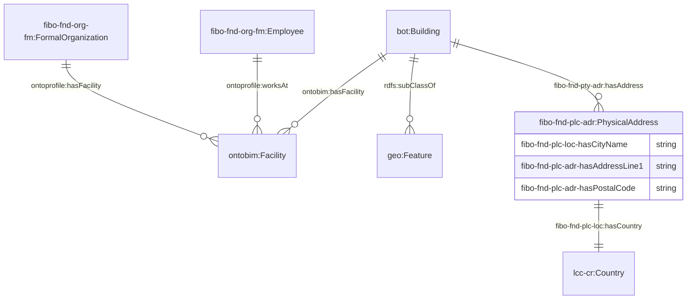

# 1. Ontology for the Profiles of Organizations and People

OntoProfile is designed to represent the profiles of organizations and people, inclusive of their names, roles, and responsibilities. The ontology is primarily an extension of the [Financial Industry Business Ontology (FIBO)](https://spec.edmcouncil.org/fibo/) to accommodate profiles unavailable in the original ontology.

The namespace for the ontology is:

<i>https://www.theworldavatar.com/kg/ontoprofile/</i>

## Table of Contents

- [1. Ontology for the Profiles of Organizations and People](#1-ontology-for-the-profiles-of-organizations-and-people)
- [2. Data Model](#2-data-model)
  - [Legend](#legend)
  - [2.1 Organisations](#21-organisations)
    - [2.1.1 Overview](#211-overview)
    - [2.1.2 Employer-Employee relationships](#212-employer-employee-relationships)
  - [2.2 Person](#22-person)
    - [2.2.1 Overview](#221-overview)
  - [2.3 Relationships with facilities](#23-relationships-with-facilities)

# 2. Data Model

## Legend

| Prefix            | Namespace                                                                                 |
| ----------------- | ----------------------------------------------------------------------------------------- |
| bot               | `https://w3id.org/bot#`                                                                   |
| cmns-col          | `https://www.omg.org/spec/Commons/Collections/`                                           |
| cmns-dt           | `https://www.omg.org/spec/Commons/DatesAndTimes/`                                         |
| cmns-dsg          | `https://www.omg.org/spec/Commons/Designators/`                                           |
| cmns-pts          | `https://www.omg.org/spec/Commons/PartiesAndSituations/`                                  |
| cmns-rlcmp        | `https://www.omg.org/spec/Commons/RolesAndCompositions/`                                  |
| fibo-be-le-lei    | `https://spec.edmcouncil.org/fibo/ontology/BE/LegalEntities/LEIEntities/`                 |
| fibo-fnd-agr-ctr  | `https://spec.edmcouncil.org/fibo/ontology/FND/Agreements/Contracts/`                     |
| fibo-fnd-arr-rep  | `https://spec.edmcouncil.org/fibo/ontology/FND/Arrangements/Reporting/`                   |
| fibo-fnd-aap-ppl  | `https://spec.edmcouncil.org/fibo/ontology/FND/AgentsAndPeople/People/`                   |
| fibo-fnd-org-org  | `https://spec.edmcouncil.org/fibo/ontology/FND/Organizations/Organizations/`              |
| fibo-fnd-pas-pas  | `https://spec.edmcouncil.org/fibo/ontology/FND/ProductsAndServices/ProductsAndServices/`  |
| fibo-fnd-pas-psch | `https://spec.edmcouncil.org/fibo/ontology/FND/ProductsAndServices/PaymentsAndSchedules/` |
| fibo-fnd-plc-adr  | `https://spec.edmcouncil.org/fibo/ontology/FND/Places/Addresses/`                         |
| fibo-fnd-plc-fac  | `https://spec.edmcouncil.org/fibo/ontology/FND/Places/Facilities/`                        |
| fibo-fnd-plc-loc  | `https://spec.edmcouncil.org/fibo/ontology/FND/Places/Locations/`                         |
| fibo-fnd-pty-pty  | `https://spec.edmcouncil.org/fibo/ontology/FND/Parties/Parties/`                          |
| fibo-fnd-rel-rel  | `https://spec.edmcouncil.org/fibo/ontology/FND/Relations/Relations`                       |
| fibo-fnd-org-fm   | `https://spec.edmcouncil.org/fibo/ontology/FND/Organizations/FormalOrganizations/`        |
| lcc-cr            | `https://www.omg.org/spec/LCC/Countries/CountryRepresentation/`                           |
| om                | `http://www.ontology-of-units-of-measure.org/resource/om-2/`                              |
| sf                | `http://www.opengis.net/ont/sf#`                                                          |
| geo               | `http://opengis.net/ont/geosparql#`                                                       |
| time              | `http://www.w3.org/2006/time#`                                                            |
| vcard             | `https://www.w3.org/2006/vcard/ns#`                                                       |
| vc                | `https://spec.edmcouncil.org/auto/ontology/VC/VehicleCore/`                               |
| rdfs              | `http://www.w3.org/2000/01/rdf-schema#`                                                   |
| ontobim           | `https://www.theworldavatar.com/kg/ontobim/`                                              |
| ontoprofile       | `https://www.theworldavatar.com/kg/ontoprofile/`                                          |

## 2.1 Organisations

### 2.1.1 Overview

The profiles of organisations generally includes their organisation names, mailing address, as well as their different roles. An organization may also play the following roles represented under the `cmns-pts:PartyRole` concept:

1. `fibo-fnd-org-fm:Employer` - party that provides compensation in exchange for work performed by one or more people up to the standard that the party dictates
2. `fibo-fnd-pas-pas:Client` - party that purchases professional services from another party
3. `fibo-fnd-pas-pas:ServiceProvider` - party that provides and typically provisions professional services.

Figure 1: TBox representation for an organisation

### 2.1.2 Employer-Employee relationships

The following figure depicts how an employee and employer relationship can be represented in an ontology. It is pertinent to realise that both the employee and employer concepts are established as party roles that is played either by a person or an organisation. Employees also have their associated work responsibilities that they must fulfil. These work responsibilities are intended to be instantiated as enums based on the corresponding Abox `OntoProfile_abox.ttl`.

Figure 2: TBox representation for an employer-employee relationship

Note that the employee status are represented as enums in the corresponding ABox. The available statuses are as follows:

- OnLeave
- OnWork

## 2.2 Person

### 2.2.1 Overview

The profile of a person generally includes their name and may include their contact information. A person may also play the following roles represented under the `cmns-pts:PartyRole` concept:

1. `fibo-fnd-org-fm:Employee` - A person in the service of another under any contract of hire
2. `ontoprofile:Driver`- An employee who is specifically employed to drive a vehicle
3. `ontoprofile:OperationManager`- An employee who is specifically employed to manage and supervise the operational conditions of a service
4. `ontoprofile:OperationScheduler`- An employee who is specifically employed to manage the operational schedule of a service
5. `ontoprofile:SalesAdmin`- An employee who is specifically employed to communicate with clients about the company's products and/or services
6. `ontoprofile:Student` - A person who has a membership role within an educational institution, typically enrolled in a course of study or program, and is involved in learning or training activities under the supervision of educators

Figure 3: TBox representation for a person

## 2.3 Relationships with facilities

This section depicts how organisations and their employees can be linked to a facility. An organisation may have facilities operating in a building which is associated with a corresponding address and geolocation.

Figure 4: TBox representation for relationships within facilities

