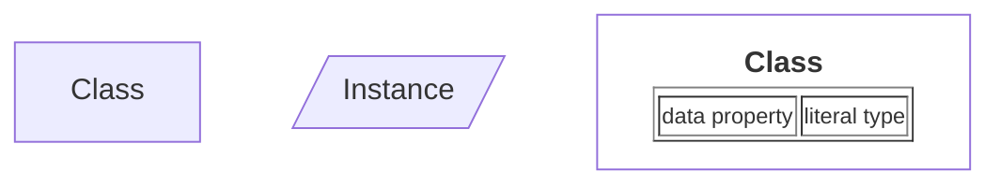
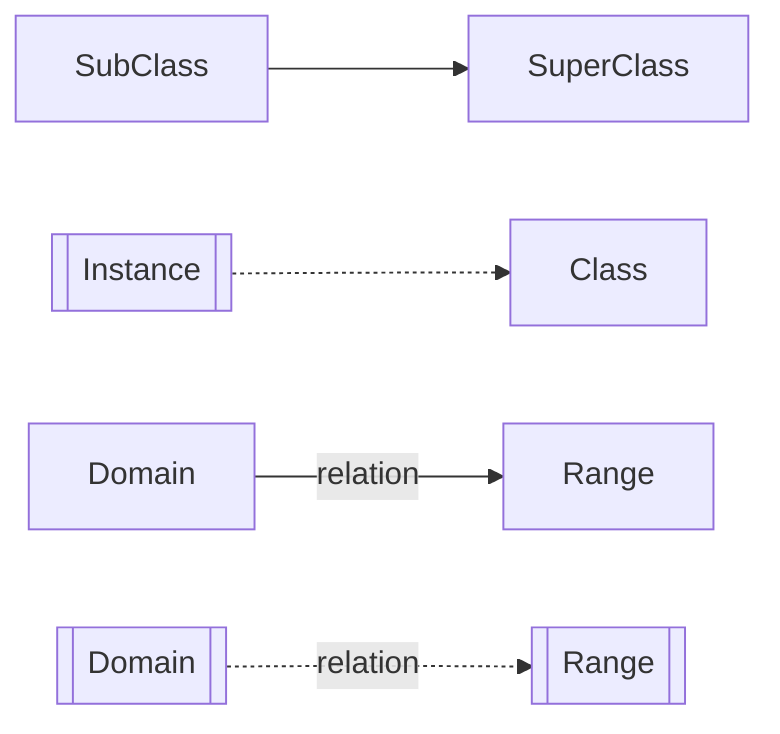
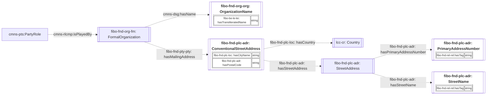
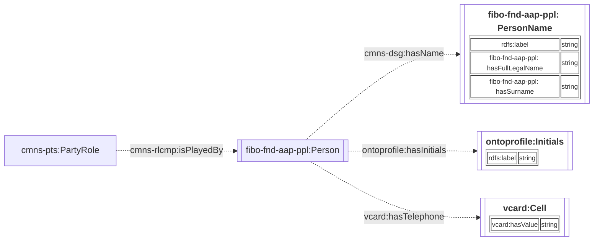
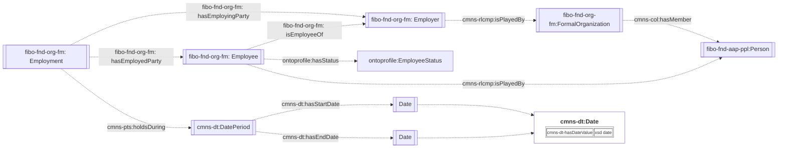
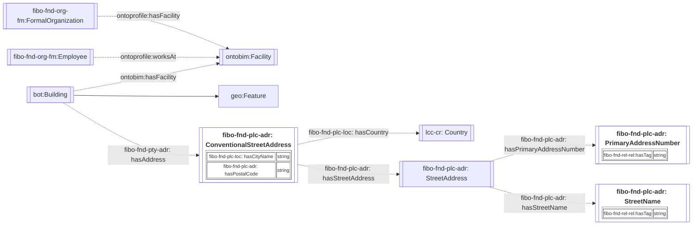

# 1. Ontology for the Profiles of Organizations and People

OntoProfile is designed to represent the profiles of organizations and people, inclusive of their names, roles, and responsibilities. The ontology is primarily an extension of the [Financial Industry Business Ontology (FIBO)](https://spec.edmcouncil.org/fibo/) to accommodate profiles unavailable in the original ontology.

The namespace for the ontology is:

<i>https://www.theworldavatar.com/kg/ontoprofile/</i>

## Table of Contents

- [1. Ontology for the Profiles of Organizations and People](#1-ontology-for-the-profiles-of-organizations-and-people)
- [2. Data Model](#2-data-model)
  - [Legend](#legend)
  - [2.1 Profiles](#21-profiles)
    - [2.1.1 Organisations](#211-organisations)
    - [2.1.2 Person](#212-person)
  - [2.2 Situations](#22-situations)
    - [2.2.1 Employment](#221-employment)
    - [2.2.2 Facility usage](#222-facility-usage)

# 2. Data Model

## Legend

> Ontology Diagram

The representation of a class and instance is denoted by the node's shape. This means that an instance of the `Person` class will share the same label as the `Person` class itself, and they can only be distinguished by their shape. Literal are represented via a table within the node of the class

For relations, unlabelled arrows references `rdfs:subClassOf` and `rdf:type` for default and dotted lines respectively. Default lines are relations between two classes, whereas dotted lines are relations between instances of one or more classes.

> Namespace Prefix

| Prefix            | Namespace                                                                                 |
| ----------------- | ----------------------------------------------------------------------------------------- |
| bot               | `https://w3id.org/bot#`                                                                   |
| cmns-col          | `https://www.omg.org/spec/Commons/Collections/`                                           |
| cmns-dt           | `https://www.omg.org/spec/Commons/DatesAndTimes/`                                         |
| cmns-dsg          | `https://www.omg.org/spec/Commons/Designators/`                                           |
| cmns-pts          | `https://www.omg.org/spec/Commons/PartiesAndSituations/`                                  |
| cmns-rlcmp        | `https://www.omg.org/spec/Commons/RolesAndCompositions/`                                  |
| fibo-be-le-lei    | `https://spec.edmcouncil.org/fibo/ontology/BE/LegalEntities/LEIEntities/`                 |
| fibo-fnd-agr-ctr  | `https://spec.edmcouncil.org/fibo/ontology/FND/Agreements/Contracts/`                     |
| fibo-fnd-arr-rep  | `https://spec.edmcouncil.org/fibo/ontology/FND/Arrangements/Reporting/`                   |
| fibo-fnd-aap-ppl  | `https://spec.edmcouncil.org/fibo/ontology/FND/AgentsAndPeople/People/`                   |
| fibo-fnd-org-org  | `https://spec.edmcouncil.org/fibo/ontology/FND/Organizations/Organizations/`              |
| fibo-fnd-pas-pas  | `https://spec.edmcouncil.org/fibo/ontology/FND/ProductsAndServices/ProductsAndServices/`  |
| fibo-fnd-pas-psch | `https://spec.edmcouncil.org/fibo/ontology/FND/ProductsAndServices/PaymentsAndSchedules/` |
| fibo-fnd-plc-adr  | `https://spec.edmcouncil.org/fibo/ontology/FND/Places/Addresses/`                         |
| fibo-fnd-plc-fac  | `https://spec.edmcouncil.org/fibo/ontology/FND/Places/Facilities/`                        |
| fibo-fnd-plc-loc  | `https://spec.edmcouncil.org/fibo/ontology/FND/Places/Locations/`                         |
| fibo-fnd-pty-pty  | `https://spec.edmcouncil.org/fibo/ontology/FND/Parties/Parties/`                          |
| fibo-fnd-rel-rel  | `https://spec.edmcouncil.org/fibo/ontology/FND/Relations/Relations`                       |
| fibo-fnd-org-fm   | `https://spec.edmcouncil.org/fibo/ontology/FND/Organizations/FormalOrganizations/`        |
| lcc-cr            | `https://www.omg.org/spec/LCC/Countries/CountryRepresentation/`                           |
| om                | `http://www.ontology-of-units-of-measure.org/resource/om-2/`                              |
| sf                | `http://www.opengis.net/ont/sf#`                                                          |
| geo               | `http://opengis.net/ont/geosparql#`                                                       |
| time              | `http://www.w3.org/2006/time#`                                                            |
| vcard             | `https://www.w3.org/2006/vcard/ns#`                                                       |
| vc                | `https://spec.edmcouncil.org/auto/ontology/VC/VehicleCore/`                               |
| rdfs              | `http://www.w3.org/2000/01/rdf-schema#`                                                   |
| ontobim           | `https://www.theworldavatar.com/kg/ontobim/`                                              |
| ontoprofile       | `https://www.theworldavatar.com/kg/ontoprofile/`                                          |

## 2.1 Profiles

This section describes the profile details about an organisation and/or person, as well as the roles they could play.

### 2.1.1 Organisations

The profiles of organisations generally includes their organisation names, mailing address, as well as their different roles. An organization may also play the following roles represented under the `cmns-pts:PartyRole` concept:

1. `fibo-fnd-org-fm:Employer` - party that provides compensation in exchange for work performed by one or more people up to the standard that the party dictates
2. `fibo-fnd-pas-pas:Client` - party that purchases professional services from another party
3. `fibo-fnd-pas-pas:ServiceProvider` - party that provides and typically provisions professional services.

Figure 1: TBox representation for an organisation's profile

### 2.1.2 Person

The profile of a person generally includes their name and may include their contact information. A person may also play the following roles represented under the `cmns-pts:PartyRole` concept:

1. `fibo-fnd-org-fm:Employee` - A person in the service of another under any contract of hire
2. `ontoprofile:Driver`- An employee who is specifically employed to drive a vehicle
3. `ontoprofile:OperationManager`- An employee who is specifically employed to manage and supervise the operational conditions of a service
4. `ontoprofile:OperationScheduler`- An employee who is specifically employed to manage the operational schedule of a service
5. `ontoprofile:SalesAdmin`- An employee who is specifically employed to communicate with clients about the company's products and/or services
6. `ontoprofile:Student` - A person who has a membership role within an educational institution, typically enrolled in a course of study or program, and is involved in learning or training activities under the supervision of educators

Figure 2: TBox representation for a person's profile

## 2.2 Situations

This section describes the various situations that organisations or people are involved in.

### 2.2.1 Employment

In this situation, a person can be employed by an organisation, who plays an employer role. It is pertinent to realise that both the employee and employer concepts are established as party roles that is played either by a person or an organisation. Employees also have their associated work responsibilities that they must fulfil.

Figure 3: TBox representation for an employment situation

Note that the employee status are represented as enums in the corresponding ABox `OntoProfile_abox.ttl`. The available statuses are as follows:

- OnLeave
- OnWork

### 2.2.2 Facility usage

This section depicts the usage of facility by organisations and employees. These facilities may operate in a building which is associated with a corresponding address and geolocation. The ontology also enables the inclusion of employees from external organisations.

Figure 4: TBox representation for relationships within facilities

