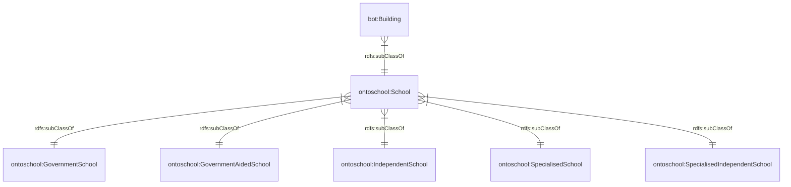
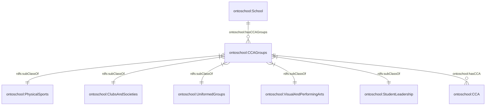
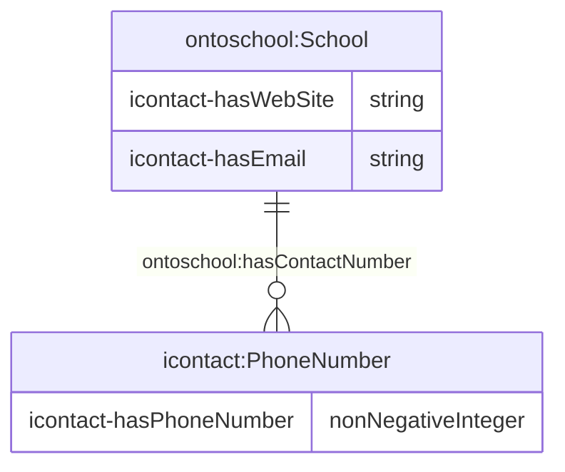
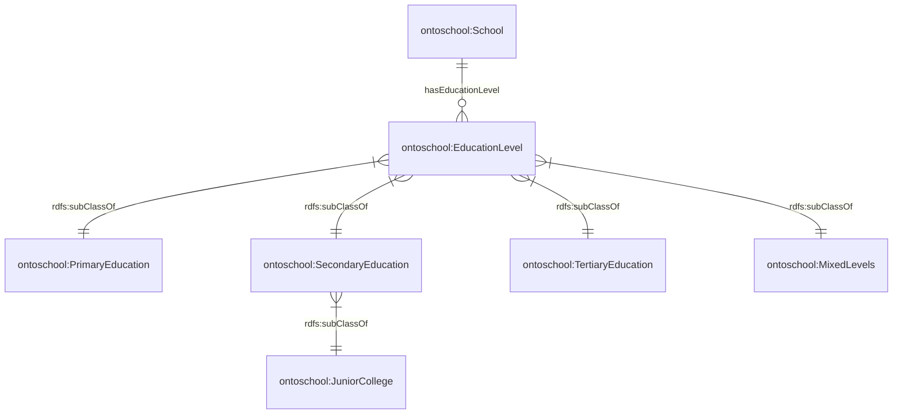
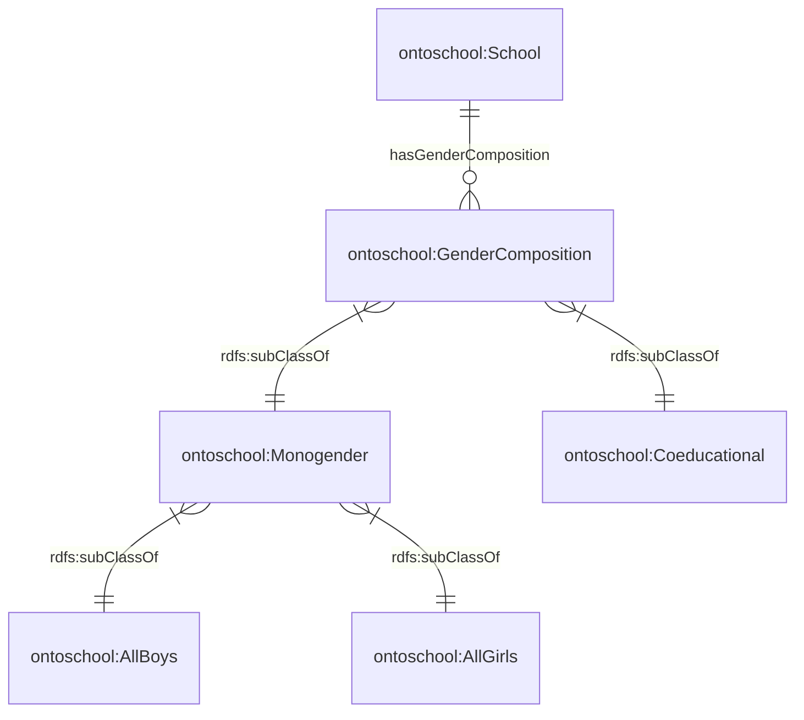

# Ontology for School
## 1. Introduction
OntoSchool is developed to represent schools and their information.

## 2. Legend
| Prefix                                                                                                                  | Namespace                                           |
|---------------------------------------------------------------------------------------------------------------------------|--------------------------------------------------------------|
| [icontact](http://ontology.eil.utoronto.ca/icontact.owl) | `http://ontology.eil.utoronto.ca/icontact.owl#`     |
| [bot](https://w3c-lbd-cg.github.io/bot/) | `https://w3id.org/bot#`     |
| [rdfs](https://www.w3.org/TR/rdf12-schema/) | `https://www.w3.org/2000/01/rdf-schema#`     |
| [xsd](https://www.w3.org/2001/XMLSchema) | `https://www.w3.org/2001/XMLSchema#`     |
| [ontoschool](https://github.com/cambridge-cares/TheWorldAvatar/tree/main/JPS_Ontology/ontology/ontoschool)                      | `https://www.theworldavatar.com/kg/ontoschool/` |
## 3. Data Model
The ontology can be divided into these respective domains:

### 3.1. School and subclasses

### 3.2. Co-Curicular Activities

### 3.3. Contact Number, Email, Website

### 3.4. Education Level

### 3.5. Gender Composition
