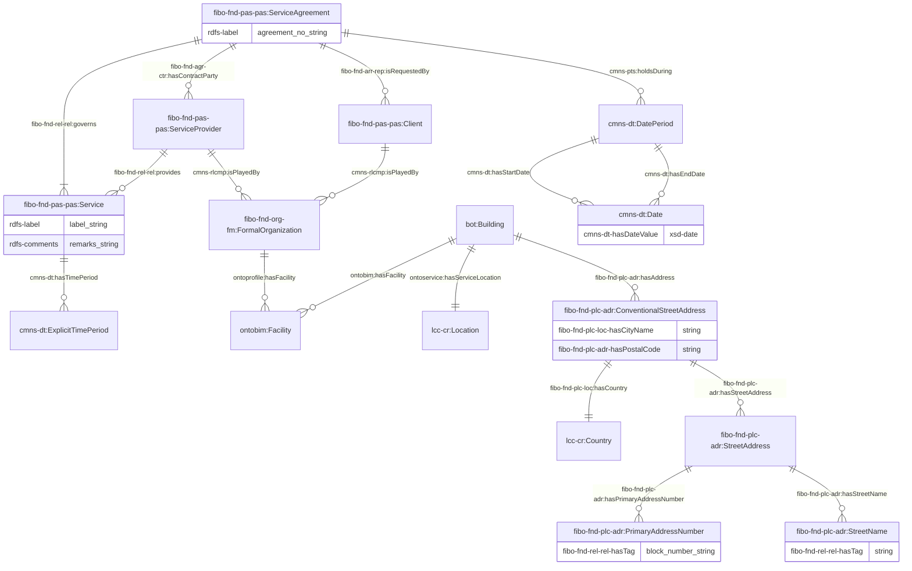
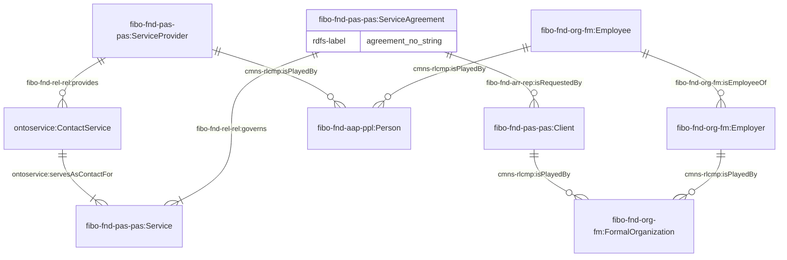
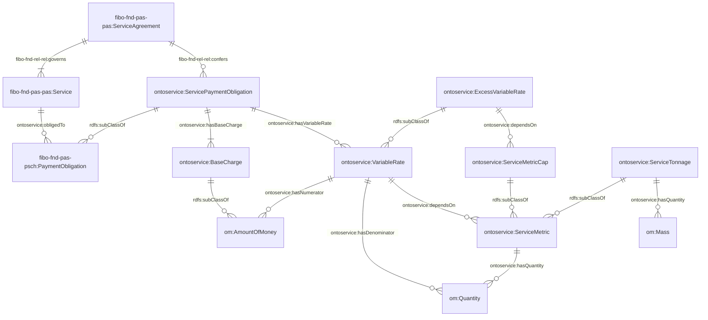
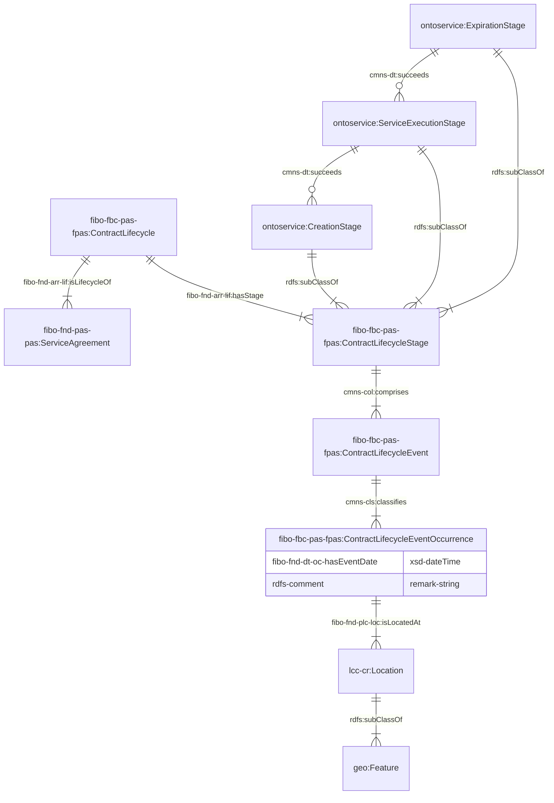
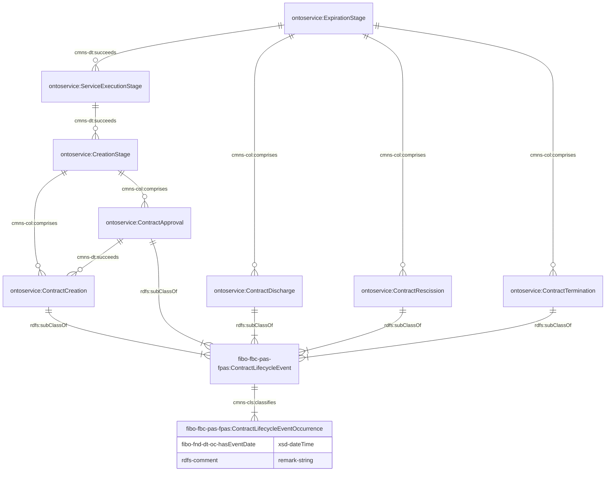
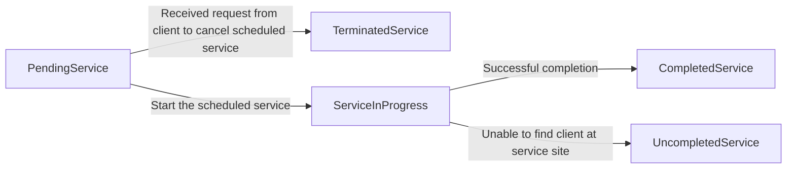
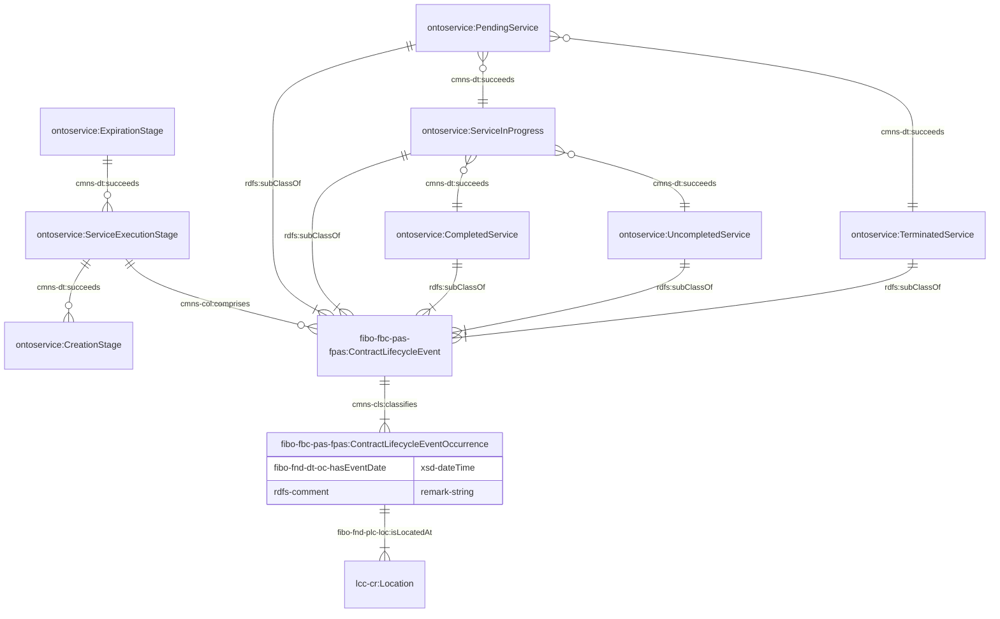
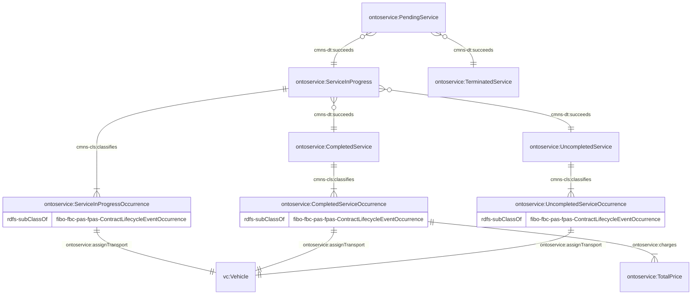
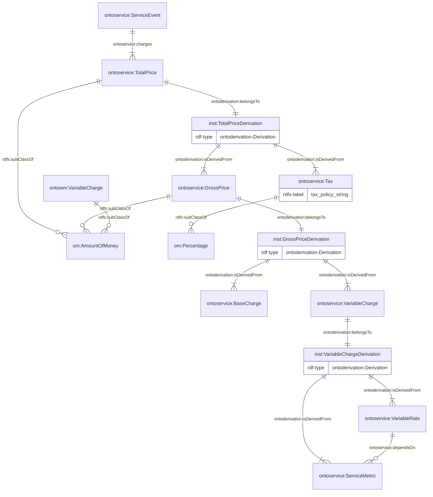

# 1. Ontology for Services

OntoService is designed to represent the terms, conditions, and obligations associated with service delivery as well as the execution details. The ontology is primarily an extension of the [Financial Industry Business Ontology (FIBO)](https://spec.edmcouncil.org/fibo/). This document serves to explain the modelling decisions and provide example usage of the ontology alongside the external ontologies.

The namespace for the ontology is:

<p align="center"><i>https://www.theworldavatar.com/kg/ontoservice/</i></p>

## Table of Contents

- [1. Ontology for Services](#1-ontology-for-services)
- [2. Data Model](#2-data-model)
  - [Legend](#legend)
  - [2.1 Service Agreement](#21-service-agreement)
  - [2.2 Service Agreement Lifecycle](#22-service-agreement-lifecycle)
    - [2.2.1 Creation and Expiration Stage](#221-creation-and-expiration-stage)
    - [2.2.2 Service Execution Stage](#222-service-execution-stage)
  - [2.3 Reporting](#23-reporting)

# 2. Data Model

## Legend

| Prefix            | Namespace                                                                                        |
| ----------------- | ------------------------------------------------------------------------------------------------ |
| bot               | `https://w3id.org/bot#`                                                                          |
| cmns-cls          | `https://www.omg.org/spec/Commons/Classifiers/`                                                  |
| cmns-col          | `https://www.omg.org/spec/Commons/Collections/`                                                  |
| cmns-dt           | `https://www.omg.org/spec/Commons/DatesAndTimes/`                                                |
| cmns-pts          | `https://www.omg.org/spec/Commons/PartiesAndSituations/`                                         |
| cmns-rlcmp        | `https://www.omg.org/spec/Commons/RolesAndCompositions/`                                         |
| fibo-fbc-pas-fpas | `https://spec.edmcouncil.org/fibo/ontology/FBC/ProductsAndServices/FinancialProductsAndServices` |
| fibo-fnd-agr-ctr  | `https://spec.edmcouncil.org/fibo/ontology/FND/Agreements/Contracts/`                            |
| fibo-fnd-arr-lif  | `https://spec.edmcouncil.org/fibo/ontology/FND/Arrangements/Lifecycles/`                         |
| fibo-fnd-arr-rep  | `https://spec.edmcouncil.org/fibo/ontology/FND/Arrangements/Reporting/`                          |
| fibo-fnd-dt-oc    | `https://spec.edmcouncil.org/fibo/ontology/FND/DatesAndTimes/Occurrences/`                       |
| fibo-fnd-pas-pas  | `https://spec.edmcouncil.org/fibo/ontology/FND/ProductsAndServices/ProductsAndServices/`         |
| fibo-fnd-pas-psch | `https://spec.edmcouncil.org/fibo/ontology/FND/ProductsAndServices/PaymentsAndSchedules/`        |
| fibo-fnd-plc-adr  | `https://spec.edmcouncil.org/fibo/ontology/FND/Places/Addresses/`                                |
| fibo-fnd-plc-loc  | `https://spec.edmcouncil.org/fibo/ontology/FND/Places/Locations/`                                |
| fibo-fnd-rel-rel  | `https://spec.edmcouncil.org/fibo/ontology/FND/Relations/Relations`                              |
| fibo-fnd-org-fm   | `https://spec.edmcouncil.org/fibo/ontology/FND/Organizations/FormalOrganizations/`               |
| lcc-cr            | `https://www.omg.org/spec/LCC/Countries/CountryRepresentation/`                                  |
| om                | `http://www.ontology-of-units-of-measure.org/resource/om-2/`                                     |
| sf                | `http://www.opengis.net/ont/sf#`                                                                 |
| geo               | `http://opengis.net/ont/geosparql#`                                                              |
| rdfs              | `http://www.w3.org/2000/01/rdf-schema#`                                                          |
| ontobim           | `https://www.theworldavatar.com/kg/ontobim/`                                                     |
| ontoderivation    | `https://www.theworldavatar.com/kg/ontoderivation/`                                              |
| ontoprofile       | `https://www.theworldavatar.com/kg/ontoprofile/`                                                 |
| ontoservice       | `https://www.theworldavatar.com/kg/ontoservice/`                                                 |
| vc                | `https://spec.edmcouncil.org/auto/ontology/VC/VehicleCore/`                                      |

## 2.1. Service Agreement

The basis of this ontology revolves around the `fibo-fnd-pas-pas:ServiceAgreement` concept. The agreement specifies the requirements and terms of the service requested by clients. This section has been split into several aspects to improve readability and understanding of the concepts - namely, (1) service agreement duration and parties, (2) payment obligations, and (3) lifecycle.

The service agreement will first define the duration, parties involved, requested service and service location. The representation of the service location enables the association of facility with a specific geolocation for service delivery within the building or site as well as the contact person in charge at the location for the required service (See [OntoProfile](https://www.theworldavatar.com/kg/ontoprofile/)). Additional service details and remarks can also be attached to the `Service` concept when required.

Figure 1: TBox representation for a Service Agreement following the FIBO ontology



Figure 2: TBox representation for the client's point of contact (contact service) for the service following the FIBO ontology



The billing charges are described at the service agreement level, which comprise of two types of billing - base charge and variable rate:

- **Base charge**: Fixed service charge
- **Variable rate**: The rates that is being charged based on a service metric.
- **Excess variable rate**: The rates that is being charged based on a service metric that have exceeded the cap specified.

Figure 3: TBox representation of the payment obligations stated in the service agreement for any service rendered



## 2.2. Service Agreement Lifecycle

The events occurring during the service agreement can be represented within a contract lifecycle. This usually consists of three stages in sequence of creation, service execution, and expiration. It is recommended to instantiate a `cmns-dt:succeeds` relationship between this three stages as seen in the figure below. Each stage will comprise of several events `ContractLifecycleEvent` which occurs multiple times, each represented by an `ContractLifecycleEventOccurrence` instance. Each occurrence can include a date time, location, as well as remarks. The following subsections will describe the events occurring within each stage of the lifecycle.

Figure 4: TBox representation of the service agreement's overall lifecycle



## 2.2.1 Creation and Expiration Stage

In the creation stage, the service agreement will need to be created before it is approved, as represented by the `ContractCreation` and `ContractApproval` events. During the expiration stage, the service agreement can end in four situations:

1. All contractually stipulated services have been performed successfully - `ContractDischarge`
2. Agreement was created in fradulent circumstances and services need not be fulfilled - `ContractRescission`
3. Early termination of an agreement initiated and agreed upon both parties - `ContractTermination`
4. Early termination of this agreement when amendments are required, and a separate new agreement should be created - `ContractTermination`

These events are recommended to be linked to their stages using the `cmns-col:comprises` property. Each of these events should occur once, with one instance of `ContractLifecycleEventOccurrence` with a specific date time and remarks if required.

Figure 5: TBox representation of the service agreement's creation and expiration lifecycle stage



## 2.2.2 Service Execution Stage

In the service execution stage, the possible events are as follows:

1. `PendingService`: A service event that is currently scheduled but has not yet started
2. `TerminatedService`: A service event that has not started and will not be delivered
3. `ServiceInProgress`: A service event that is currently in progress
4. `CompletedService`: A service event that has completed successfully
5. `UncompletedService`: A service event that has been started but is not completed

The flow of service events is depicted as follows and can be represented using the `cmns-dt:succeeds` relationship:



Multiple occurrences of each event can be instantiated with the `ContractLifecycleEventOccurrence` concept, which must be assigned a specific date time and location. Remarks are optional to assign. These occurrences will serve as a record to be analysed for quality, efficiency, and compliance with service agreements. Additionally, the occurrence of each service in progress, completed or uncompleted service can be assigned a transport if required. Furthermore, completed service occurrences can also be assigned a monetary charge.

Figure 6: TBox representation of the service agreement's service execution lifecycle stage



Figure 7: TBox representation of the service events and their occurrences



## 2.3 Reporting

This section focuses on reporting matters such as billing. The derived information framework is used in representing how the total price of a service is calculated and represented in the knowledge graph. The computation of the total price is as follows:

```math
Total Price = Gross Price + Tax \\
Gross Price = Base Charge + Variable Charge + Excess Variable Charge \\
Variable Charge = (Service Metric - Service Metric Cap) \\
```

Figure 8: ABox representation of the provenance structure for the total service charge


