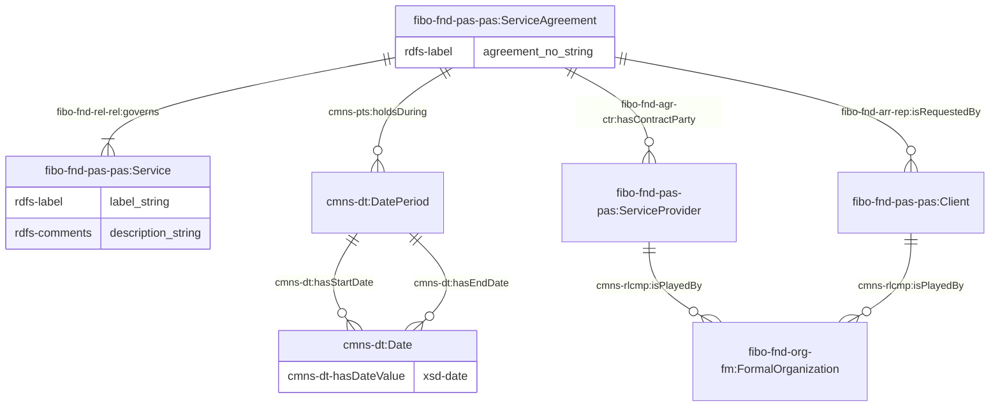
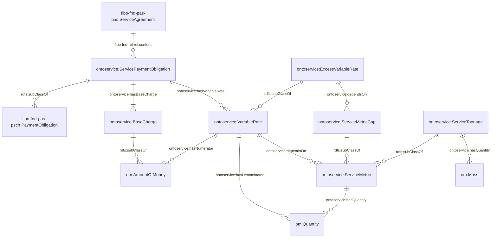
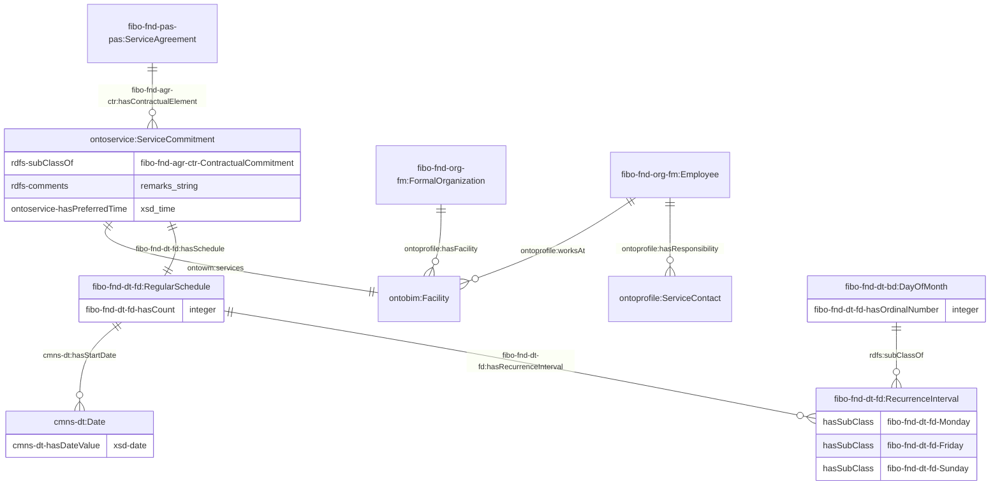
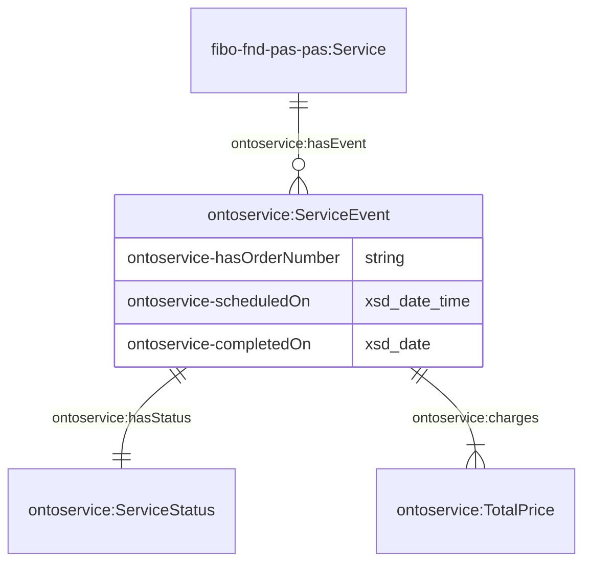
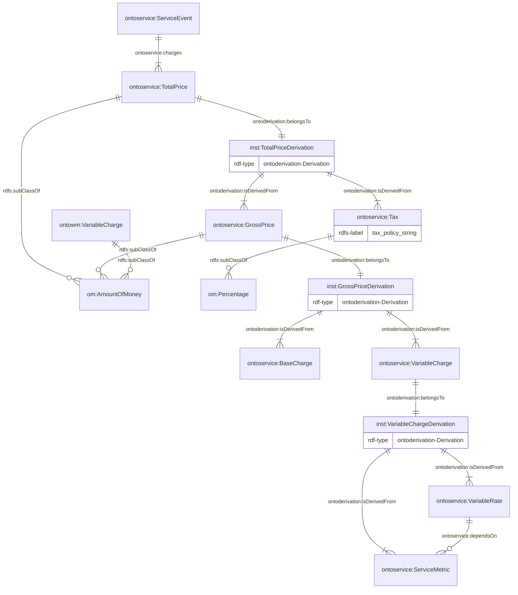

# 1. Ontology for Services

OntoService is designed to represent the terms, conditions, and obligations associated with service delivery as well as the execution details. The ontology is primarily an extension of the [Financial Industry Business Ontology (FIBO)](https://spec.edmcouncil.org/fibo/). This document serves to explain the modelling decisions and provide example usage of the ontology alongside the external ontologies.

The namespace for the ontology is:

<p align="center"><i>https://www.theworldavatar.com/kg/ontoservice/</i></p>

## Table of Contents

- [1. Ontology for Services](#1-ontology-for-services)
- [2. Data Model](#2-data-model)
  - [Legend](#legend)
  - [2.1 Service Agreement](#21-service-agreement)
    - [2.1.1 Overview](#211-overview)
    - [2.1.2 Employer-Employee relationships](#212-employer-employee-relationships)
  - [2.2 Person](#22-person)
    - [2.2.1 Overview](#221-overview)
  - [2.3 Relationships with facilities](#23-relationships-with-facilities)

# 2. Data Model

## Legend

| Prefix            | Namespace                                                                                 |
| ----------------- | ----------------------------------------------------------------------------------------- |
| bot               | `https://w3id.org/bot#`                                                                   |
| cmns-dt           | `https://www.omg.org/spec/Commons/DatesAndTimes/`                                         |
| cmns-pts          | `https://www.omg.org/spec/Commons/PartiesAndSituations/`                                  |
| cmns-rlcmp        | `https://www.omg.org/spec/Commons/RolesAndCompositions/`                                  |
| fibo-fnd-agr-ctr  | `https://spec.edmcouncil.org/fibo/ontology/FND/Agreements/Contracts/`                     |
| fibo-fnd-arr-rep  | `https://spec.edmcouncil.org/fibo/ontology/FND/Arrangements/Reporting/`                   |
| fibo-fnd-pas-pas  | `https://spec.edmcouncil.org/fibo/ontology/FND/ProductsAndServices/ProductsAndServices/`  |
| fibo-fnd-pas-psch | `https://spec.edmcouncil.org/fibo/ontology/FND/ProductsAndServices/PaymentsAndSchedules/` |
| fibo-fnd-rel-rel  | `https://spec.edmcouncil.org/fibo/ontology/FND/Relations/Relations`                       |
| fibo-fnd-org-fm   | `https://spec.edmcouncil.org/fibo/ontology/FND/Organizations/FormalOrganizations/`        |
| om                | `http://www.ontology-of-units-of-measure.org/resource/om-2/`                              |
| sf                | `http://www.opengis.net/ont/sf#`                                                          |
| geo               | `http://opengis.net/ont/geosparql#`                                                       |
| rdfs              | `http://www.w3.org/2000/01/rdf-schema#`                                                   |
| ontobim           | `https://www.theworldavatar.com/kg/ontobim/`                                              |
| ontoderivation    | `https://www.theworldavatar.com/kg/ontoderivation/`                                       |
| ontoprofile       | `https://www.theworldavatar.com/kg/ontoprofile/`                                          |
| ontoservice       | `https://www.theworldavatar.com/kg/ontoservice/`                                          |

## 2.1. Service Agreement

The basis of this ontology revolves around the `fibo-fnd-pas-pas:ServiceAgreement` concept. The agreement specifies the requirements and terms of the service requested by clients. This section has been split into three figures to improve readability and understanding of the concepts - namely, (1) service agreement duration and parties, (2) payment obligations and (3) service commitment.

Figure 1: TBox representation for a Service Agreement following the FIBO ontology



The billing charges are described at the service agreement level, which comprise of two types of billing - base charge and variable rate:

- **Base charge**: Fixed service charge
- **Variable rate**: The rates that is being charged based on a service metric.
- **Excess variable rate**: The rates that is being charged based on a service metric that have exceeded the cap specified.

Figure 2: TBox representation of the payment obligations stated in the service agreement for any service rendered



The service agreement will also mandate a service commitment, including the service time, schedule, facility (i.e. the location for service execution) and/or remarks.

- The representation of the service location enables the association of facility to a specific building with their own geolocation as well as the contact person in charge at the location for the required service.
- It is intended that this commitment does not instantiate any further attributes from their corresponding concepts but stores the repeatable categories. A scheduler agent is expected to detect this state and ingest the initial knowledge in Figure 3 to optimise and arrange services with executable details.

Figure 3: TBox representation of the contractual obligations for a service



## 2.2. Service events

Service events represent the specific occurrence a service being performed, and serves as a record to be analysed for quality, efficiency, and compliance with service agreements. The scheduler agent is expected to generate a new service event instance based on the associated service commitment and payment obligations following their service intervals.

Figure 4: TBox representation of a service event



## 2.3 Reporting

This section focuses on reporting matters such as billing. The derived information framework is used in representing how the total price of a service is calculated and represented in the knowledge graph. The computation of the total price is as follows:

```math
Total Price = Gross Price + Tax \\
Gross Price = Base Charge + Variable Charge + Excess Variable Charge \\
Variable Charge = (Service Metric - Service Metric Cap) \\
```

Figure 5: ABox representation of the provenance structure for the total service charge


