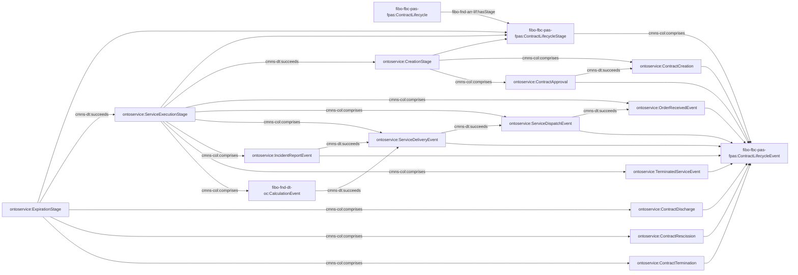
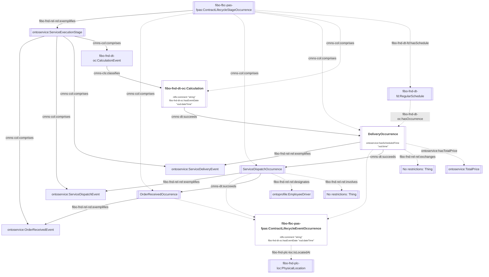
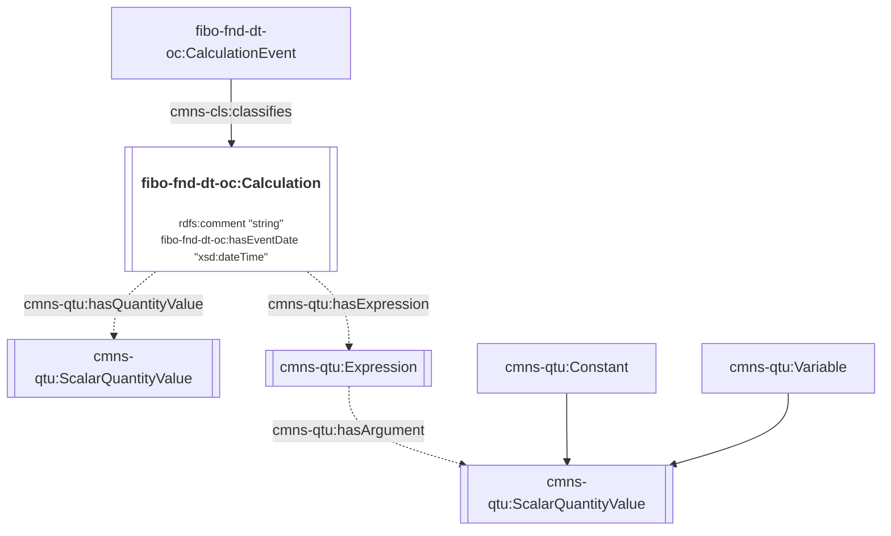

# 1. Ontology for Services

OntoService is designed to represent the terms, conditions, and obligations associated with service delivery as well as the execution details. The ontology is primarily an extension of the [Financial Industry Business Ontology (FIBO)](https://spec.edmcouncil.org/fibo/). This document serves to explain the modelling decisions and provide example usage of the ontology alongside the external ontologies.

The namespace for the ontology is:

<i>https://www.theworldavatar.com/kg/ontoservice/</i>

## Table of Contents

- [1. Ontology for Services](#1-ontology-for-services)
- [2. Data Model](#2-data-model)
  - [Legend](#legend)
  - [2.1 Service Agreement](#21-service-agreement)
  - [2.2 Service Agreement Lifecycle](#22-service-agreement-lifecycle)
    - [2.2.1 Service Agreement Occurrences](#221-service-agreement-occurrences)
    - [2.2.2 Service Execution Stage](#222-service-execution-stage)
  - [2.3 Reporting](#23-reporting)

# 2. Data Model

## Legend

> Ontology Diagram

The representation of a class and instance is denoted by the node's shape. This means that an instance of the `Person` class will share the same label as the `Person` class itself, and they can only be distinguished by their shape. Literals are represented within the node of the class.

For relations, unlabelled arrows references `rdfs:subClassOf` and `rdf:type` for default and dotted lines respectively. Default lines are relations that involve at least one class, whereas dotted lines are relations between instances of one or more classes.

> Namespace Prefix

| Prefix            | Namespace                                                                                        |
| ----------------- | ------------------------------------------------------------------------------------------------ |
| bot               | `https://w3id.org/bot#`                                                                          |
| cmns-cls          | `https://www.omg.org/spec/Commons/Classifiers/`                                                  |
| cmns-col          | `https://www.omg.org/spec/Commons/Collections/`                                                  |
| cmns-dt           | `https://www.omg.org/spec/Commons/DatesAndTimes/`                                                |
| cmns-pts          | `https://www.omg.org/spec/Commons/PartiesAndSituations/`                                         |
| cmns-qtu          | `https://www.omg.org/spec/Commons/QuantitiesAndUnits/`                                           |
| cmns-rlcmp        | `https://www.omg.org/spec/Commons/RolesAndCompositions/`                                         |
| fibo-fbc-pas-fpas | `https://spec.edmcouncil.org/fibo/ontology/FBC/ProductsAndServices/FinancialProductsAndServices` |
| fibo-fnd-agr-ctr  | `https://spec.edmcouncil.org/fibo/ontology/FND/Agreements/Contracts/`                            |
| fibo-fnd-arr-lif  | `https://spec.edmcouncil.org/fibo/ontology/FND/Arrangements/Lifecycles/`                         |
| fibo-fnd-arr-rep  | `https://spec.edmcouncil.org/fibo/ontology/FND/Arrangements/Reporting/`                          |
| fibo-fnd-dt-fd    | `https://spec.edmcouncil.org/fibo/ontology/FND/DatesAndTimes/FinancialDates/`                    |
| fibo-fnd-dt-bd    | `https://spec.edmcouncil.org/fibo/ontology/FND/DatesAndTimes/BusinessDates/`                     |
| fibo-fnd-dt-oc    | `https://spec.edmcouncil.org/fibo/ontology/FND/DatesAndTimes/Occurrences/`                       |
| fibo-fnd-pas-pas  | `https://spec.edmcouncil.org/fibo/ontology/FND/ProductsAndServices/ProductsAndServices/`         |
| fibo-fnd-pas-psch | `https://spec.edmcouncil.org/fibo/ontology/FND/ProductsAndServices/PaymentsAndSchedules/`        |
| fibo-fnd-plc-adr  | `https://spec.edmcouncil.org/fibo/ontology/FND/Places/Addresses/`                                |
| fibo-fnd-plc-fac  | `https://spec.edmcouncil.org/fibo/ontology/FND/Places/Facilities/`                               |
| fibo-fnd-plc-loc  | `https://spec.edmcouncil.org/fibo/ontology/FND/Places/Locations/`                                |
| fibo-fnd-rel-rel  | `https://spec.edmcouncil.org/fibo/ontology/FND/Relations/Relations`                              |
| fibo-fnd-org-fm   | `https://spec.edmcouncil.org/fibo/ontology/FND/Organizations/FormalOrganizations/`               |
| lcc-cr            | `https://www.omg.org/spec/LCC/Countries/CountryRepresentation/`                                  |
| om                | `http://www.ontology-of-units-of-measure.org/resource/om-2/`                                     |
| sf                | `http://www.opengis.net/ont/sf#`                                                                 |
| geo               | `http://opengis.net/ont/geosparql#`                                                              |
| rdfs              | `http://www.w3.org/2000/01/rdf-schema#`                                                          |
| ontobim           | `https://www.theworldavatar.com/kg/ontobim/`                                                     |
| ontoderivation    | `https://www.theworldavatar.com/kg/ontoderivation/`                                              |
| ontoprofile       | `https://www.theworldavatar.com/kg/ontoprofile/`                                                 |
| ontoservice       | `https://www.theworldavatar.com/kg/ontoservice/`                                                 |
| vc                | `https://spec.edmcouncil.org/auto/ontology/VC/VehicleCore/`                                      |

## 2.1. Service Agreement

The basis of this ontology revolves around the `fibo-fnd-pas-pas:ServiceAgreement` concept. The agreement specifies the requirements and terms of the service requested by clients. This section has been split into several aspects to improve readability and understanding of the concepts - namely, (1) service agreement duration and parties, (2) payment obligations, and (3) lifecycle.

The service agreement will first define the duration, parties involved, requested service, and service location. The representation of the service location enables the association of facility with a specific geolocation for service delivery within the building or site as well as the contact person in charge at the location for the required service (See [OntoProfile](https://www.theworldavatar.com/kg/ontoprofile/)). Additional service details and remarks can also be attached to the `Service` concept when required.

Figure 1: TBox representation for a Service Agreement following the FIBO ontology

Figure 2: TBox representation for the client's point of contact (contact service) for the service following the FIBO ontology

The billing charges are described at the service agreement level, which comprise of two types of billing - base charge and variable rate:

- **Base charge**: Fixed service charge
- **Variable rate**: The rates that is being charged based on a service metric.
- **Excess variable rate**: The rates that is being charged based on a service metric that have exceeded the cap specified.

Figure 3: TBox representation of the payment obligations stated in the service agreement for any service rendered

## 2.2. Service Agreement Lifecycle

A generic lifecycle, comprising of stages and their events, will be represented and instantiated once and reused across all agreement instances. The contract lifecycle usually consists of three stages in sequence of creation, service execution, and expiration. It is recommended to instantiate a `cmns-dt:succeeds` relationship between these three stages as seen in the figure below. Events occurring within each stages are also instantiated and assigned using the `cmns-col:comprises` property. The recommended lifecycle triples are also available as `TTL` format in this directory's `abox.ttl` file.

Figure 4: TBox representation of the service contract lifecycle

In the creation stage, the service agreement will need to be created before it is approved, as represented by the `ContractCreation` and `ContractApproval` events.

During the service execution stage, the sequence of events should occur in the following manner during a successful delivery. It should be noted that the event may be completed with either a `CalculationEvent`, `IncidentReportEvent`, or `TerminatedServiceEvent`. The `Terminated Service Event` represents the termination of an upcoming service either by the service provider or the client, which may occur at any time after the first event.

1. `Order Received Event`: When a new service order is received and acknowledged by the system after the approval
2. `Service Dispatch Event`: Assignment of service personnel, resources, and/or location(s) to perform the requested service
3. `Service Delivery Event`: Delivery of the requested service
4. `Calculation Event`: Records a summary of the service trip, tailored to the specific domain; multiple calculation events can be instantiated if multiple calculations/quantities are reported
   - `Incident Report Event`: An alternate possible event in which an incident occurred during the service delivery, resulting in the failure to complete

During the expiration stage, the service agreement can end in four situations:

1. `ContractDischarge`: All contractually stipulated services have been performed successfully
2. `ContractRescission`: Agreement was created in fradulent circumstances and services need not be fulfilled
3. `ContractTermination`: Early termination of an agreement initiated and agreed upon both parties
4. `ContractTermination`: Early termination of this agreement when amendments are required, and a separate new agreement should be created

### 2.2.1 Service Agreement Occurrences

Occurrences serve to represent the lifecycle of each service agreement in a separate distinguishable instance to record the details of that agreement. By separating the occurrence from the overall lifecycle process, the ontology also reduces the duplication of triples created for the lifecycle representation. Each occurrence can either holds during a date period or occur at an instantaneous time. Note that occurrences will be generated at the overall lifecycle, lifecycle stage, and lifecycle event level, and they are linked in the same hierarchial order as their occurrence kind:

- `Lifecycle hasStage LifecycleStage` and `LifecycleOccurrence hasStage LifecycleStageOccurrence`
- `LifecycleStage comprises LifecycleEvent` and `LifecycleStageOccurrence comprises LifecycleEventOccurrence`
- `ServiceExecutionStage succeeds CreationStage` and `ServiceExecutionStageOccurrence succeeds CreationStageOccurrence`

Events in the creation and expiration stage are expected to occur once and we recommend to generate one instance of `ContractLifecycleEventOccurrence` with a specific date time and remarks if required. If the service is terminated or faced an incident, it is recommended to instantiate a new occurrence for the corresponding event with the required time stamp and reason for its occurrence (`rdfs:comment`).

Figure 5: TBox representation of the service agreement's occurrences within a service contract lifecycle

### 2.2.2 Service Execution Stage

This stage governs the delivery of the requested service stated in the service agreement.

#### Regular Schedule

In representing the upcoming service delivery occurrences, a regular schedule is assigned to the stage occurrence. The start date of the schedule must follow the `StartDate` instance linked to the service execution lifecycle stage. The representation of the requested service time employs the `cmns-dt:ExplicitTimePeriod` concept via the `cmns-dt:hasTimePeriod` relationship. In representing the recurrence interval ie weekly on every monday and tuesday, users can employ the `fibo-fnd-dt-fd:hasRecurrenceInterval` relationship along with an [`fibo-fnd-dt-fd:ExplicitRecurrenceInterval`](https://spec.edmcouncil.org/fibo/ontology/FND/DatesAndTimes/FinancialDates/ExplicitRecurrenceInterval) concept. This will have a corresponding ISO 8601 duration string literal linked by the `hasDurationValue` relationship. For example, daily = `P1D`, weekly = `P7D`, and alternate day = `P2D`. In the case where services must be delivered for multiple days within a week, additional `fibo-fnd-dt-bd:BusinessRecurrenceInterval` recurrence intervals can be instantiated to represent the day of week or day of month required. The `fibo-fnd-dt-fd:hasCount` property denotes the number of scheduled service occurrence and will end the agreement once all services have been delivered.

Figure 6: TBox representation of a regular schedule

#### Successful Service Delivery

The typical sequence of events for a successful service delivery is depicted in the figure below. Each event's occurrence can be instantiated with the `ContractLifecycleEventOccurrence` concept, which must be assigned a specific date, time, and location (if required). The process begins with the `OrderReceivedEvent`, which kickstarts the workflow. The next event is the `ServiceDispatchEvent`, where users can assign resources, personnel, and locations to specific orders. Personnel can be assigned using the `fibo-fnd-rel-rel:designates` relation and `fibo-fnd-org-fm:Employee` subclasses, while resources can be assigned using the `fibo-fnd-rel-rel:involves` relation. For example, a driver can be designated for the delivery, and their assigned transport and other details can be tracked as described in [`OntoProfile`](https://www.theworldavatar.com/kg/ontoprofile/). Following this, the `ServiceDeliveryEvent` occurs when the services are executed. Users can supplement information on any exchange of assets or equipment using the `fibo-fnd-rel-rel:exchanges` relation, and the total cost of the delivery can be recorded via the `ontoservice:hasTotalPrice` relation. Once the service is delivered, users can log any relevant information with the subsequent `CalculationEvent`. Note that multiple calculation events may be present depending on the service. These occurrences will serve as a record to be analysed for quality, efficiency, and compliance with service agreements.

Figure 7: TBox representation of a successful service delivery lifecycle

#### Calculation

Once the service is completed, it is expected that the user will log certain values, which serves as inputs for some form of calculation such as collection weight or distance travelled. The calculation have an associated expression, that may ingest any constant or variable values. Outputs are represented via the `cmns-qtu:hasQuantityValue`.

Figure 8: TBox representation of a calculation during the service lifecycle

## 2.3 Reporting

This section focuses on reporting matters such as billing. The derived information framework is used in representing how the total price of a service is calculated and represented in the knowledge graph. The computation of the total price is as follows:

$$
  \begin{align*}
    Total Price = Gross Price + Tax \\
    Gross Price = Base Charge + Variable Charge + Excess Variable Charge \\
    Variable Charge = (Service Metric - Service Metric Cap) \\
  \end{align*}
$$

Figure 9: ABox representation of the provenance structure for the total service charge

