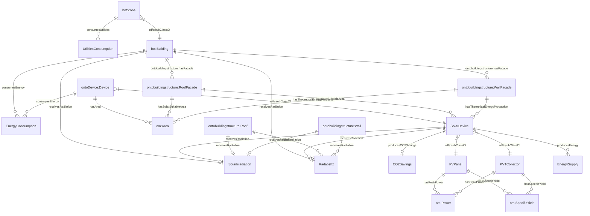
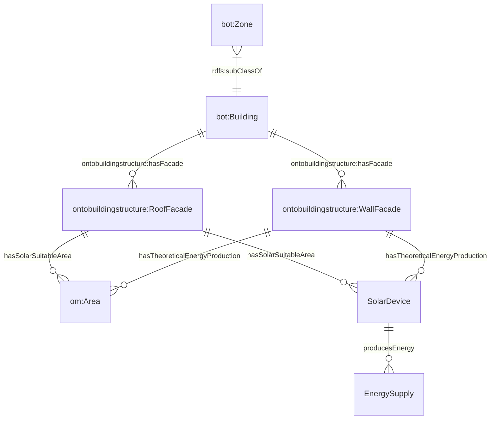

# Ontology for Urban Building Energy Modelling (UBEM) and Master Planning (MP) 
## 1. Introduction
The UBEMMP ontology is developed to represent the concepts and relationships related to energy and utility consumption and renewable energy production at the building and larger scale.

### 1.1 Related Ontologies
As part of TheWorldAvatar(TWA), this ontology has a modular design that can be easily incorporated in conjunction with other ontologies. This will provide more comprehensive data coverage across domains and scales. Related ontologies that have been integrated are listed below:

| Ontology                                                                                                                  | Incorporated data                                            |
|---------------------------------------------------------------------------------------------------------------------------|--------------------------------------------------------------|
| [OntoBuildingEnvironment](https://github.com/cambridge-cares/TheWorldAvatar/tree/main/JPS_Ontology/ontology/ontobuiltenv) | Building properties, uses, values, and location              |
| [OntoBIM](https://github.com/cambridge-cares/TheWorldAvatar/tree/main/JPS_Ontology/ontology/ontobim)                      | Topological relationships between a building and its elements |
| [OntoBuildingStructure](https://github.com/cambridge-cares/TheWorldAvatar/tree/main/JPS_Ontology/ontology/ontobuildingstructure)                | Wall and roof facades to receive solar irradiation                          |
| [OntoDevice](https://github.com/cambridge-cares/TheWorldAvatar/tree/main/JPS_Ontology/ontology/ontodevice)                | Device properties for solar devices                          |

### 1.2 Related Agents
This ontology is used in the following agent:
1) [CEA Agent](https://github.com/cambridge-cares/TheWorldAvatar/tree/main/Agents/CEAAgent)

## 2. Data Model
This diagram includes all relationships in this ontology.

This diagram below is broken down further to allow an easier view.
