# 1. Ontology for Waste Management

OntoWasteManagement is designed to represent and support the day-to-day waste management operations, ranging from handling collection requests and billing reports, meeting reporting requirements, to fleet and bin management. This document serves to explain the modelling decisions and provide example usage of the ontology alongside the external ontologies.

The namespace for the ontology is:

<p align="center"><i>https://www.theworldavatar.com/kg/ontowastemanagement/</i></p>

## Table of Contents

- [1. Ontology for Waste Management](#1-ontology-for-waste-management)
- [2. Data Model](#2-data-model)
  - [Legend](#legend)
  - [2.1 Service Agreement](#21-service-agreement)
  - [2.2 Waste Services](#22-waste-services)
    - [2.2.1 Service Lifecycle](#221-service-lifecycle)
    - [2.2.2 Waste Categories](#222-waste-categories)
  - [2.3 Assets](#23-assets)
    - [2.3.1 Truck](#231-truck)
    - [2.3.2 Bin](#232-bin)
  - [2.4 Reporting](#25-reporting)

# 2. Data model

## Legend

| Prefix            | Namespace                                                                                         |
| ----------------- | ------------------------------------------------------------------------------------------------- |
| cmns-col          | `https://www.omg.org/spec/Commons/Collections/`                                                   |
| cmns-dt           | `https://www.omg.org/spec/Commons/DatesAndTimes/`                                                 |
| cmns-dsg          | `https://www.omg.org/spec/Commons/Designators/`                                                   |
| cmns-pts          | `https://www.omg.org/spec/Commons/PartiesAndSituations/`                                          |
| cmns-qtu          | `https://www.omg.org/spec/Commons/QuantitiesAndUnits/`                                            |
| cmns-rlcmp        | `https://www.omg.org/spec/Commons/RolesAndCompositions/`                                          |
| fibo-fbc-pas-fpas | `https://spec.edmcouncil.org/fibo/ontology/FBC/ProductsAndServices/FinancialProductsAndServices/` |
| fibo-fnd-agr-ctr  | `https://spec.edmcouncil.org/fibo/ontology/FND/Agreements/Contracts/`                             |
| fibo-fnd-arr-rep  | `https://spec.edmcouncil.org/fibo/ontology/FND/Arrangements/Reporting/`                           |
| fibo-fnd-aap-ppl  | `https://spec.edmcouncil.org/fibo/ontology/FND/AgentsAndPeople/People/`                           |
| fibo-fnd-dt-bd    | `https://spec.edmcouncil.org/fibo/ontology/FND/DatesAndTimes/BusinessDates/`                      |
| fibo-fnd-dt-fd    | `https://spec.edmcouncil.org/fibo/ontology/FND/DatesAndTimes/FinancialDates/`                     |
| fibo-fnd-dt-oc    | `https://spec.edmcouncil.org/fibo/ontology/FND/DatesAndTimes/Occurrences/`                        |
| fibo-fnd-pas-pas  | `https://spec.edmcouncil.org/fibo/ontology/FND/ProductsAndServices/ProductsAndServices/`          |
| fibo-fnd-pas-psch | `https://spec.edmcouncil.org/fibo/ontology/FND/ProductsAndServices/PaymentsAndSchedules/`         |
| fibo-fnd-plc-adr  | `https://spec.edmcouncil.org/fibo/ontology/FND/Places/Addresses/`                                 |
| fibo-fnd-plc-fac  | `https://spec.edmcouncil.org/fibo/ontology/FND/Places/Facilities/`                                |
| fibo-fnd-plc-loc  | `https://spec.edmcouncil.org/fibo/ontology/FND/Places/Locations/`                                 |
| fibo-fnd-pty-pty  | `https://spec.edmcouncil.org/fibo/ontology/FND/Parties/Parties/`                                  |
| fibo-fnd-rel-rel  | `https://spec.edmcouncil.org/fibo/ontology/FND/Relations/Relations/`                              |
| fibo-fnd-org-fm   | `https://spec.edmcouncil.org/fibo/ontology/FND/Organizations/FormalOrganizations/`                |
| fibo-fnd-utl-alx  | `https://spec.edmcouncil.org/fibo/ontology/FND/Utilities/Analytics/`                              |
| lcc-cr            | `https://www.omg.org/spec/LCC/Countries/CountryRepresentation/`                                   |
| om                | `http://www.ontology-of-units-of-measure.org/resource/om-2/`                                      |
| sf                | `http://www.opengis.net/ont/sf#`                                                                  |
| geo               | `http://opengis.net/ont/geosparql#`                                                               |
| time              | `https://www.w3.org/TR/owl-time/#time`                                                            |
| vcard             | `https://www.w3.org/2006/vcard/ns`                                                                |
| vc                | `https://spec.edmcouncil.org/auto/ontology/VC/VehicleCore/`                                       |
| ontobim           | `https://www.theworldavatar.com/kg/ontobim/`                                                      |
| ontoderivation    | `https://www.theworldavatar.com/kg/ontoderivation/`                                               |
| ontoprofile       | `https://www.theworldavatar.com/kg/ontoprofile/`                                                  |
| ontoservice       | `https://www.theworldavatar.com/kg/ontoservice/`                                                  |
| ontowm            | `https://www.theworldavatar.com/kg/ontowastemanagement/`                                          |

## 2.1. Service agreement

The basis of this ontology revolves around the `fibo-fnd-pas-pas:ServiceAgreement` concept to specify the agreed upon service requirements and terms. The general usage of this concept can be found as part of the [OntoService](https://www.theworldavatar.com/kg/ontoservice/) ontology, including its duration, involved parties, payment obligations, and commitments, as well as the organisation profiles in the [OntoProfile](https://www.theworldavatar.com/kg/ontoprofile/) ontology. This ontology specifically demonstrates the extension of `OntoService` and `OntoProfile` to the waste operation industry.

Figure 1: TBox representation for a Service Agreement in the waste management sector following the FIBO ontology

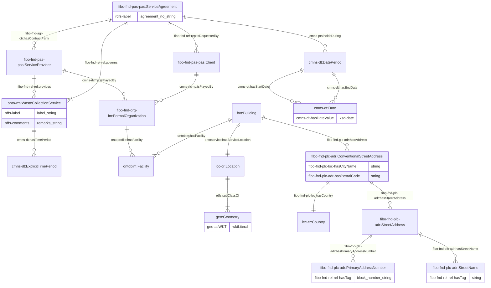

Furthermore, the service will be given a contact person, who is an employee of the client. This person will play a role of a service provider who provides a contact service for the service specified in the agreement.

Figure 2: TBox representation for the client's point of contact (contact service) for the service following the FIBO ontology

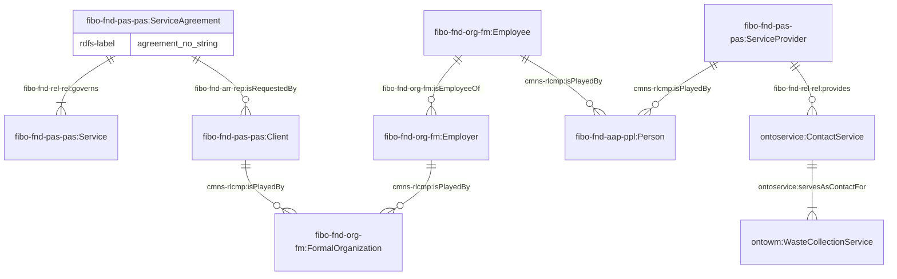

## 2.2. Waste services

The services available in the waste operation industry are as follows:

1. **Bin delivery service**: Delivery of an empty bin to site. Must be assigned to an OTC truck
2. **Bin exchange service** `WasteCollectionService`: Delivery of an empty bin to site while towing away the existing full bin. Must be assigned to an OTC truck
3. **Tow away service** `WasteCollectionService`: Collects and disposes of the waste from the service site without returning the bin afterwards. Must be assigned to an OTC truck
4. **Touch and go service** `WasteCollectionService`: Brings an empty bin to collect and dispose of the waste on the service site without returning the bin afterwards. Must be assigned to an OTC truck
5. **Dump and return service** `WasteCollectionService`: Brings an empty bin to collect and dispose of the waste on the service site and returns the bin afterwards. Must be assigned to an OTC truck

When setting up the agreement, the bin and waste categories can be assigned through their corresponding relationships with the service. Notably, waste categories can only be assigned to waste collection services, where waste is collected and disposed. The disposal of waste must occur at specific waste disposal facilities, which will be represented with their locations, operating hours, providers, and waste categories.

Figure 3: TBox representation of waste services

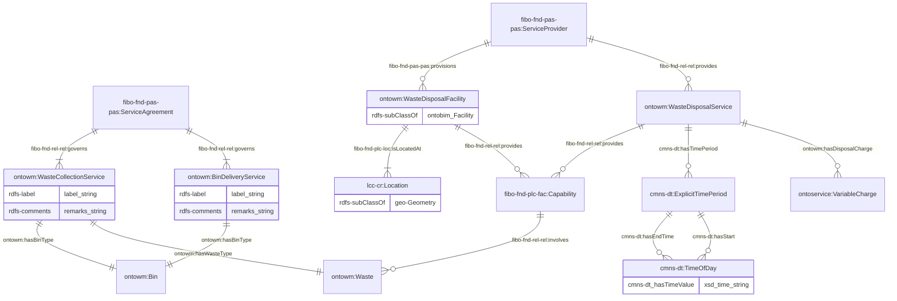

### 2.2.1 Service Lifecycle

In monitoring the services rendered during the lifecycle of a service agreement, the [OntoService](https://www.theworldavatar.com/kg/ontoservice/) ontology can describe, represent, and generate the occurences of the lifecycle, stages, and events according to the real-time occurrences of the service delivered. A comprehensive description of the lifecycle representation is available at [section 2.2 of OntoService](../ontoservice#22-service-agreement-lifecycle). Briefly, each stage will comprise of several events `ContractLifecycleEvent` which occurs multiple times, each represented by an `ContractLifecycleEventOccurrence` instance. These instances serves as a record to be analysed for quality, efficiency, and compliance with service agreements. Each occurrence can either holds during a date period or occur at an instantaneous time. During the service execution stage, there may be missed or terminated service events, that can be represented with the corresponding occurrence and descriptions/comments if they were to occur.

Figure 4: TBox representation for the service agreement's overall lifecycle

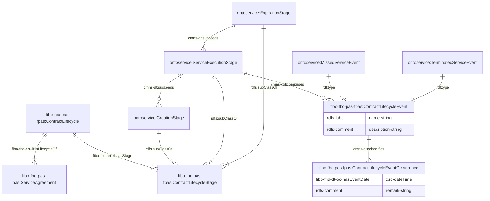

When the service agreement is initially drafted, upcoming scheduled service events are represented within a regular schedule. For each successful delivery occurrence of the requested service, a `ContractLifecycleEventOccurrence` instance is linked to both the schedule and `ServiceDeliveryEvent` instances. This occurrence usually represents the collection and/or exchange of bins from the service site that occurs within a time period. This event occurrence will also contain information about the transport(s) and bin(s) involved. Note that the `hasAssignedBin` relationship  is intended to designate a bin that is used throughout the entire occurrence. However, if the occurrence involves multiple bins at different stages, the `hasReplacementBin` relationship can be used to represent the initial empty bin that is transported to the site to replace the existing bin, which will then be taken away for disposal.

Figure 5: TBox representation of a service delivery event occurrence for waste services

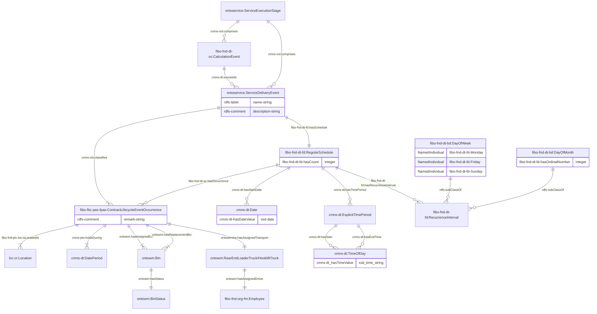

The amount of waste collected is also recorded through the use of the `CalculationEvent`. Do note that a `ServiceDeliveryEvent` must first occur before the `CalculationEvent`. An occurrence for the`CalculationEvent` event represents the calculation of the amount of waste disposed of at a specific waste disposal facility at a specific time. It consists of the deduction of the truck's unladen weight from the gross weight to get the net waste weight. If necessary, the type of waste can be retrieved from the service associated with this lifecycle. Note that the measurement unit of `tonne` is available in the `abox` file.

Figure 6: TBox representation of an occurrence of the calculation of the amount of waste disposed

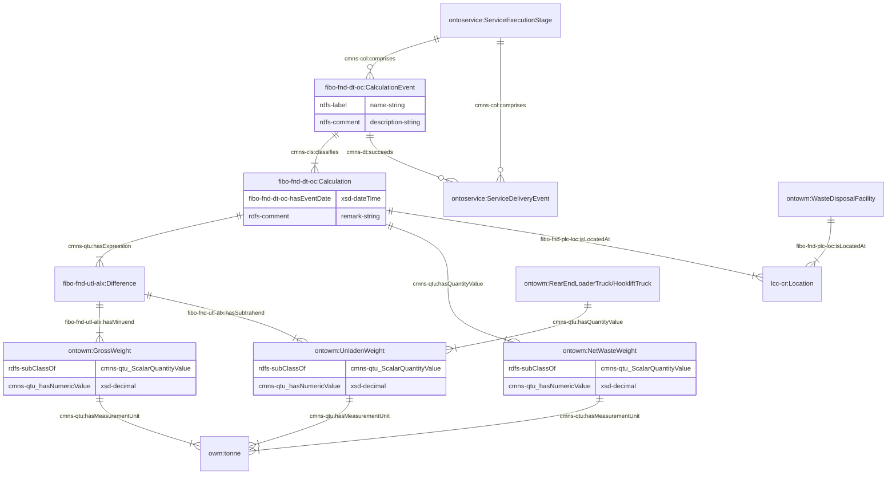

### 2.2.2 Waste categories

The following waste categories are represented in this ontology. Please find the respective descriptions within the ontology for more details.

1. Ash waste
2. Sludge waste
3. Construction and demolition waste
4. Electronic waste
5. Ferrous metal waste
6. Food waste
7. Fish waste
8. Vegetable waste
9. Glass waste
10. Horticultural waste
11. Tree trunk waste
12. Tree branches waste
13. Leaves waste
14. Non-ferrous metal waste
15. Aluminium waste
16. Stainless steel waste
17. Copper waste
18. Paper or cardboard waste
19. Paper waste
20. Old corrugated cardboard waste
21. Plastics waste
22. Polyethylene terephthalate (PET) waste
23. High-density polyethylene (HDPE) waste
24. Low-density polyethylene (LDPE) waste
25. Polypropylene (PP) waste
26. Polystyrene (PS) waste
27. Scrap tyres waste
28. Textile or leather waste
29. Used slag waste
30. Wood waste
31. Pallet waste
32. Furniture waste

Additionally, there is also a mixed waste category, which allows users to denote the composition of waste if required.

Figure 7: TBox representation of the waste composition for mixed waste

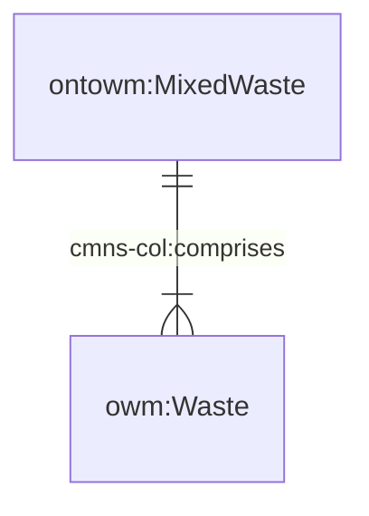

## 2.3 Assets

This ontology provides representation of assets managed by organisation with waste operations, such as bins and garbage trucks. These assets are also intended to have geospatial and temporal representations, which will typically follow the `geo:Feature` representation as follows:

Figure 8: TBox representation of geospatial and temporal representation of assets

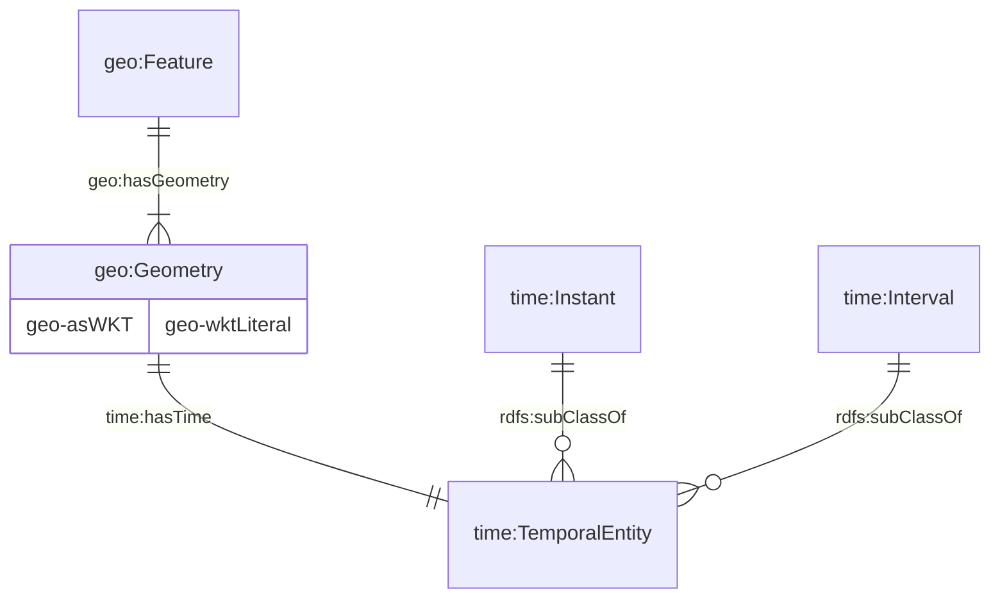

### 2.3.1 Truck

The following truck types are employed in the waste management sector:

1. **Rear End Loader Truck**: A truck designed for municipal waste collection, featuring a rear-loading mechanism with a hydraulic lift to compact waste into the truck body.
2. **Hooklift Truck**: A versatile truck equipped with a hydraulic hooklift system, used for transporting various container types, including heavy industrial and commercial waste containers.

Figure 9: TBox representation of a truck for the waste management sector

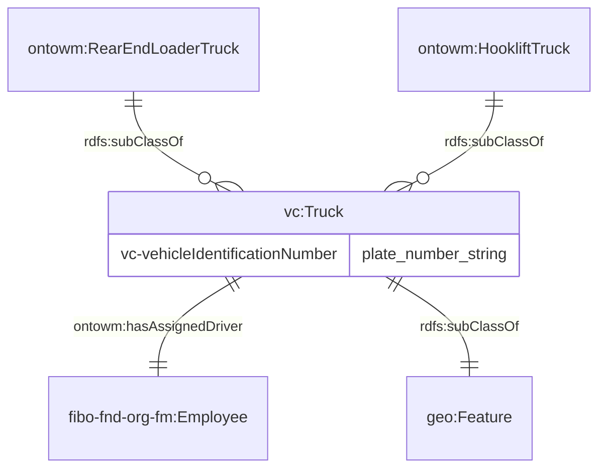

### 2.3.2 Bin

There are six categories of bins:

1. **OTC bin**: A bin for attaching to an OTC truck
2. **3-feet bin**: An open top container bin with a length of 3 feet
3. **5-feet bin**: An open top container bin with a length of 5 feet
4. **7-feet bin**: An open top container bin with a length of 7 feet
5. **Compactor bin**: An open top container bin with the ability to compact waste

Figure 10: TBox representation of a bin

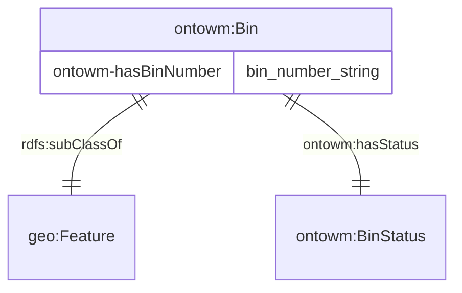

Bin statuses are also represented as enums in the corresponding ABox. The available statuses are as follows:

- Filled
- Empty
- Available
- Unavailable
- Decomissioned

## 2.4 Reporting

This section focuses on reporting matters such as billing, specifically as an the extension of the [OntoService](https://www.theworldavatar.com/kg/ontoservice/) ontology to the waste operation industry. The derived information framework is used in representing how the total price of a waste collection service is calculated and represented in the knowledge graph. The computation of the total price is as follows:

```math
Total Price = Gross Price + Tax \\
Gross Price = Base Charge + Variable Charge + Excess Variable Charge \\
Excess Variable Charge = (Net Waste Weight - Service Tonnage Cap) \\
Net Waste Weight = Gross Truck Weight - Unladen Truck Weight
```

Figure 11: ABox representation of the computation of the total price charged for each occurrence of a waste service

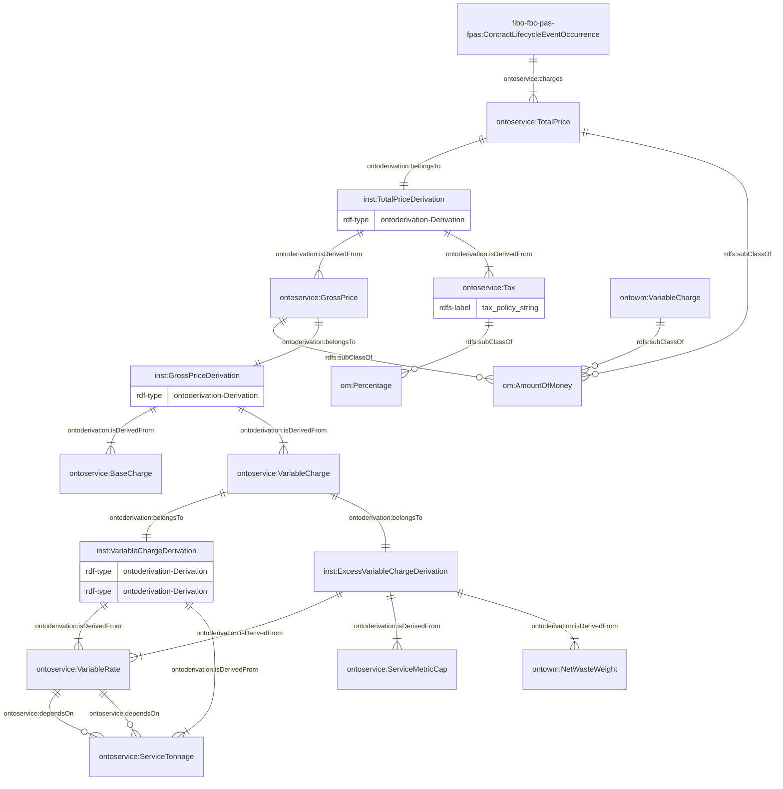
