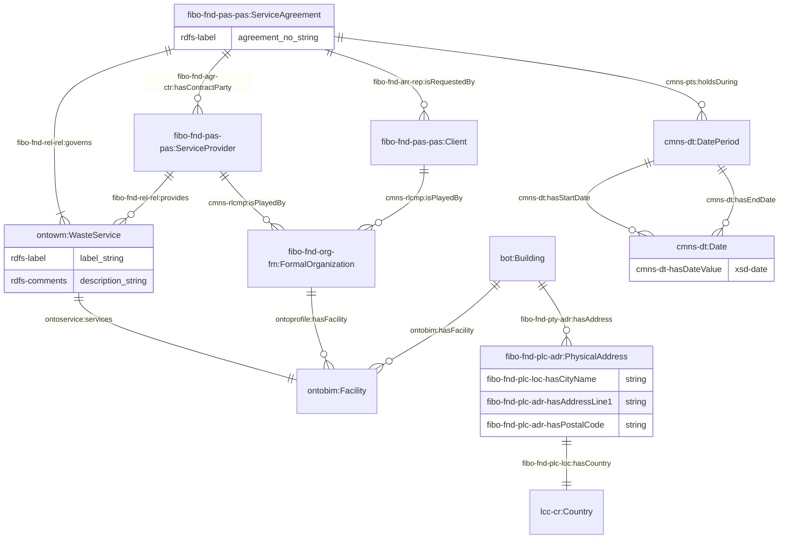
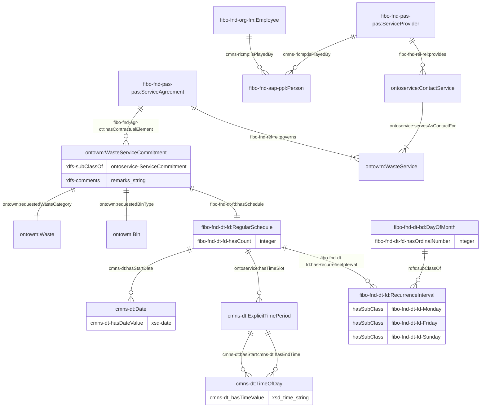
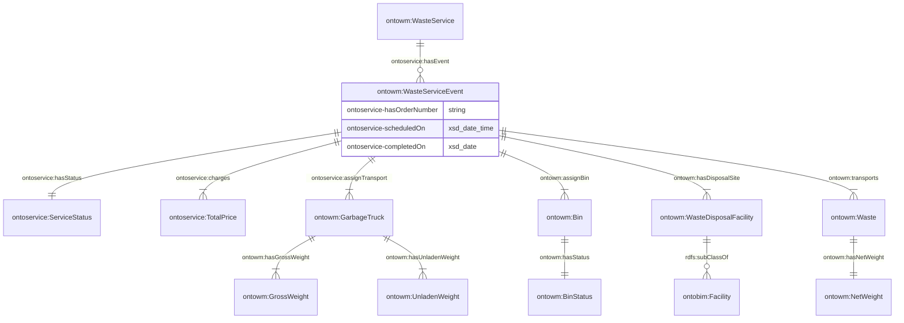
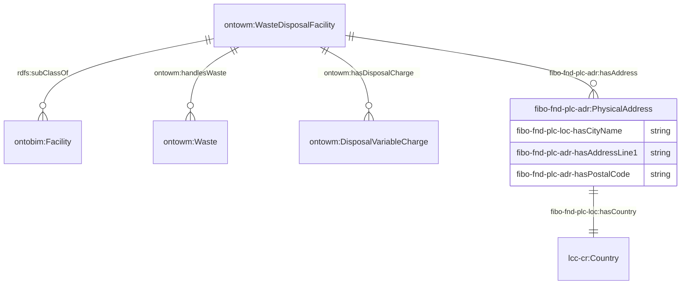
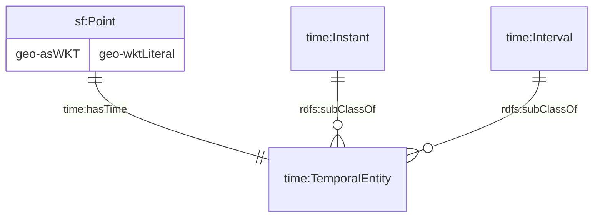
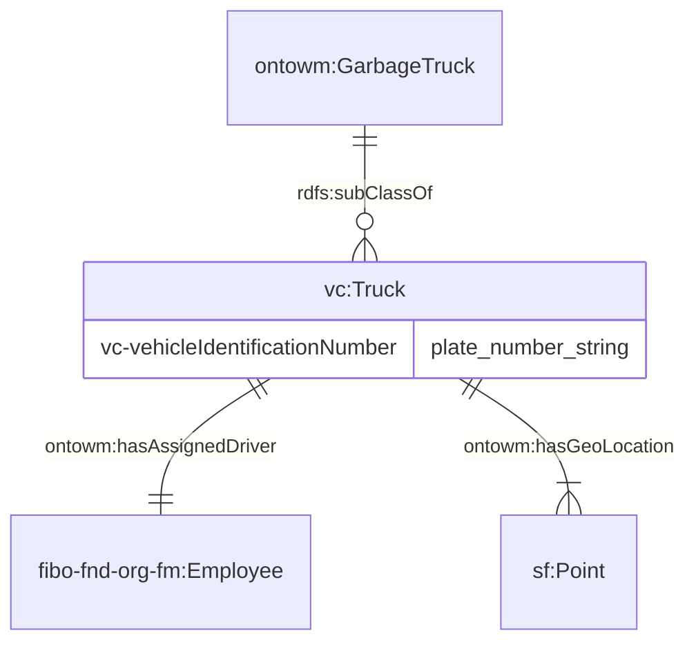
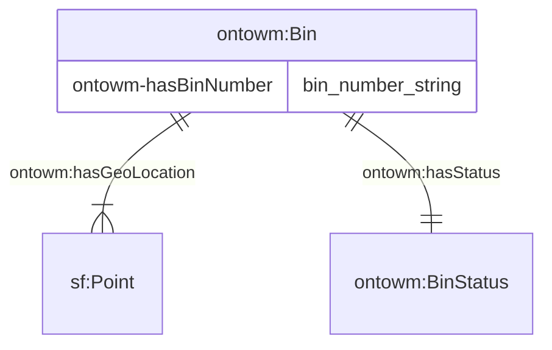
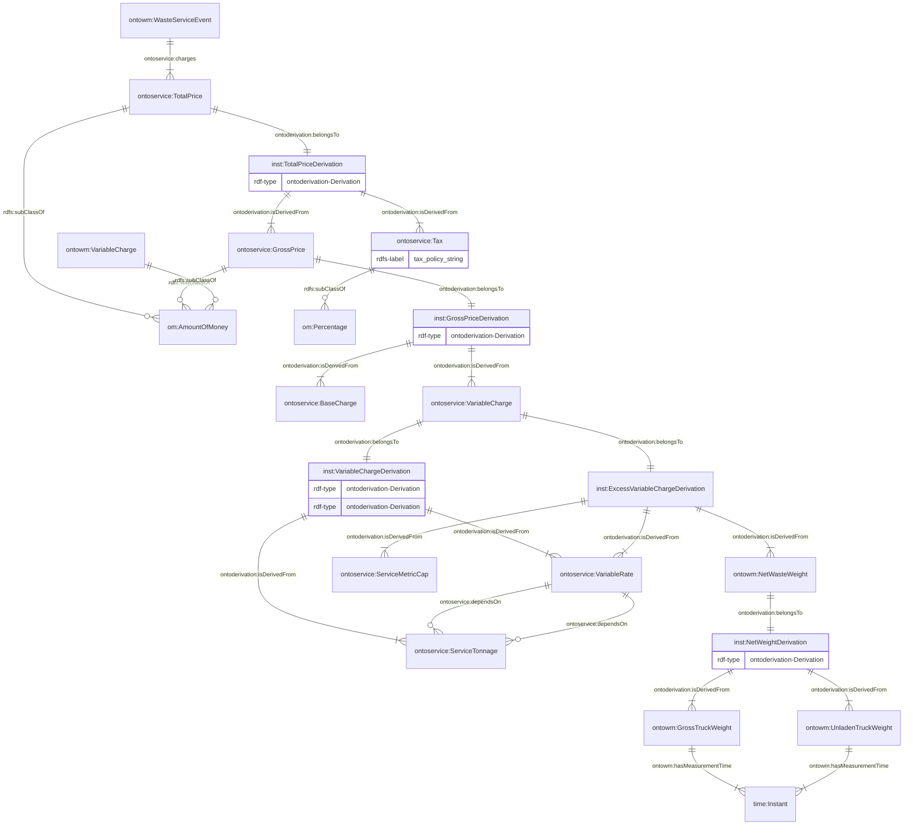

# 1. Ontology for Waste Management

OntoWasteManagement is designed to represent and support the day-to-day waste management operations, ranging from handling collection requests and billing reports, meeting reporting requirements, to fleet and bin management. This document serves to explain the modelling decisions and provide example usage of the ontology alongside the external ontologies.

The namespace for the ontology is:

<p align="center"><i>https://www.theworldavatar.com/kg/ontowastemanagement/</i></p>

## Table of Contents

- [1. Ontology for Waste Management](#1-ontology-for-waste-management)
- [2. Data Model](#2-data-model)
  - [Legend](#legend)
  - [2.1 Service Agreement](#21-service-agreement)
  - [2.2 Waste Services](#22-waste-services)
    - [2.2 Waste Categories](#221-waste-categories)
    - [2.2 Waste Disposal Facilities](#222-waste-disposal-facilities)
  - [2.3 Assets](#23-assets)
    - [2.3.1 Truck](#231-truck)
    - [2.3.2 Bin](#232-bin)
  - [2.4 Status](#24-status)
  - [2.5 Reporting](#25-reporting)

# 2. Data model

## Legend

| Prefix            | Namespace                                                                                 |
| ----------------- | ----------------------------------------------------------------------------------------- |
| cmns-col          | `https://www.omg.org/spec/Commons/Collections/`                                           |
| cmns-dt           | `https://www.omg.org/spec/Commons/DatesAndTimes/`                                         |
| cmns-dsg          | `https://www.omg.org/spec/Commons/Designators/`                                           |
| cmns-pts          | `https://www.omg.org/spec/Commons/PartiesAndSituations/`                                  |
| cmns-rlcmp        | `https://www.omg.org/spec/Commons/RolesAndCompositions/`                                  |
| fibo-fnd-agr-ctr  | `https://spec.edmcouncil.org/fibo/ontology/FND/Agreements/Contracts/`                     |
| fibo-fnd-arr-rep  | `https://spec.edmcouncil.org/fibo/ontology/FND/Arrangements/Reporting/`                   |
| fibo-fnd-aap-ppl  | `https://spec.edmcouncil.org/fibo/ontology/FND/AgentsAndPeople/People/`                   |
| fibo-fnd-dt-bd    | `https://spec.edmcouncil.org/fibo/ontology/FND/DatesAndTimes/BusinessDates/`              |
| fibo-fnd-dt-fd    | `https://spec.edmcouncil.org/fibo/ontology/FND/DatesAndTimes/FinancialDates/`             |
| fibo-fnd-pas-pas  | `https://spec.edmcouncil.org/fibo/ontology/FND/ProductsAndServices/ProductsAndServices/`  |
| fibo-fnd-pas-psch | `https://spec.edmcouncil.org/fibo/ontology/FND/ProductsAndServices/PaymentsAndSchedules/` |
| fibo-fnd-plc-adr  | `https://spec.edmcouncil.org/fibo/ontology/FND/Places/Addresses/`                         |
| fibo-fnd-plc-fac  | `https://spec.edmcouncil.org/fibo/ontology/FND/Places/Facilities/`                        |
| fibo-fnd-plc-loc  | `https://spec.edmcouncil.org/fibo/ontology/FND/Places/Locations/`                         |
| fibo-fnd-pty-pty  | `https://spec.edmcouncil.org/fibo/ontology/FND/Parties/Parties/`                          |
| fibo-fnd-rel-rel  | `https://spec.edmcouncil.org/fibo/ontology/FND/Relations/Relations/`                      |
| fibo-fnd-org-fm   | `https://spec.edmcouncil.org/fibo/ontology/FND/Organizations/FormalOrganizations/`        |
| lcc-cr            | `https://www.omg.org/spec/LCC/Countries/CountryRepresentation/`                           |
| om                | `http://www.ontology-of-units-of-measure.org/resource/om-2/`                              |
| sf                | `http://www.opengis.net/ont/sf#`                                                          |
| geo               | `http://opengis.net/ont/geosparql#`                                                       |
| time              | `https://www.w3.org/TR/owl-time/#time`                                                    |
| vcard             | `https://www.w3.org/2006/vcard/ns`                                                        |
| vc                | `https://spec.edmcouncil.org/auto/ontology/VC/VehicleCore/`                               |
| ontobim           | `https://www.theworldavatar.com/kg/ontobim/`                                              |
| ontoderivation    | `https://www.theworldavatar.com/kg/ontoderivation/`                                       |
| ontoprofile       | `https://www.theworldavatar.com/kg/ontoprofile/`                                          |
| ontoservice       | `https://www.theworldavatar.com/kg/ontoservice/`                                          |
| ontowm            | `https://www.theworldavatar.com/kg/ontowastemanagement/`                                  |

## 2.1. Service agreement

The basis of this ontology revolves around the `fibo-fnd-pas-pas:ServiceAgreement` concept to specify the agreed upon service requirements and terms. The general usage of this concept can be found as part of the [OntoService](https://www.theworldavatar.com/kg/ontoservice/) ontology, including its duration, involved parties, payment obligations, and commitments, as well as the organisation profiles in the [OntoProfile](https://www.theworldavatar.com/kg/ontoprofile/) ontology. This section specifically demonstrates the extension of `OntoService` and `OntoProfile` to the waste operation industry.

Figure 1: TBox representation for a Waste Service Agreement following the FIBO ontology



The service agreement will also mandate a waste service commitment, including the service time, schedule, waste category, bin type, and/or remarks. It is intended that this commitment does not instantiate any further attributes from their corresponding concepts but stores the repeated categories. A scheduler agent is expected to detect this state and ingest the initial knowledge in Figure 2 to optimise and arrange waste services with executable details.

Figure 2: TBox representation of the contractual obligations for the waste collection service



## 2.2. Waste services

In the waste operation industry, several waste services are available below. These services are then performed with a corresponding waste service event to represent that specific occurrence, and serves as a record to be analysed for quality, efficiency, and compliance with service agreements.

1. **Bin delivery service**: Delivery of an empty bin to site. Must be assigned to an OTC truck
2. **Bin exchange service**: Delivery of an empty bin to site while towing away the existing full bin. Must be assigned to an OTC truck
3. **Tow away service**: Collects and disposes of the waste from the service site without returning the bin afterwards. Must be assigned to an OTC truck
4. **Touch and go service**: Brings an empty bin to collect and dispose of the waste on the service site without returning the bin afterwards. Must be assigned to an OTC truck
5. **Dump and return service**: Brings an empty bin to collect and dispose of the waste on the service site and returns the bin afterwards. Must be assigned to an OTC truck

This section specifically demonstrates the extension of the `ServiceEvent` concept in the [OntoService](https://www.theworldavatar.com/kg/ontoservice/) ontology to the waste operation industry. The scheduler agent is expected to generate a new service event instance based on the associated service commitment and payment obligations following their service intervals.

Figure 3: TBox representation of a waste service event



## 2.2.1 Waste categories

The following waste categories are represented in this ontology:

1. Industrial waste
2. Hardcore waste
3. Sludge waste
4. Biological waste
5. Horticultural waste
6. Tree waste
7. Mixed waste
8. General waste
9. Recycled waste
10. Paper waste
11. Metal waste
12. Plastic waste
13. Glass waste
14. Electronic waste

## 2.2.2 Waste disposal facilities

The waste collected during a waste service often have to be disposed at a particular facility, which is represented in the following manner:

Figure 4: TBox representation of waste disposal facilities



## 2.3 Assets

This ontology provides representation of assets managed by organisation with waste operations, such as bins and garbage trucks. These assets are also intended to have geospatial and temporal representations, which will typically follow the `sf:Point` representation as follows:

Figure 5: TBox representation of geospatial and temporal representation of assets



### 2.3.1 Truck

Figure 6: TBox representation of a garbage truck



### 2.3.2 Bin

There are six categories of bins:

1. **OTC bin**: A bin for attaching to an OTC truck
2. **3-feet bin**: An open top container bin with a wall height of 3 feet
3. **5-feet bin**: An open top container bin with a wall height of 5 feet
4. **7-feet bin**: An open top container bin with a wall height of 7 feet
5. **Compactor bin**: An open top container bin with the ability to compact waste

Figure 7: TBox representation of a bin



## 2.4 Status

The ontology represents statuses as enums in the corresponding ABox. The available statuses are as follows:

1. Bin Status

   - Filled
   - Empty
   - Available
   - Unavailable
   - Decomissioned

## 2.5 Reporting

This section focuses on reporting matters such as billing, specifically as an the extension of the [OntoService](https://www.theworldavatar.com/kg/ontoservice/) ontology to the waste operation industry. The derived information framework is used in representing how the total price of a waste collection service is calculated and represented in the knowledge graph. The computation of the total price is as follows:

```math
Total Price = Gross Price + Tax \\
Gross Price = Base Charge + Variable Charge + Excess Variable Charge \\
Excess Variable Charge = (Net Waste Weight - Service Tonnage Cap) \\
Net Waste Weight = Gross Truck Weight - Unladen Truck Weight
```

Figure 8: ABox representation of the computation of the total price charged for a waste service

