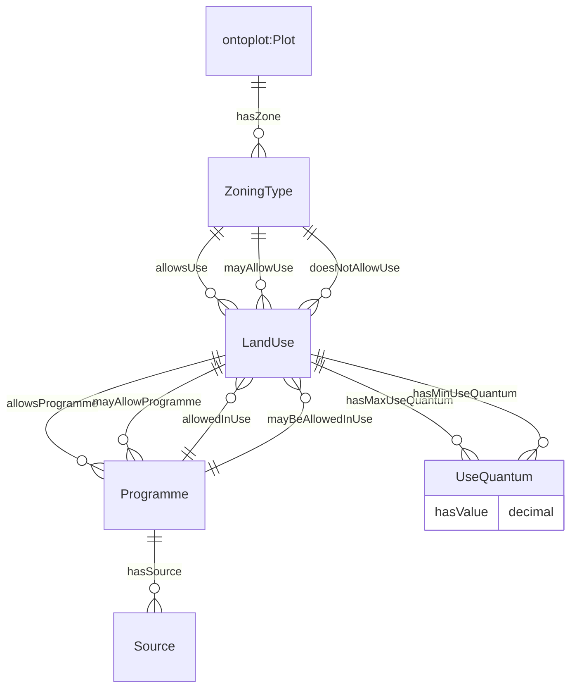

# OntoZoning
## 1. Introduction
OntoZoning is an ontology developed to represent relationships between zoning types, land uses and programmes (more specific land uses) for a land plot. A simple overview of the data model is illustrated in Figure 1. The detailed zoning types, land uses, and programmes is available within the ontology itself. 

*Figure 1. Data model for OntoZoning*

## 2. Modelling Decisions
>ZoningType

- As defined in Singapore's Master Plan 2019, there are 32 unique zoning types, which have been incorporated into this ontology. These zones may host multiple land uses. 
- All zoning types have a 'Zone' suffix in their class names to bring clarity, especially given the presence of a 'SpecialUse' zoning type.

>LandUse

- The term 'land use' is interpreted to refer to broad categories of land use types tied to specific zoning types in Singapore, and have implications on legal status and exhaustivity. Namely, `ZoningType` determine the finite number of specific land uses (i.e. instances of `LandUse`) that are allowed within their boundaries, but each `LandUse` could allow a unique and infinite set of 'programmes'. 
- This definition combines activities, physical forms and ownership types to bind land regulations to a specific land use and thus, plot.
- Class naming structure can be categorised as:

Outcome | ZoneType | LandUse 
--- | --- | ---
***One-to-one linking*** | ***One zone type*** | ***One land use***
Garden<ins>Use</ins> | SportsAndRecreation | GardenUse
Airport<ins>Use</ins> | Airport | AirportUse
Interim<ins>Use</ins> | ReserveSite | InterimUse
|  |
***One-to-many linking*** | ***One zone type*** | ***Multiple land uses with different purpose***
BuiltOpenSpace<ins>Use</ins> | OpenSpace | BuiltOpenSpaceUse
UnbuiltOpenSpace<ins>Use</ins> | OpenSpace | UnbuiltOpenSpaceUse
|  |
ReligiousMain<ins>Use</ins> | PlaceOfWorship | ReligiousMainUse
AncillaryNonReligious<ins>Use</ins> | PlaceOfWorship | AncillaryNonReligiousUse
AncillaryReligious<ins>Use</ins> | PlaceOfWorship | AncillaryReligiousUse
|  |
***Many-to-one linking*** | ***Mutiple zone type*** | ***One land use with the same purpose***
Commercial<ins>Use</ins>Commercial | Commercial | CommercialUse
Commercial<ins>Use</ins>Business1 | Business1 | CommercialUse
Commercial<ins>Use</ins>Hotel | Hotel  | CommercialUse
|  |
***One-to-many linking*** | ***Same zone type*** | ***Multiple land uses with different purpose***
Main<ins>Use</ins>Business1 | Business1  | MainUse
Ancillary<ins>Use</ins>Business1 | Business1 | AncillaryUse
|  |
Main<ins>Use</ins>BusinessPark | BusinessPark | MainUse
Ancillary<ins>Use</ins>BusinessPark | BusinessPark | AncillaryUse
|  |
***Unique Exceptions***|  |
OtherUseUnderElevatedRoad | |
CommunityInstitutionExcludingDormitoryAndFuneral | |

>Programme

- `Programme` is a class concept introduced to refer to statements related to examples in the URA Written Statement. This concept may correspond interchangeably with the 'development' or 'use' concepts in the Written Statement.
- Programmes are specific land uses, built structures, or building parts that are allowed in one or more `LandUse` category. Programmes are universal concepts that may be found in any country; our current list of Programmes is non-exhaustive, and the class set is infinite by definition. This universal and non-exhaustive class allows the exhaustively defined regulatory framework to function (i.e. it removes the need to regulate use exhaustively). 
    - E.g. `CommercialUseHotel mayAllowProgramme Restaurant`
    - E.g. `WhiteUseBusinessPark mayAllowProgramme Restaurant`
- Every programme has a data source defining the source of the concept name. This allows us to extend the applications beyond the limited scope of the URA Written Statement and other planning regulations in Singapore. The data sources are as follows:
    - URA Written Statement
    - Google Places data
    - The [LBCSv2](https://enterpriseintegrationlab.github.io/icity/LandUse/LandUse_1.1/doc/index-en.html) land use ontology.

>UseQuantum

- Use quantums are detailed regulations attached only to land uses. They describes the ratio of allowed uses, if multiple uses are allowed within the specific zoning type.

> Class Naming

- Exceptions to the class naming of `ZoneType`, `LandUse`, and `Programme` may arise from difficulties in distinguishing these concepts with their names alone. 
- In the event, this occurs, the concepts will follow the following structure:
    - Cemetery, CemeteryUse and CemeteryProgramme
    - SpecialUseZone, SpecialUse, Special
    - ReserveSite, InterimUse, Interim
    - SportsAndRecreation, MarinaUse, Marina

Concept | Nomenclature 
--- | --- 
Zone | **name** 
Land Use | always **name**  +  **‘Use’**
Programme | in special cases **name + ‘Programme’**, otherwise **name**
