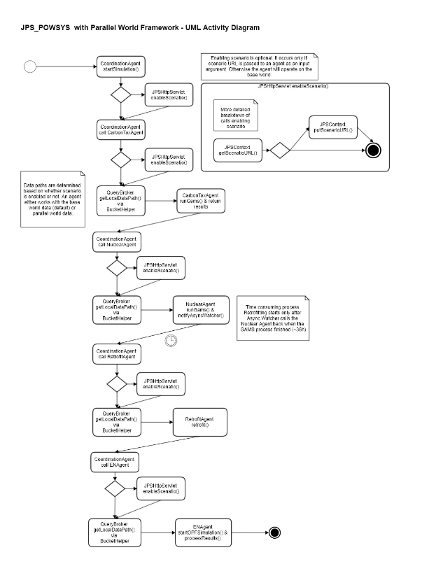

# README for JPS POWSYS

## Java Dependencies
1. jps-base-lib
2. Junit
3. Javax servlet
4. opencsv (to parse CSV file)
5. commons-validator (used to validate file types)
6. commons-io

## What to do for deployment? 
1. You need to get your GAMS installation: (optional if you are just working on front end)
   - GAMS needs to be installed from GAMS site. As of now, versions 26-30 work
   - Get the license. You can get the pre-existing one from Claudius
   - Place your GAMSDIR in your system environment directory. 
2. Transfer the relevant folder: kb\sgp\jurongisland\jurongislandpowernetwork, into your TOMCAT\webapps\ROOT directory. 
3. Transfer testfinaltestPOWSYSNuclearStartSimulationAndProcessResultAgentCallForTestScenario10 from C:\JPS_DATA\workingdir\JPS_SCENARIO\scenario in Claudius. This contains the last run simulation from nuclear scenario. 
4. mvn clean install JPS POWSYS. 
5. node app web/CO2WEB/app.js
   - Comment Line 2, Uncomment Line 3 in \web\CO2Web\public\javascripts\pwBaseFile.js when deploying in Claudius
6. Download Python 3 for OPF simulation (so pip install pypower, scipy, numpy) 
7. Expected Result: Upon deployment, by loading the page localhost:82/pwscenario
   i. A google map appears with Jurong Island Power Grid outlined in red and with markers denoting the plants
   ii. Switch context from Base to Scenario using the dropdown list. 
   iii. Once this button is pressed, a spinning blue symbol appears. Once the spinning blue symbol disappears, the powergrid is now enhanced. Nuclear reactors are attached to the power grid. 
8. Clone JPS_AWS git from Vienna
   
## How does it run? 

1. The flow of the program is illustrated in the Activity Diagram above. 
2. The scenario agent is first called by the end-user deciding to enable the Parallel World framework. It creates a 'parallel world' which the base world is duplicated before forwarding the request to the Coordination Agent along with the unique scenario ID of the 'parallel world' 
3. The Coordinate Agent, referred to as C, receives the forwarded request and starts the following chain of events. 
4. The Carbon Tax Agent is called with a carbon tax amount and the IRI of the power grid (in this case, Jurong Island). The Carbon Tax Agent would query for generators on the power grid, and returns information about generating cost, carbon emissions and the target carbon tax value decided by running GAMS. 
5. Once Carbon Tax Agent generates a list of replaceable generators back to the coordination agent (might be empty), C goes to the Nuclear Agent. 
6. Nuclear Agent optimizes the number and capacities of substitutional SMRs of different types and their location on Jurong Island. It queries the JPS knowledge graph for the list of landlots on Jurong Island and design capacity of the replaceable generators. 
7. The Nuclear Agent would create new named graphs (or instances) for the SMRs, which will substitute the replaceable generators in the parallel world. 
8. Due to Nuclear Agent taking a 36 hour runtime, the asynchronous watcher service is deployed (See JPS_AWS). 
9. Once C receives the optimization result from Nuclear Agent, it passes the list of replaceable generators from Carbon Tax Agent and the optimization result to the Retrofit Agent. 
10. General Retrofit Agent is the main class which all other retrofit agents inherit from. Retrofit Agent is the one we're looking at. 
11. Retrofit Agent connects the SMRs to the closest electric buses, thus it is writing to the knowledge graph. 
12. The task of the run is done. However, there is an additional operational phase that heavily involves the front end as well as EN Agent and EN Visualization. 
13. The end user could proceed to change the power load and run optimized power flow (OPF) to determine the change in carbon emissions produced by this new system. 
14. EN Agent is triggered by pressing on the OPF button when the end user clicks on a bus/cable/generator. EN Agent takes in the IRI of the power grid as its input. 
15. As this replica is modified, the base world remains untouched. 
16. The Aggregation Emission Agent is involved in calculating the sum total of emissions from each of the five power plants and their generators and is called by the front end as well. 

## There's something wrong? I can't deploy this!
- This applies to the visualization portion. 
- First, check if the test  `testRunPythonScript` in TestEN is working. It calls the agent directly. 
- Second, check if the test `testStartSimulationOPFDirectCallNonBaseScenario` in TestEN is working. This calls EN Agent through a scenario directly
- Third, check if `testStartSimulationOPFDirectCallBaseScenario` in TestEN works. It calls the EN Agent as a whole, without going through a scenario and without going through an agent. 
- Fourth, check if `testStartSimulationOPFAgentCallNonBaseScenario` in TestEN works. It calls the EN Agent through a scenario case. We do not call OPF agent through base scenario because we want to preserve the state of EN Agent.  
- Fifth, if both of the above conditions run without errors, then it's most likely due to the visualization being broken on the JS side. It could be that you are reading from the wrong location (at which case, look at \web\CO2Web\public\javascripts\pwBaseFile.js, Line 2. Enable it to Line 3, and it should be reading from Claudius rather than local deployment. 
- Sixth, if the above condition is already checked, run all tests in TestENVisualization. 
- Possible errors on the backend could include: 
  1. Check if the domain name is available on Claudius.
  2. GAMS not being installed and hidden under GAMS DIR. If you don't want to change your directory name, then Line 105 of EnergyStorageSystem should be changed to where your GAMS is installed. 
  3. Python not being installed
  4. Relevant OWL files not being present. To solve this, please download the relevant folder: kb\sgp\jurongisland\jurongislandpowernetwork into your TOMCAT\webapps\ROOT directory. 
  5. You might need to download your Jurong Island Power Network files under /kb/sgp/jurongisland/jurongislandpowernetwork if you were playing with them in POWSYS. This can be called if it stalls at EN Agent under a `NullPointerException`. So copy a backup from either Claudius at C:\TOMCAT\webapps\ROOT\kb\sgp\jurongisland\jurongislandpowernetwork\BACKUP2021 into C:\JPS_DATA\workingdir\JPS_SCENARIO\scenario\testPOWSYSNuclearStartSimulationAndProcessResultAgentCallForTestScenario10\www_jparksimulator_com\kb\sgp\jurongisland\jurongislandpowernetwork

## TODO: 
 - [ ] Tests are not fully working! EN Agent, EN Visuzalization and Aggregation Emission Agent are working, but Nuclear has a long run time. 
 - [ ] virtual environment for python
  