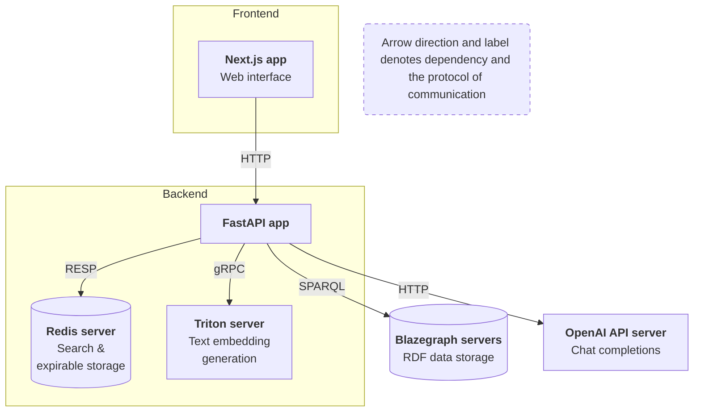
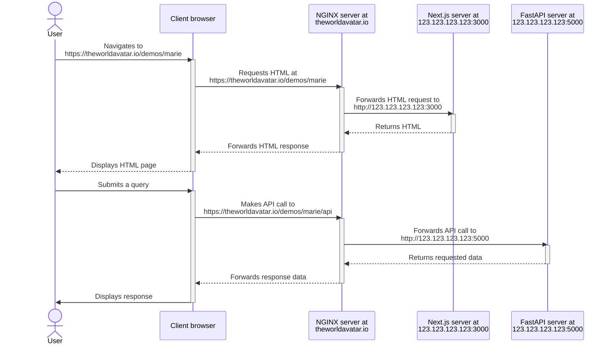

# Question-Answering System for The World Avatar

## Table of Contents

- [Question-Answering System for The World Avatar](#question-answering-system-for-the-world-avatar)
  - [Table of Contents](#table-of-contents)
  - [Introduction](#introduction)
  - [Architecture](#architecture)
  - [Project Structure](#project-structure)
  - [Deployment with NGINX Configuration](#deployment-with-nginx-configuration)
    - [Overview of the target state of the deployed system](#overview-of-the-target-state-of-the-deployed-system)
    - [Prerequisities](#prerequisities)
    - [Required resources](#required-resources)
    - [Steps](#steps)
  - [Usage](#usage)

## Introduction

The Question-Answering System for The World Avatar involves retrieving data from RDF graphs and other data sources such as HTTP endpoints. To do so, input questions need to be converted into SPARQL queries and HTTP requests, whose execution would yield the desired data. The conversion of natural language queries to data requests is facilitated by in-context learning (ICL), which entails engineering a text prompt for Large Language Models (LLMs) to automatically perform the transformation. The prompt may include context information such as parsing examples and the structure of target predictions.

Key Features

- Utilises in-context learning for semantic parsing
- Supports multiple data sources including RDF graphs and HTTP endpoints
- Employs LLMs for natural language understanding
- Provides a user-friendly frontend interface
- Includes utilities for data preparation


## Architecture

1. Frontend: **Next.js app** serves as the web interface.
2. Backend: 
    - **FastAPI app**: handles requests from Next.js app with the help of other services.
    - **Redis**: helps with
      - search, including vector similarity and text-based search for retrieving LLM inference contexts and entity linking;
      - expirable storage of QA requests and responses.
    - **Triton server**: serves Sentence-BERT model for text embedding generation via gRPC.
3. External services:
   - **Blazegraph servers**: store and expose RDF data via SPARQL.
   - **OpenAI API server**: provides chat completions API.




## Project Structure

The project is organised into the following directories:

- `data_generation/`: contains utility scripts to help with preparing datasets required by the backend.
- `backend/`
  - `fastapi_app/`: source code for FastAPI application.
  - `triton_inference_server/`: contains the config to serve the Sentence-BERT model.
- `frontend/` 
  - `mock_backend/`: source code for Express server to mock backend API.
  - `next_app_marie/`: source code for Marie's Next.js app.


## Deployment with NGINX Configuration

This section outlines how the entire application can be deployed in a single remote server with NGINX reverse proxy.

**Deployment outcome**: Users can access the web interface of the application at https://theworldavatar.io/demos/marie.

### Overview of the target state of the deployed system

Throughout this section, we assume that the IP address of the remote server hosting the application is `123.123.123.123`.

The desired state of the deployed system is as follows. 
- FastAPI server running at http://123.123.123.123:5000.
- Next.js server running at http://123.123.123.123:3000.
- NGINX server redirects:
  - https://theworldavatar.io/demos/marie to http://123.123.123.123:3000.
  - https://theworldavatar.io/demos/marie/api to http://123.123.123.123:5000.
- Next.js server is configured with the SSL-encrypted public address of the backend server https://theworldavatar.io/demos/marie/api.

Please note that this target state necessitates that the FastAPI endpoint be exposed over HTTPS so that the HTML/JS code in the client browser loaded from an secure origin, i.e. https://theworldavatar.io/demos/marie, can safely make requests to the backend without getting blocked by the browser due to [mixed content](https://developer.mozilla.org/en-US/docs/Web/Security/Mixed_content).



### Prerequisities

 - Docker (Docker Engine, Docker CLI, and Docker Compose) installed in the remote server for hosting the application.
 - Edit rights to the NGINX server's configuration.

### Required resources

- ONNX file for Sentence-BERT model weights:
  - To be placed in [`backend/triton_inference_server/model_repository/mpnet/1/`](backend/triton_inference_server/model_repository/mpnet/1/).
  - See `triton_inference_server`'s [README](backend/triton_inference_server/README.md#required-resources) for how to obtain this ONNX file.
- Datasets to be ingested into Redis need to be placed in the following directories.
  - [`backend/fastapi_app/data/lexicon`](backend/fastapi_app/data/lexicon/): JSON files for lexicons of entities that require linking with Redis. Each file is an array of `Lexicon` objects.
  - [`backend/fastapi_app/data/schema/properties`](backend/fastapi_app/data/schema/properties): JSON files for information on KG predicates. Each file is an array of `GraphItemType` objects.
  - [`backend/fastapi_app/data/nlq2datareq_examples`](backend/fastapi_app/data/nlq2datareq_examples/): JSON files for semantic parsing examples. Each file is an array of `Nlq2DataReqExample` objects.
  - [`backend/fastapi_app/data/qtRecog_examples`](backend/fastapi_app/data/qtRecog_examples/): JSON files for quantity recognition examples. Each file is an array of `QtRecogExample` objects.
  - See `data_generation`'s [README](./data_generation/README.md#json-schema-definitions) for the JSON schemas.

### Steps

1. SSH into the remote server that will host the application.

2. Clone TWA repository and navigate to the `QA_ICL` directory.
   
   ```bash
   cd TheWorldAvatar/QuestionAnswering/QA_ICL/
   ```

3. Spin up the backend services and ingest relevant data into Redis by executing the following command.

   ```bash
   sh deploy.sh
   ```

   The FastAPI app should be listening at http://123.123.123.123:5000. To verify that it is running, visit http://123.123.123.123:5000/docs in a browser and check if a Swagger UI for API documentation is shown.

4. Configure NGINX redirect for the backend endpoint. Trailing forward slashes `/` are allowed.
   ```
   location /demos/marie/api/ {
     proxy_pass    http://123.123.123.123:5000/;
     ...
   }
   ```
   KIV: Implement a health endpoint GET `/health` and so that the redirect can be verified by checking that GET `https://theworldavatar.io/demos/marie/api/health` returns 200.

5. Frontend setup:
   1. Configure the backend endpoint for the Next.js app by creating a `.env.local` file under `frontend/next_marie_app/` with the following content (note the trailing forward slash).
      ```
      NEXT_PUBLIC_BACKEND_ENDPOINT=https://theworldavatar.io/demos/marie/api/
      ```
   2. Verify that the `BASE_PATH` value in [`.env.production`](frontend/next_app_marie/.env.production) is set to `/demos/marie`.
   3. Build the image and launch the container.
      ```bash
      docker build -t next-app-marie .
      docker run --name next-app-marie -p 3000:3000 next-app-marie
      ```
      The Next.js server should be listening at http://123.123.123.123:3000/demos/marie. To verify that it is running, visit http://123.123.123.123:3000/demos/marie in a browser and check if the home page is displayed.

6. Configure NGINX redirect for the frontend endpoint. Trailing forward slashes `/` are **NOT ALLOWED**.
   ```
   # correct
   location /demos/marie {
     proxy_pass    http://123.123.123.123:3000/demos/marie;
     ...
   }

   # wrong
   location /demos/marie/ {
     proxy_pass    http://123.123.123.123:3000/demos/marie/;
       ...
   }
   ```
   To verify that the redirect works, visit https://theworldavatar.io/demos/marie in a browser and check if the home page is displayed.

## Usage

Visit https://theworldavatar.io/demos/marie or http://123.123.123.123:3000 to access the web interface and start interacting with the system.
