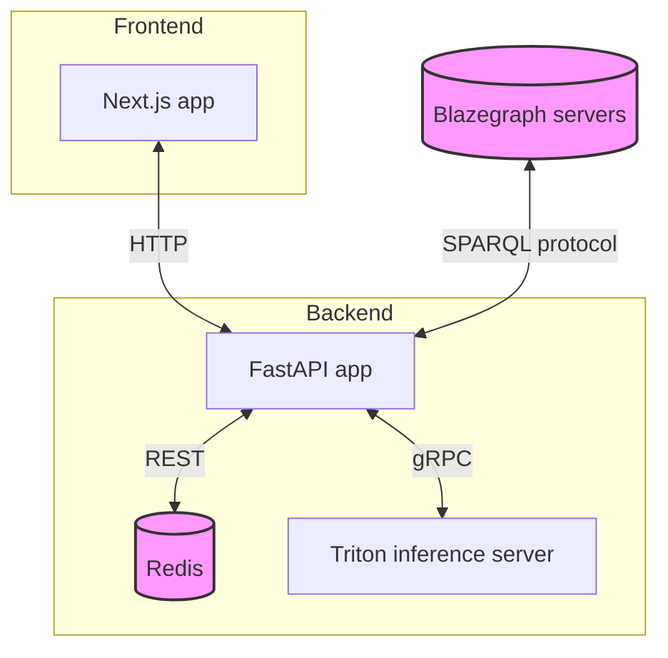

# Question-Answering System for The World Avatar

## Table of Contents
- [Question-Answering System for The World Avatar](#question-answering-system-for-the-world-avatar)
  - [Table of Contents](#table-of-contents)
  - [Introduction](#introduction)
    - [Key Features](#key-features)
  - [Architecture overview](#architecture-overview)
  - [Key Components](#key-components)
  - [Project Structure](#project-structure)
  - [Getting Started](#getting-started)

## Introduction

Question-answering for The World Avatar involves retrieving data from RDF graphs and other data sources such as HTTP endpoints. To do so, input questions need to be converted into SPARQL queries and HTTP requests, whose execution would yield the desired data. The conversion of natural language queries to data requests is facilitated by in-context learning, which entails engineering a text prompt for LLMs to automatically perform the transformation. The prompt may include context information such as parsing examples and the structure of target predictions.

### Key Features
- Utilises in-context learning for query transformation
- Supports multiple data sources including RDF graphs and HTTP endpoints
- Employs Large Language Models (LLMs) for natural language understanding

## Architecture overview

## Key Components
1. **Frontend**: A Next.js application serving as the user interface.
2. **Backend**: A FastAPI application handling core logic and data processing.
    - **Redis**: Caches frequently accessed data for improved performance.
    - **Triton Inference Server**: Manages machine learning model inference.
3. **Blazegraph Servers**: Store and manage RDF data, accessible via SPARQL protocol.

## Project Structure

The project is organized into the following main directories:

- `data_generation/`: Python scripts for entity linking and in-context learning data preparation.
- `backend/`: Contains the FastAPI application serving as the system's backend.
- `frontend/`: Houses the Next.js application for the user interface.

## Getting Started

