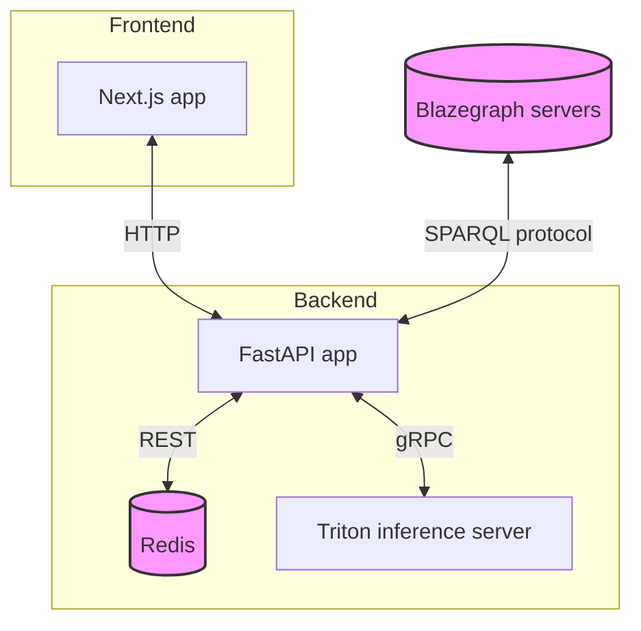

# Question-Answering System for The World Avatar

## Table of Contents
- [Question-Answering System for The World Avatar](#question-answering-system-for-the-world-avatar)
  - [Table of Contents](#table-of-contents)
  - [Introduction](#introduction)
    - [Key Features](#key-features)
  - [Architecture overview](#architecture-overview)
  - [Key Components](#key-components)
  - [Project Structure](#project-structure)
  - [Getting Started](#getting-started)
    - [Prerequisities](#prerequisities)
    - [Installation](#installation)
    - [API Documentation](#api-documentation)
    - [Usage](#usage)

## Introduction

The Question-Answering System for The World Avatar involves retrieving data from RDF graphs and other data sources such as HTTP endpoints. To do so, input questions need to be converted into SPARQL queries and HTTP requests, whose execution would yield the desired data. The conversion of natural language queries to data requests is facilitated by in-context learning (ICL), which entails engineering a text prompt for Large Language Models (LLMs) to automatically perform the transformation. The prompt may include context information such as parsing examples and the structure of target predictions.

### Key Features
- Utilises in-context learning for query transformation
- Supports multiple data sources including RDF graphs and HTTP endpoints
- Employs LLMs for natural language understanding
- Provides a user-friendly frontend interface
- Offers efficient backend processing with caching and inference capabilities
- Includes tools for data generation and preparation

## Architecture overview

The architecture of the project consists of a frontend (user interface), a backend (handling queries, model inference, and Knowledge Graph access), and additional data generation modules. These components communicate through RESTful APIs and other protocols. 



## Key Components
1. **Frontend**: A Next.js application serving as the user interface.
2. **Backend**: A FastAPI application handling core logic and data processing.
    - **Redis**: Caches frequently accessed data for improved performance.
    - **Triton Inference Server**: Manages machine learning model inference.
3. **Blazegraph Servers**: Store and manage RDF data, accessible via SPARQL protocol.

## Project Structure

The project is organised into the following main directories:

- `data_generation/`: Python scripts for entity linking and ICL data preparation. The scripts generate three kinds of data:
  - Lexicon: A collection of ontology representations in texts for classes, predicates, or entities.
  - Simplified graph schema: Captures node types, edge types, and relation types.
  - Examples of data request: Pairs of natural language queries and their corresponding data requests for ICL.
- `backend/`: The backend, called Marie Backend, it contains the FastAPI application serving as the system's backend. It consists of two main components:
  - `fastapi_app`: A FastAPI application.
  - `triton_inference_server`: Serves the Sentence-BERT model for text embedding and inference.
- `frontend/`: The frontend, called Marie Frontend, serves as the user interface for interacting with the backend services. Built using Next.js, it communicates with the backend to perform operations such as querying chemical species and filtering zeolites, and displays the results to users in a user-friendly manner.

## Getting Started

### Prerequisities
 - Docker (recommended for deployment)
 - Python 3.8 or higher
 - Node.js and npm (for frontend development)

### Installation
1. Clone the TWA repository and go to the QA_ICL folder

    ```
    cd TheWorldAvatar/QuestionAnswering/QA_ICL/
    ```

2. Setup the backend: 
   - Follow the instructions in `backend/README.md` to prepare required data and configure parameters.

   - For Docker deployment (recommended):

      ```
      cd backend
      sh deploy.sh
      ```

   - For  manual setup, refer to the backend README.

3. Set up the frontend:
   - Navigate to the `frontend/next_app_marie` directory.
   - Install dependencies:
      ```
      npm install
      ```
    - Configure the backend endpoint in the `.env` file.
4. (Optional) Set up the data generation environment:
    - Create a virtual environment (recommended):
      ```
      conda create --name data-env python=3.8
      conda activate data-env
      ``` 

    - Install dependecies:
      ```
      cd data_generation
      pip install -r requirements.txt
      ```

### API Documentation
Once the backend is running, you can access the API documentation at: `http://localhost:5000/docs`.

This interactive documentation provides detailed information about available endpoints, request/response formats, and allows you to test the API directly from your browser.

### Usage
1. Start the backend services.
2. Start the frontend development servers.
3. Access the application at `http://localhost:3000` (or the port specified in your frontend configuration).