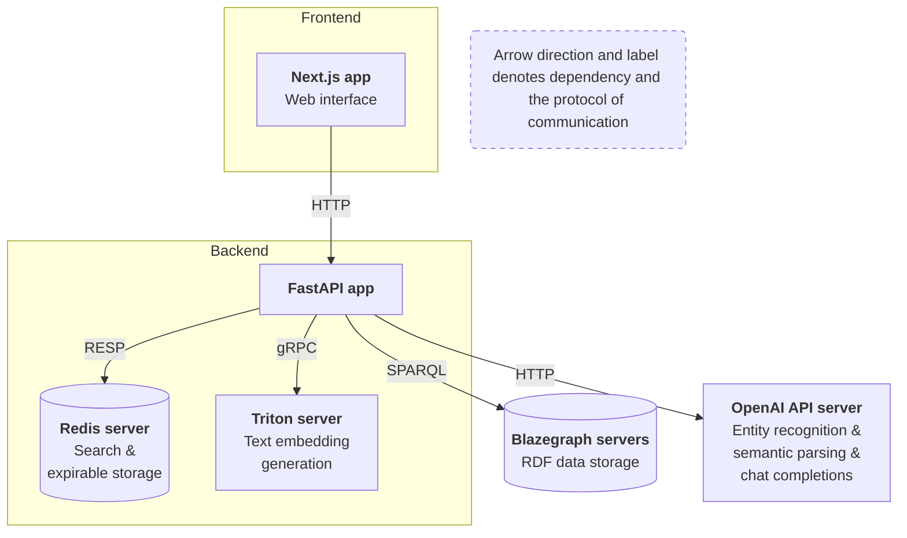
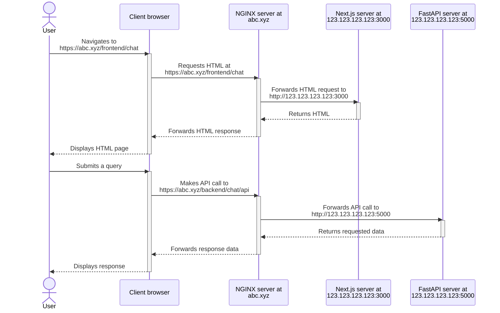

# Question-Answering System for The World Avatar

## How to Use This Documentation

- For a complete production deployment guide, including Docker setup and NGINX configuration, read this README file in its entirety.
- For component-specific setup or development instructions, refer to the linked README files in the [Project Structure](#project-structure) section.
- The production deployment guide in this README is self-contained and can be followed without referencing other documents.

## Table of Contents

- [Question-Answering System for The World Avatar](#question-answering-system-for-the-world-avatar)
  - [How to Use This Documentation](#how-to-use-this-documentation)
  - [Table of Contents](#table-of-contents)
  - [Introduction](#introduction)
  - [Architecture](#architecture)
  - [Project Structure](#project-structure)
  - [Production deployment guide](#production-deployment-guide)
    - [Prerequisites](#prerequisites)
    - [Required resources](#required-resources)
    - [Steps](#steps)
    - [Outcome](#outcome)
  - [Usage](#usage)

## Introduction

In this iteration, The World Avatar's Question-Answering System converts natural language queries asked by users into executable SPARQL queries to retrieve data from triplestores and virtual triplestores. The technique involved is in-context learning (ICL), which entails engineering a text prompt for Large Language Models (LLMs) to automatically perform the transformation. The prompt may include context information such as parsing examples and the structure of target predictions.

Key Features

- Utilises in-context learning for semantic parsing.
- Supports multiple data sources including RDF graphs and HTTP endpoints.
- Employs LLMs for natural language understanding.
- Provides a user-friendly frontend interface.
- Includes utilities for data preparation.


## Architecture

The architecture involve the interaction between a frontend interface and the backend agent service, encapsulated by the FastAPI app. Users asking questions on the frontend will trigger a request to the FastAPI agent, which will contact the other backend and external services to generate a response

1. Frontend: **Next.js app** serves as the web interface.
2. Backend: 
    - **FastAPI app**: Core QA application agent that receives and answers questions through HTTP requests from the frontend; Questions are answered with the support of other external services as well.
    - **Redis**: helps with
      - search, including vector similarity and text-based search for retrieving LLM inference contexts and entity linking;
      - expirable storage of QA requests and responses.
    - **Triton server**: serves Sentence-BERT model for text embedding generation via gRPC.
3. External services:
   - **Blazegraph servers**: store and expose RDF data via SPARQL.
   - **OpenAI API server**: provides entity recognition, semantic parsing and chat completions API.




## Project Structure

The project is organised into the following directories:

- [`data_generation/`](data_generation/): Contains utility scripts to help with preparing datasets required by the backend.
- [`backend/`](backend/)
  - [`fastapi_app/`](backend/fastapi_app/): Source code for FastAPI application.
  - [`triton_inference_server/`](backend/triton_inference_server/): Configuration for serving the Sentence-BERT model.
- [`frontend/`](frontend/)
  - [`mock_backend/`](frontend/mock_backend/): Source code for Express server to mock backend API.
  - [`next_app_marie/`](frontend/next_app_marie/): Source code for Marie's Next.js app.

Each linked README contains specific setup instructions for development or component-specific deployment.

## Production deployment guide


This section provides a comprehensive guide for deploying the entire system using Docker and configuring NGINX as a reverse proxy. It is intended to be read independently from other sets of installation instructions found in component-specific README files. For development setup or component-specific details, please refer to the linked README files in the [Project Structure](#project-structure) section.

This entire application must be deployed on a production server with a NGINX server set up in order to function.

### Prerequisites

 - Docker (Docker Engine, Docker CLI, and Docker Compose) installed in the remote server for hosting the application.
 - Edit rights to the NGINX server's configuration.

### Required resources

For deployment, you will need various resource files including model weights, lexicons, and example data. These should be prepared in advance. See Step 3 in the [Steps](#steps) section for details on where to place these files.

Note: If you need to generate new resources or understand their format, refer to the `data_generation` directory ([More details](data_generation/README.md)) for utility scripts and documentation.

### Steps

1. SSH into the remote server that will host the application.

2. Clone TWA repository and navigate to the `QA_ICL` directory.
   
   ```bash
   cd TheWorldAvatar/QuestionAnswering/QA_ICL/
   ```

3. Add resource files for the backend:
     - ONNX file for Sentence-BERT model weights:
       - Place in [`backend/triton_inference_server/model_repository/mpnet/1/`](backend/triton_inference_server/model_repository/mpnet/1/).
     - Lexicon files:
       - Place JSON files in [`backend/fastapi_app/data/lexicon`](backend/fastapi_app/data/lexicon/)
     - Schema property files:
       - Place JSON files in [`backend/fastapi_app/data/schema/properties`](backend/fastapi_app/data/schema/properties)
     - Semantic parsing example files:
       - Place JSON files in [`backend/fastapi_app/data/nlq2datareq_examples`](backend/fastapi_app/data/nlq2datareq_examples/)
     - Quantity recognition example files:
       - Place JSON files in [`backend/fastapi_app/data/qtRecog_examples`](backend/fastapi_app/data/qtRecog_examples/)

   Note: The format of these resources and instructions on how to generate them can be found in the `data_generation` directory (see [More details](data_generation/README.md)). For instructions on how to obtain the ONNX file, see `triton_inference_server`'s [README](backend/triton_inference_server/README.md#required-resources).

4. Backend setup:
    1. Configure parameters by creating `fastapi_app/app.yaml` and add the following configurations:
        ```
          translator:
            api_key: <openai_api_key_for_translation_service>
          chat:
            api_key: <openai_api_key_for_chat_service>
          location_iq:
            api_key: <location_iq_api_key_for_geocoding_service>
          ontomops_fileserver:
            username: <ontomops_fileserver_username>
            password: <ontomops_fileserver_password>
        ```
    2. Spin up the backend services
        ```bash
        sh backend/deploy.sh
        ```

        The script involves two steps:
        1. Deploy the backend services in Docker
        2. Ingest relevant data into Redis

    The FastAPI app should be listening at http://123.123.123.123:5000. To verify that it is running, visit http://123.123.123.123:5000/docs in a browser and check if a Swagger UI for API documentation is shown.

5. Configure NGINX redirect for the backend endpoint. Trailing forward slashes `/` are allowed.
   ```
   location /backend/chat/api/ {
     proxy_pass    http://123.123.123.123:5000/;
     ...
   }
   ```
   KIV: Implement a health endpoint GET `/health` and so that the redirect can be verified by checking that GET `https://abc.xyz/backend/chat/api/health` returns 200.

6. Frontend setup:
   1. Configure the backend endpoint for the Next.js app by creating a `.env.local` file under `frontend/next_marie_app/` with the following content (note the trailing forward slash).
      ```
      NEXT_PUBLIC_BACKEND_ENDPOINT=https://abc.xyz/backend/chat/api/
      ```
   2. Verify that the `BASE_PATH` value in [`.env.production`](frontend/next_app_marie/.env.production) is set to `/frontend/chat`.
   3. Build the image and launch the container.
      ```bash
      docker build -t next-app-marie .
      docker run -d --name next-app-marie -p 3000:3000 next-app-marie
      ```
      The Next.js server should be listening at http://123.123.123.123:3000/frontend/chat. To verify that it is running, visit http://123.123.123.123:3000/frontend/chat in a browser and check if the home page is displayed.

7. Configure NGINX redirect for the frontend endpoint. Trailing forward slashes `/` are **NOT ALLOWED**.
   ```
   # correct
   location /frontend/chat {
     proxy_pass    http://123.123.123.123:3000/frontend/chat;
     ...
   }

   # wrong
   location /frontend/chat/ {
     proxy_pass    http://123.123.123.123:3000/frontend/chat/;
       ...
   }
   ```
   To verify that the redirect works, visit https://abc.xyz/frontend/chat in a browser and check if the home page is displayed.

### Outcome

Throughout this section, we assume that the IP address of the remote server hosting the application is `123.123.123.123`.

The desired state of the deployed system is as follows. 
- FastAPI server running at http://123.123.123.123:5000.
- Next.js server running at http://123.123.123.123:3000.
- NGINX server redirects:
  - https://abc.xyz/frontend/chat to http://123.123.123.123:3000.
  - https://abc.xyz/backend/chat/api to http://123.123.123.123:5000.
- Next.js server is configured with the SSL-encrypted public address of the backend server https://abc.xyz/backend/chat/api.

Please note that this target state necessitates that the FastAPI endpoint be exposed over HTTPS so that the HTML/JS code in the client browser loaded from an secure origin, i.e. https://abc.xyz/frontend/chat, can safely make requests to the backend without getting blocked by the browser due to [mixed content](https://developer.mozilla.org/en-US/docs/Web/Security/Mixed_content).




## Usage

Visit https://abc.xyz/frontend/chat or http://123.123.123.123:3000 to access the web interface and start interacting with the system.
