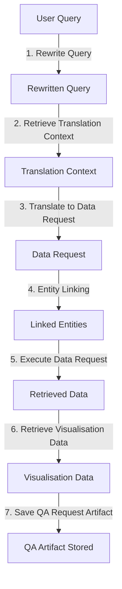
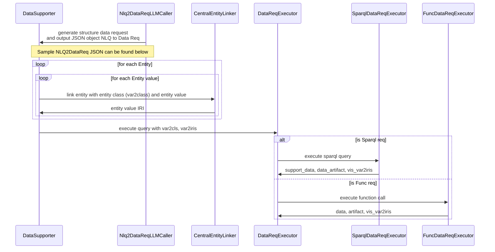

# Pipeline

This part of the document outlines the key components and steps in the QA pipeline. Each step transforms the user's natural language query into a structured data request, ultimately retrieving relevant information and visualisations.

## Flow Diagram



## Step 1: Query Rewriting

    rewritten_query = self.nlq_rewriter.rewrite(question=query)
    
The query method of the `DataSupporter` class initiates by calling the rewrite method of the `nlq_rewriter` object. This step standardises the user query by normalising any physical quantities present. It leverages a GPT model (normalise method of the `QtNormaliser` class) to detect and a unit conversion system (`normalise_qt` method) to standardise these quantities into consistent units. This ensures that the system accurately interprets physical quantities, regardless of the user’s input format. If no quantities are detected or if an error occurs, the original query is passed through unchanged.

## Step 2: Context Retrieval

    translation_context = self.context_retriever.retrieve(nlq=rewritten_query)

This step prepares the translation of the natural language query into a structured data request. It retrieves relevant schema properties and example queries from a schema store and example store, both limited by predefined numbers (`relation_num` and `example_num`). These are combined into a `TranslationContext` object, providing the necessary context for accurately translating the query in the subsequent steps.

## Step 3: Translate to Data Request

    data_req = self.llm_caller.forward(
                nlq=rewritten_query, translation_context=translation_context
            )

The `Nlq2DataReqLLMCaller` class translates the rewritten query and the retrieved context into a structured data request. This is done by crafting a prompt for an OpenAI language model (GPT), which then generates a JSON object representing the data request. This JSON is validated against a predefined `DataRequest` model. If valid, it forms a machine-readable representation of the query; otherwise, the process returns `None`, indicating that a valid data request could not be generated.

## Step 4: Entity Linking

Entity linking is managed by the `CentralEntityLinker` class, which serves as a central hub for various domain-specific linker managers (e.g., `OntospeciesLinkerManager`, `OntozeoliteLinkerManager`). For each variable in the `entity_bindings` of the data request, the linker attempts to map the text or identifiers to specific entities in the knowledge base. The process uses custom linkers, exact matching, semantic similarity, or fuzzy matching to find relevant entities, resulting in a `var2iris` dictionary that maps variables to linked IRIs.

## Step 5: Data Request Execution

    data, data_artifact, vis_var2iris = self.executor.exec(
        var2cls=data_req.var2cls,
        entity_bindings=var2iris,
        const_bindings=data_req.const_bindings,
        req_form=data_req.req_form,
        vis_vars=data_req.visualise,
    )

This step takes the structured data request generated in previous steps and executes it to retrieve the actual data. The executor can handle different requests: SPARQL queries for RDF databases, predefined function calls, or a fallback method. It uses the entity bindings from the previous step and any constant values and class information to retrieve data. The system first attempts to use SPARQL or function execution based on the request form. If these fail or are not applicable, they fall back to a default execution method. The output includes the retrieved data, a data artefact for record-keeping, and information for visualisation. This step essentially bridges the gap between the structured request and the actual data in the system's databases or makes it accessible through its functions.

## Step 6: Visualisation Data Retrieval

This step retrieves and organises visualisation data, particularly for chemical structures. If the data request includes visualisation requirements, the `VisualisationDataStore` is queried using class and IRI information. The resulting data is organised into a dictionary (`vis_var2structs`) that maps query variables to visual representations, enabling the system to provide textual and visual answers.

## Step 7: Save QA request artifact

The final step preserves a comprehensive record of the QA process. The `QARequestArtifactStore` saves a `QARequestArtifact` object that includes the original and rewritten queries, the generated data request, and the executed data artefact. A unique request_id is generated, linking the QA response to its corresponding artefact.

# Entity Linking
The following sequence diagram describes the /qa workflow in [controllers/qa.py](./fastapi_app/controllers/qa.py).


```mermaid
sequenceDiagram

```

## JSON Object Example
```json
{
    "nlq": "What is the electron configuration of oxygen and sodium?",
    "data_req": {
        "var2cls": {
            "Element": "pt:Element",
            "ElectronConfiguration": "os:Property"
        },
        "entity_bindings": {
            "Element": [
                "oxygen",
                "sodium"
            ]
        },
        "req_form": {
            "type": "sparql",
            "triplestore": "ontospecies",
            "query": "SELECT DISTINCT ?Element ?ElectronConfiguration\nWHERE {\n  ?Element os:hasElectronConfiguration ?ElectronConfiguration .\n}",
            "pkeys": [
                "Element"
            ]
        },
        "visualise": [
            "Species"
        ]
    }
}
```
This JSON object is generated by LLM. 
- Entity Recognition
    - The LLM recognizes `oxygen` and `sodium` as `Element` entity from the natural language request
- Sparql Request 
    - The LLM generates the Sparql request that can retrieve the information needed from the naturla language request
    - The LLM identify the class for the variable `?Element` and `?ElectronConfiguration` in the Sparql request and output to `var2cls`
    - The LLM predicts the triplestore which contains the information the Sparql request needs
To run this Sparql query, the variable `?Element` need to be replaced with the IRIs of `oxygon` and `sodium` and this is where the entity matching comes in.

## Entity Linking Strategy
The following is the resulted dict after the entity linking `var2iris`
```
{
    "Element": ["iri_oxygen", "iri_sodium"]
}
```