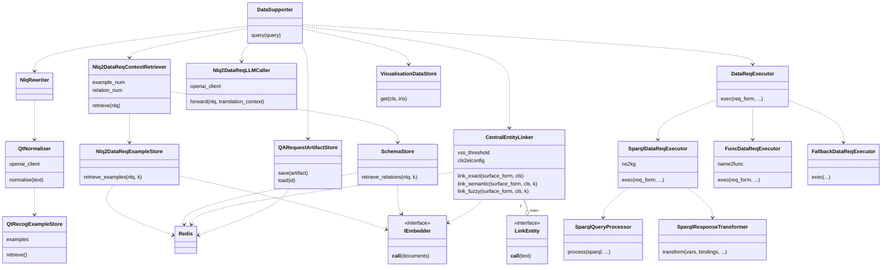
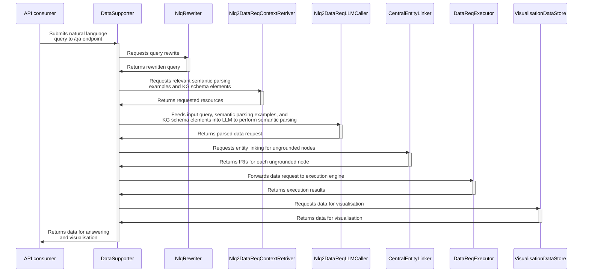
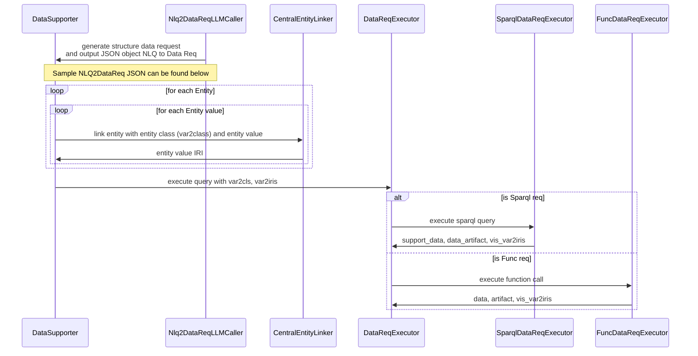
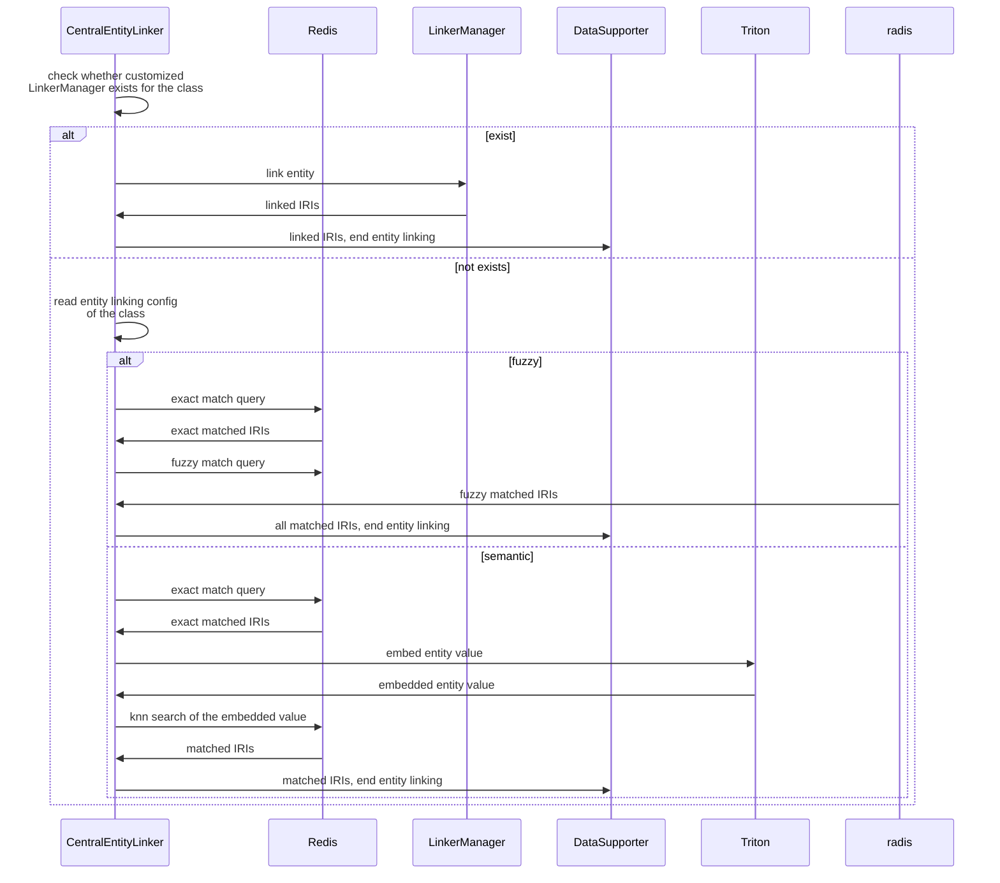

# QA Application Backend

## Table of Contents
- [QA Application Backend](#qa-application-backend)
  - [Table of Contents](#table-of-contents)
  - [Initial setup](#initial-setup)
    - [Required services](#required-services)
      - [Services to Deploy](#services-to-deploy)
      - [External API Services](#external-api-services)
    - [Required datasets](#required-datasets)
    - [Configurable parameters](#configurable-parameters)
  - [Native installation](#native-installation)
    - [Prerequisites](#prerequisites)
    - [Steps](#steps)
  - [Docker installation](#docker-installation)
  - [Usage](#usage)
    - [Backend](#backend)
    - [Frontend (to be deprecated)](#frontend-to-be-deprecated)
  - [Developer's documentation](#developers-documentation)
    - [Application breakdown](#application-breakdown)
    - [/qa endpoint handling](#qa-endpoint-handling)
    - [Entity Linking](#entity-linking)
      - [Input \& Output JSON Object Example](#input--output-json-object-example)
      - [Linking Methods](#linking-methods)
        - [Customized Linker](#customized-linker)
        - [Fuzzy Match with Redis](#fuzzy-match-with-redis)
        - [Semantic Match with Redis](#semantic-match-with-redis)


## Initial setup

This section outlines the services, resources, and configurations needed for native and Docker installations. Follow these instructions before proceeding to the installation steps.

### Required services

#### Services to Deploy
- Redis server: For data storage and retrieval. [Run Redis Stack in Docker](https://redis.io/docs/latest/operate/oss_and_stack/install/install-stack/docker/)
- Text embedding service: Exposed via either OpenAI-compatible or NVIDIA's Triton API. For local deployment, see [triton_inference_server](../triton_inference_server/).

#### External API Services
These services are called directly and don't require setup, but may need API keys configured:
- Chat completion service: Exposed via OpenAI-compatible API.
- (Optional) LocationIQ geocoding service: Used for determining geographical coordinates based on location names. 
  - Context: Some of Zaha's features require geocoding i.e. the determination of geographical coordinates based on a location name. These apply for use cases such as finding pollutant concentrations or the nearest carpark given a location name. By default the app will preferentially use the [API key-free geocoding service by Nominatim](https://nominatim.org/release-docs/latest/api/Search/). However, Nominatim does impose a rate limit (read more about [Nominatim's usage policy](https://operations.osmfoundation.org/policies/nominatim/)). 
  - To avoid having geocoding requests denied, the app will also make requests to [LocationIQ](https://locationiq.com/), which requires an API key. At the time of writing, LocationIQ does offer a free plan for API access.
  - KIV: [set up a local Nominatim instance](https://nominatim.org/release-docs/latest/admin/Installation/) to remove dependency on external geocoding services.

### Required datasets

Datasets required by this app are:

- [`data/lexicon`](data/lexicon/): JSON files for lexicons of entities that require linking with Redis. Each file is an array of `Lexicon` objects.
- [`data/schema/properties`](data/schema/properties): JSON files for information on KG predicates. Each file is an array of `GraphItemType` objects.
- [`data/nlq2datareq_examples`](data/nlq2datareq_examples/): JSON files for semantic parsing examples. Each file is an array of `Nlq2DataReqExample` objects.
- [`data/qtRecog_examples`](data/qtRecog_examples/): JSON files for quantity recognition examples. Each file is an array of `QtRecogExample` objects.

The specifications of these datasets are outlined in [../../data_generation/README.md](../../data_generation/README.md#terminologies).

To facilitate efficient on-demand retrieval, the datasets need to be ingested into the Redis server before the app starts accepting requests from users. The module [`ingest_data`](./ingest_data/) provides the utilities to run automated ingestion. Execute `python -m ingest_data --help` to see a list of all available command-line options.

Example execution:
```
python -m ingest_data --redis_host localhost --text_embedding_backend triton --text_embedding_url localhost:8001 --drop_index --invalidate_cache
```

Each dataset can also be ingested separately.
- To ingest entity lexicons, `python -m ingest_data.entities ...`
- To ingest examples for translating input questions into data requests, `python -m ingest_data.nlq2datareq_examples ...`
- To ingest KG relations, `python -m ingest_data.properties ...`

### Configurable parameters

All configurable parameters for the app are indicated in [`app.yaml`](./app.yaml), which have been pre-populated with default values. Environment-specific parameters are also pre-filled in [`app.dev.yaml`](./app.dev.yaml) and [`app.prod.yaml`](./app.prod.yaml), either of which is automatically selected based on the value `dev` or `prod` of the `APP_ENV` environment variable.

API keys for external services need to be set in the `app.local.yaml` file, which has to be created by the user. Following is a minimal template. Additional fields can be set to override default settings.
```{yaml}
translator:
   api_key: <openai_api_key_for_translation_service>
chat:
   api_key: <openai_api_key_for_chat_service>
location_iq:
   api_key: <location_iq_api_key_for_geocoding_service>
ontomops_fileserver:
   username: <ontomops_fileserver_username>
   password: <ontomops_fileserver_password>
```

Precedence: `app.local.yaml` > `app.{APP_ENV}.yaml` > `app.yaml`.


## Native installation

### Prerequisites

- (recommended) Linux enviroment
- python>=3.8
- [conda](https://conda.io/projects/conda/en/latest/user-guide/install/index.html)
  
### Steps

1. Deploy the required services, add the resources, and configure the parameters as defined in the [Initial setup](#initial-setup) section.

2. Create conda environment and activate it.
   ```{bash}
   conda create --name qa_backend python==3.10
   conda activate qa_backend
   ```

3. Install dependencies.
   ```{bash}
   pip install -r requirements.txt
   ```

4. Ingest required datasets into Redis server, as per the section [Required datasets](#required-datasets).

5. Start the server:
   - In debug mode (app is automatically reloaded upon code changes), `uvicorn main:app --reload --log-config=log_conf.yaml`.
   - In production mode, `uvicorn main:app --host=0.0.0.0 --log-config log_conf.yaml --workers 4`.
   - The app will be available at `localhost:8000`.  
   <!-- TODO: add a health check endpoint -->
   - To expose the app at a different port, use the command line argument `--port {port}` e.g. `uvicorn main:app --reload --log-config=log_conf.yaml --port 5000`.

6. Whenever any dataset needs to be updated, re-run the ingestion script for that specific dataset with the argument `--drop_index --invalidate_cache` to (1) trigger Redis to flush the old index and create a new one, and (2) re-create on-disc cache for the processed datasets. KIV: allow user to add new resource entries without processing everything again and recreatng the index.

## Docker installation

1. Ensure that the required services are deployed, resources are added, and parameters are configured as specified in the [Initial setup](#initial-setup) section.

1. Build the image, `docker build -t fastapi_app .`.
2. Spin up the container as follows. The app will be available at `localhost:5000` on Docker host.
   ```{bash}
   docker run -d --name fastapi_app \
      -e APP_ENV=prod \
      -v "$(pwd)/data:/code/data" \
      -p 5000:8000 \
      fastapi_app:latest
   ```
   Notes:
   - `-p 5000:8000` instructs Docker to map port 5000 on Docker host to port 8000 in the container, which is the default FastAPI port. 
   - `-v "$(pwd)/data:/code/data"` mounts the `data` directory in the host machine into the container.
3. To ingest the required datasets, one may open a `bash` terminal in the container by executing `docker exec -it fastapi_app bash` and then run the ingestion command as introduced in section ['Required datasets'](#required-datasets).


## Usage

### Backend

Visit `/docs` to see detailed API documentation. This Swagger UI will show you all available endpoints and allow you to test them directly from the browser.

Overview:

- `POST` `/qa`: given a natural language question, returns the structured data that meet the information need.
- `POST` `/chat`: given the `id` of the QA request, returns a text stream for natural language response.
- `GET` `/ontospecies/species`: given constraints such as chemical classes and physical properties, returns all species that fulfil the requirements.
- `GET` `/ontozeolite/zeolite-frameworks`: given criteria such as XRD peaks and unit cell dimensions, returns all zeolite frameworks that fulfil the requirements.
- `GET` `/ontozeolite/zeolitic-materials`: given criteria such as framework code and an author's family name, returns all zeolitic materials that fulfil the requirements.

### Frontend (to be deprecated)

Zaha's frontend can be accessed at `localhost:5000` in the browser.


## Developer's documentation

### Application breakdown



### /qa endpoint handling



### Entity Linking
The following sequence diagram gives a closer look at the activity happens before and after entity linking, which gives a better understanding on the input and use of output of entity linking.


Entity Linking sequence diagram



#### Input & Output JSON Object Example

The following JSON object represents an intermediate step in the question-answering process, specifically the output of the LLM-based semantic parsing and the input to the entity linking process. This example illustrates how a natural language query is transformed into a structured data request, which is then used for entity linking and subsequent data retrieval.

```json
{
    "nlq": "What is the electron configuration of oxygen and sodium?",
    "data_req": {
        "var2cls": {
            "Element": "pt:Element",
            "ElectronConfiguration": "os:Property"
        },
        "entity_bindings": {
            "Element": [
                "oxygen",
                "sodium"
            ]
        },
        "req_form": {
            "type": "sparql",
            "triplestore": "ontospecies",
            "query": "SELECT DISTINCT ?Element ?ElectronConfiguration\nWHERE {\n  ?Element os:hasElectronConfiguration ?ElectronConfiguration .\n}",
            "pkeys": [
                "Element"
            ]
        },
        "visualise": [
            "Species"
        ]
    }
}
```
This JSON object is generated by the LLM as part of the semantic parsing process. Here's a breakdown of its components and their roles:

- **Entity Recognition**
    - The LLM recognises `oxygen` and `sodium` as `Element` entities from the natural language request.
- **SPARQL Request Generation**
    - The LLM generates a SPARQL query that can retrieve the information needed from the natural language request.
    - It identifies the classes for the variables `?Element` and `?ElectronConfiguration` in the SPARQL request and outputs them to `var2cls`.
    - The LLM predicts the triplestore (`ontospecies`) which contains the information the SPARQL request needs.
- **Entity Linking Preparation**
  - To execute this SPARQL query, the variable `?Element` needs to be replaced with the IRIs of `oxygon` and `sodium`. This is where the entity linking process comes in.

After entity linking, a new dictionary `var2iris` is created, which looks like this:
```
{
    "Element": ["iri_oxygen", "iri_sodium"]
}
```
This `var2iris` dictionary is then used to replace the placeholders in the SPARQL query with actual IRIs before execution.

By understanding this intermediate representation, we can see how the system bridges the gap between natural language input and structured data queries, enabling accurate information retrieval from the knowledge graph.

#### Linking Methods
##### Customized Linker
Some ontology has customsied manager and linker methods. The currently supported managers and linker are summarized below
- ontokin: 
    - okin:ReactionMechanism
    - ocape:ChemicalReaction
- ontomop:
    - mops:MetalOrganicPolyhedron
    - mops:ChemicalBuildingUnit
    - mops:GenericBuildingUnit
    - mops:AssemblyModel
- ontospecies:
    - inchi
    - smiles
    - iupac_name
- ontozeolite:
    - zeo:ZeoliteFramework
    - zeo:ZeoliticMaterial

##### Fuzzy Match with Redis
Allow vectors within certain Levenshtein distance as matched vectors.

##### Semantic Match with Redis
Embed the entity value as vector and search for the K nearest neighbours as matched vectors.