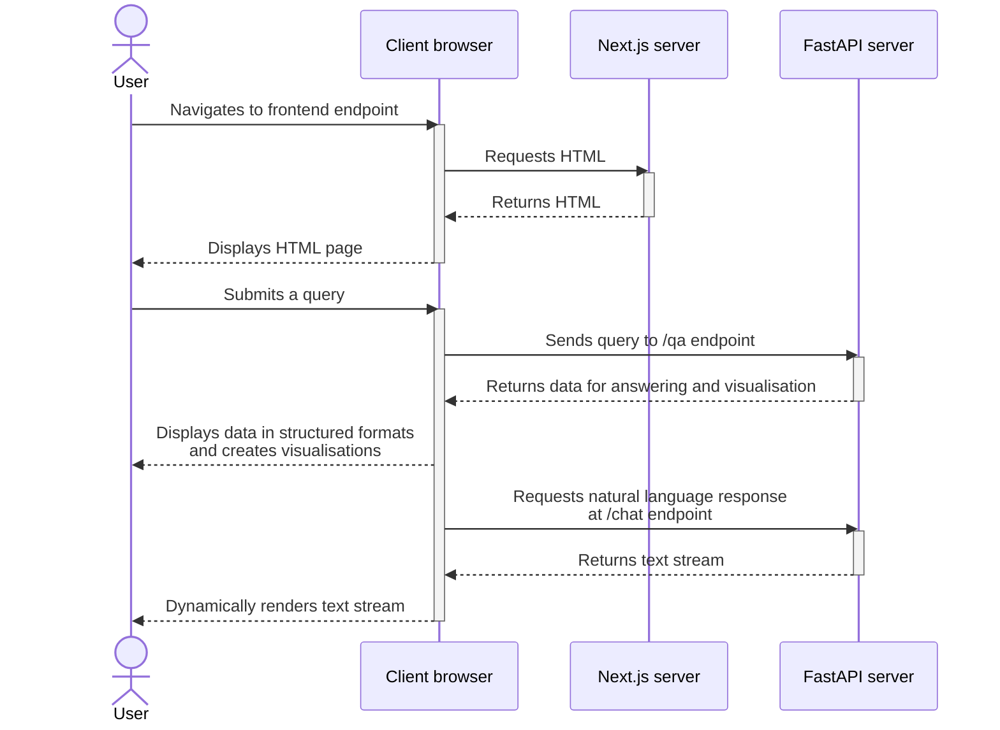

# Marie's Frontend

## Overview

Marie's frontend is the web interface to interact with TWA's chemical data repositories via natural language. This Next.js app provides a  user-friendly way to submit queries and obtain responses from Marie's backend, including visualisation of molecular structures. The application also provides structured forms to search for chemical species and zeolites, as well as plots to visualise chemical and structural trends.

## Table of Contents
- [Marie's Frontend](#maries-frontend)
  - [Overview](#overview)
  - [Table of Contents](#table-of-contents)
  - [Installation](#installation)
    - [Backend endpoint configuration](#backend-endpoint-configuration)
    - [Native setup](#native-setup)
      - [Prerequisites](#prerequisites)
      - [Steps](#steps)
    - [Docker deployment](#docker-deployment)
      - [Prerequisites](#prerequisites-1)
      - [Steps](#steps-1)
  - [Developer's Documentation](#developers-documentation)
    - [Overview of tech stack](#overview-of-tech-stack)
    - [UI components](#ui-components)
    - [Image components](#image-components)
    - [Query submission handling](#query-submission-handling)

## Installation

### Backend endpoint configuration

If the backend endpoint is different from the value of `NEXT_PUBLIC_BACKEND_ENDPOINT` in [`.env`](.env), create a new file named `.env.local` and set its value here. Please note the following:
- The endpoint is used by JavaScript code that runs in the browser client. Therefore, it must be identifiable from the client's network.
- The endpoint must be specified with a trailing forward slash e.g. `http://123.123.123.123:3000/api/`, so that all URLs created relative to this base path are resolved correctly.

### Native setup

#### Prerequisites

- Linux OS (recommended)
- [Node.js 20](https://nodejs.org/en/download/package-manager) or later (which includes npm)

#### Steps

1. [Configure the backend endpoint](#backend-endpoint-configuration).
2. Install dependencies: `npm install`.
3. Start the server:
   
   - Development mode: `npm run dev`,
   - Production mode: first, create a production build: `npm run build`; then, start production server: `npm run start`.

   The app will be available at `localhost:3000`. 
   
   The port can be manually set by setting the argument `-p 8080` e.g. `npm run dev -- -p 8080` (note that the separator `--` is required for passing arguments into run-scripts).

### Docker deployment

#### Prerequisites

- Docker

#### Steps

1. [Configure the backend endpoint](#backend-endpoint-configuration).
2. Build the image: `docker build -t next-app-marie .`
3. Launch the container: `docker run -d --name next-app-marie -p 3000:3000 next-app-marie`

The app will be available at `localhost:3000/demos/marie`. 

Note that by default, the base path `/demos/marie` is set via the environment variable `BASE_PATH` in [`.env.production`](./.env.production). This can be overridden by setting a different value in `.env.local`.

## Developer's Documentation

### Overview of tech stack

- State management: [built-in React](https://react.dev/learn/managing-state)
- Styling: [tailwindcss](https://tailwindcss.com/)
- Routing: Next's [App Router](https://nextjs.org/docs/app)

### UI components

The approach for UI component development in this repository is customisation of UI primitives. This serves the following purposes:
- Leverage well-tested implementations of common UI components.
- Each React primitive can be installed separately, making it easier to keep the entire app as lean as possible.
- React primitives are bare-bone and are thus very flexible for style customisation.

This repository makes extensive use of boilerplates provided by [shadcn](https://ui.shadcn.com/docs), which makes use of React primitive libraries such as [Radix UI](https://www.radix-ui.com/primitives) and [TanStack](https://tanstack.com/). Shadcn boilerplates provide examples of style customisation with tailwindcss and internal state management for more complex components e.g. [DataTable](https://ui.shadcn.com/docs/components/data-table).

### Image components

For rendering images bundled together with the app, please use [static imports](https://nextjs.org/docs/app/building-your-application/optimizing/images#local-images) for the `src` attribute. This ensures that images are rendered properly even when the app is deployed behind an NGINX reverse proxy.

### Query submission handling

