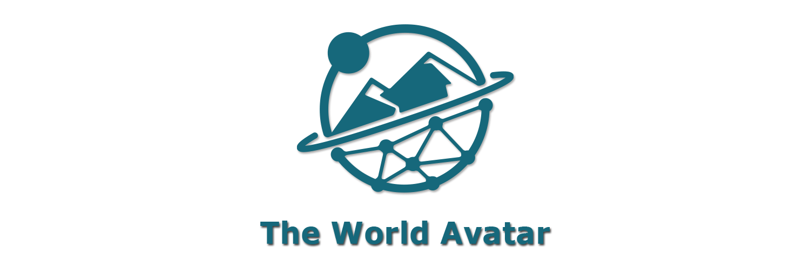

> [!NOTE]  
> This TWA monorepo is no longer maintained and has been migrated to several more organised repositories in [TheWorldAvatar's GitHub organisation](https://github.com/orgs/TheWorldAvatar/repositories). The core projects here are [stack](https://github.com/TheWorldAvatar/stack), [ontology](https://github.com/TheWorldAvatar/ontology) and [viz](https://github.com/TheWorldAvatar/viz)

    
    
     
    
    
    

## Introduction ##

The World Avatar project aims to create a digital ‘avatar’ of the real world. The digital world is composed of a dynamic knowledge graph (KG) that contains concepts and data that describe the world, and an ecosystem of autonomous computational agents that simulate the behaviour of the world and that update the concepts and data so that the digital world remains current in time. A knowledge graph is a network of data expressed as a directed graph, where the nodes of the graph are concepts or their instances (data items) and the edges of the graph are links between related concepts or instances. Knowledge graphs are often built using the principles of Linked Data. They provide a powerful means to host, query and traverse data, and to find and retrieve related information.

The World Avatar represents information in a dynamic knowledge graph using technologies from the Semantic Web stack. Unlike a traditional database, the World Avatar contains an ecosystem of autonomous computational agents that continuously update it. The agents are described ontologically as part of the knowledge graph, and are able to perform actions on both concepts and instances. This design enables agents to update and restructure the knowledge graph, and allows them to discover and compose other agents simply by reading from and writing to the knowledge graph.

## Useful links ##

* [The World Avatar Website](https://theworldavatar.io/)
* Key Collaborators:
  * [CARES](https://www.cares.cam.ac.uk/), [CoMo](https://como.ceb.cam.ac.uk/), [CMCL](https://www.cmcl.io/), [CMPG](https://www.cmpg.io/)
