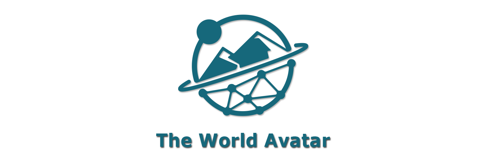

    
    
     
    
    
    

## Description ##

The World Avatar project aims to create a digital ‘avatar’ of the real world. The digital world is composed of a dynamic knowledge graph that contains concepts and data that describe the world, and an ecosystem of autonomous computational agents that simulate the behaviour of the world and that update the concepts and data so that the digital world remains current in time. A knowledge graph is a network of data expressed as a directed graph, where the nodes of the graph are concepts or their instances (data items) and the edges of the graph are links between related concepts or instances. Knowledge graphs are often built using the principles of Linked Data. They provide a powerful means to host, query and traverse data, and to find and retrieve related information.

The World Avatar represents information in a dynamic knowledge graph using technologies from the Semantic Web stack. Unlike a traditional database, the World Avatar contains an ecosystem of autonomous computational agents that continuously update it. The agents are described ontologically as part of the knowledge graph, and are able to perform actions on both concepts and instances. This design enables agents to update and restructure the knowledge graph, and allows them to discover and compose other agents simply by reading from and writing to the knowledge graph.

## Documentation ##

You can find the documentation for The World Avatar project in the repository's [Wiki pages](https://github.com/cambridge-cares/TheWorldAvatar/wiki).

## Contributing ##

Collaboration is at the heart of The World Avatar project. Development happens publicly on GitHub, and we are grateful to the community for contributing bugfixes and improvements. Read below to learn how you can take part in improving The World Avatar.

[**Code of Conduct**](https://www.contributor-covenant.org/version/2/1/code_of_conduct/)
* The Organization for Ethical Source has produced an Open Source Code of Conduct that we expect project participants to adhere to. Please read the full text so that you can understand what actions will and will not be tolerated.
  
[**Contributing Guide**](https://github.com/cambridge-cares/TheWorldAvatar/wiki/How-to-Contribute)
* Read our contributing guide to learn about our development process, how to propose bugfixes and improvements, and how to build and test your changes to The World Avatar.
  
[**Good First Issues**](https://github.com/cambridge-cares/TheWorldAvatar/labels/good%20first%20issue)
* To help you get your feet wet and get you familiar with our contribution process, we have a list of good first issues that contain bugs that have a relatively limited scope. This is a great place to get started developing The World Avatar

## Licence ##

The World Avatar is [MIT licensed](./LICENSE.txt).

## Useful links ##

* [The World Avatar Website](https://theworldavatar.io/)
* Key Collaborators:
  * [CARES](https://www.cares.cam.ac.uk/), [CoMo](https://como.ceb.cam.ac.uk/), [CMCL](https://www.cmcl.io/), [CMPG](https://www.cmpg.io/)
