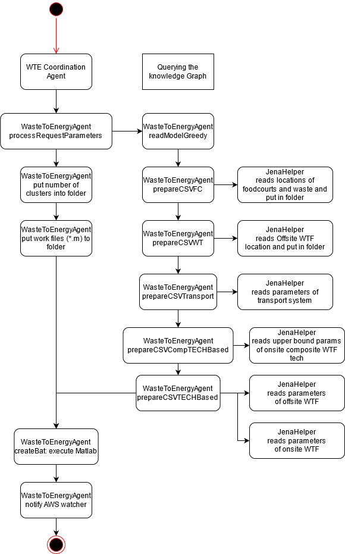

# README for Waste To Energy Agent
## Java Dependencies
1. jps-base-lib
2. Junit
3. javax servlet

## What to do for deployment? 
 - Have matlab installed. Have java installed. 
 - mvn clean install JPS WTE
 - node app web/CO2WEB/app.js
 - have nodeJS server running
 - Have JPS-AWS (Asynchronous Watcher Service) running. Pull from Vienna to get this watcher service. 
 - Comment Line 4, Uncomment Line 5 in \web\CO2Web\public\javascripts\wte.js when deploying in Claudius
 - Copy over the relevant files: ontology\ontowaste\OntoWaste, ontotransport, and kb\sgp\singapore\wastenetwork
 - Expected Result: Upon deployment, by loading the page localhost:82/wteMap. 
 	1. A google map appears
 	2. A side bar, containing variables for changing the transport and waste processing costs. 
 	3. Fifteen minutes after hitting run, a red dot appears over the blue symbols representing food courts. These red dots represent onsite waste
 	treatment facilities. 
## I've ran Waste To Energy Agent, but after the Matlab simulation runs, nothing happens?
1. Check if your JPS_AWS is running
	- How do you check? Check if something like this: Response:uk.ac.cam.cares.jps.aws.AsynchronousWatcherService$ResponseBody@XXXXXXXX is there when matlab starts
	- After matlab runs to *completion*, this line shows: New file observed: year by year_NPV.txt
	- Then this line: Calling back http://HOST:PORT/JPS_WTE/processresult would call back your next value

## How does it run? 
1. After user loads localhost:82/wteMap on their local server, one HTTP Request with IRI of Wastenetwork is sent to WTEVisualization
2. WTEVisualization returns back locations of Food Courts, Offsite Waste Treatment Facilities, and related costs. 
3. Once the user changes the variable (as well as the number of clusters), he hits run
4. Number of clusters is updated to either the number input by the end-user, or defaults to 40. Number of clusters means how many points do the FoodCourts aggregate, with the maximum number being 109. 
5. WTECoordination receives wastenetwork and n_cluster variables, and passes it to WastetoEnergy Agent
6. WastetoEnergy Agent queries the Knowledge Graph, and returns the values of related costs, locations and waste values of Food Courts, as well as the level of waste processed by the Offsite Waste Treatment Facility
7. Matlab simulation is called, should finish in five minutes time. 

8. The loading is due to new Onsite Facility instances being created slowly, and added to the knowledge graph. The sequence of events can be located in the diagram below. 
9. Each is saved to the output file and sent to the visualization. 

## There's something wrong? I can't deploy this!
1. WasteToEnergyAgent ran, but WTESingleAgent did not. 
   - Check if you have a Gurobi License (The current version deployed expires every two months)
    1. go to this website: https://www.gurobi.com/login/
	 2. Once you've created an account (sign in with your Cambridge email!) go to licenses page. Check if your licenses are available and whether they've expired: https://www.gurobi.com/downloads/licenses/
	 3. get yourself a license if your pre-existing license has expired: https://www.gurobi.com/downloads/free-academic-license/
	 4. Download it by typing it into your CMD line
	 5. Downloaded!
		
   - Check if you have Matlab downloaded
    1. Download using your Cambridge license
	 2. add matlab to your system environment
	 
   - Your Matlab has completed execution and there are newly completed files, but nothing has happened. 
     Check if your Asynchronous Watcher is deployed. This is found under JPS_AWS-git
	 Unfortunately, this means you have to restart the process after deploying Asynchronous Watcher
   - You don't see the visualization. 
     Check your connection to your Tomcat Server
### TODO: 
 - [ ] Remove the need to swap the parameters when running visualization