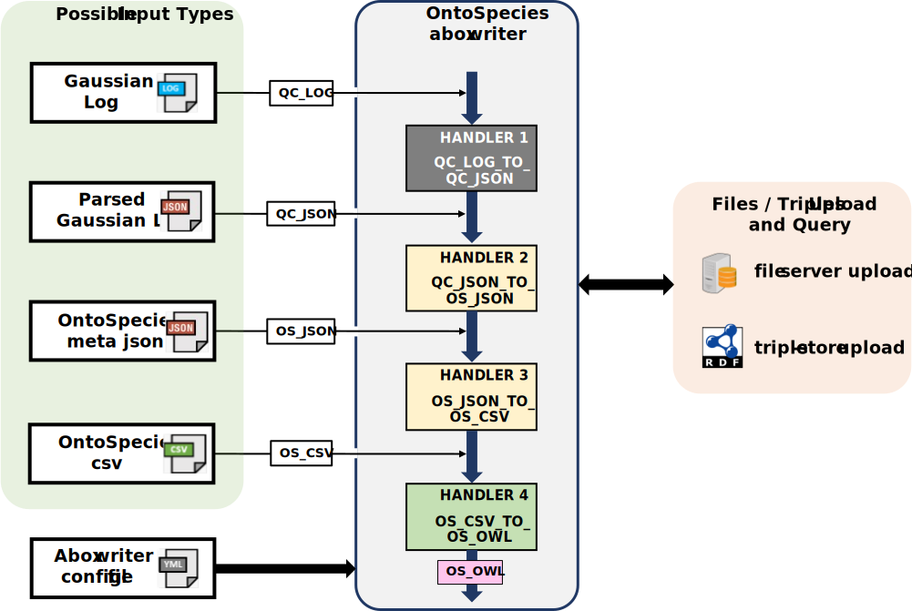
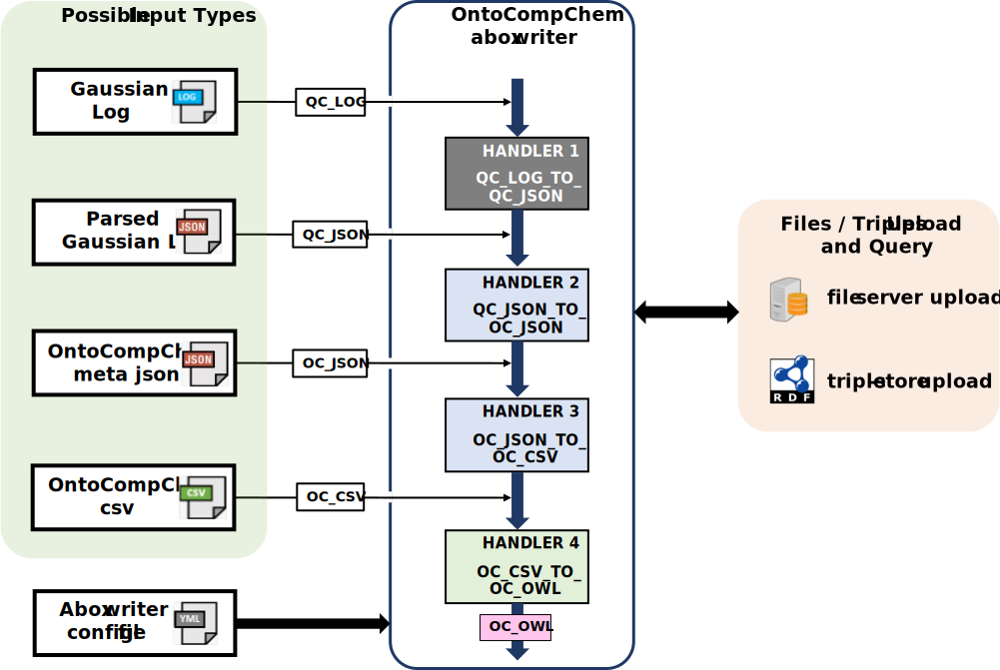
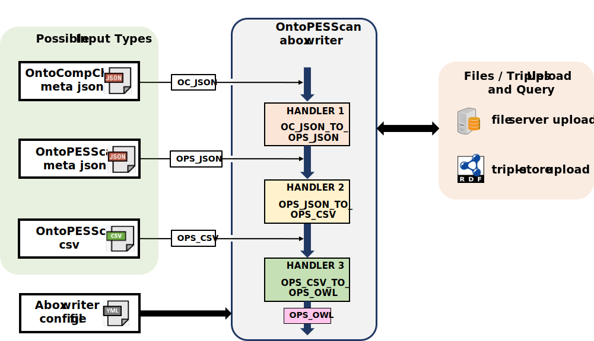

# Description


The `chemaboxwriters` package provides a simple python API for generating and uploading aboxes, describing chemical data, to the [TheWorldAvatar](https://github.com/cambridge-cares/TheWorldAvatar) knowledge graph. The package's main aim is to simplify and unify the chemical data abox generation and upload steps by supporting variety of different input formats and abox types and by allowing an easy configuration. Currently, the following aboxes are supported:
- `ontospecies`
- `ontocompchem`
- `ontopesscan`
- `ontomops`


## Abox writers overview

All of the listed abox writers were built in a modular fashion as an input processing pipeline containing a number of different handlers, where each handler is specialised in processing a particular type of input. All handlers are tagged with the input and output stages determining supported type of input (file types) and produced output type. Once the handler processes the input it passes the generated output to another handler that is able to process it. Thanks to such design, all abox writers are capable of starting with any input type as long as one of its handlers supports it.

Running any of the supported abox writers results in the following steps:
1. assemble pipeline
2. configure and check the pipeline handlers
3. check and pass the inputs to the first handler that supports them
4. handler: receives the inputs
5. handler: if configured, uploads the inputs to the specified endpoints
6. handler: handles the inputs and produces the outputs
7. handler: if configured, uploads the outputs to the specified endpoints
8. Repeat steps 3-7 until the end of the pipeline is reached


### OntoSpecies abox writer

The ontospecies abox writer creates and uploads the ontospecies aboxes. The writer is schematically presented on the figure below. It consists of four handlers:
- QC_LOG_TO_QC_JSON
  - input type: QC_LOG - the quantum calculation log files (currently only Gaussian G03, G06, G09, G16 are supported)
  - output type: QC_JSON - a generic quantum calculations json file
  - handler_kwargs: None - this lists supported handler parameters (optional and required)
- QC_JSON_TO_OS_JSON
  - input type: QC_JSON
  - output type: OS_JSON - an intermediate ontospecies meta json file
  - handler_kwargs:
    - random_id (str) OPTIONAL - random id used in all ontospecies instances, if not provided, randomly generated
    - enth_of_form (str) OPTIONAL - enthalpy of formation value, not included in the abox if omitted
    - enth_of_form_unit (str) OPTIONAL - enthalpy of formation unit, not included in the abox if omitted
    - enth_of_form_phase (str) OPTIONAL - phase that the enthalpy of formation entry corresponds to, not included in the abox if omitted
    - enth_of_form_ref_temp (str) OPTIONAL - enthalpy of formation reference temperature, not included in the abox if omitted
    - enth_of_form_ref_temp_unit (str) OPTIONAL - enthalpy of formation reference temperature unit, not included in the abox if omitted
    - enth_of_form_provenance (str) OPTIONAL - enthalpy of formation provenance, not included in the abox if omitted
- OS_JSON_TO_OS_CSV
  - input type: OS_JSON
  - output type: OS_CSV - an intermediate ontospecies csv file
  - handler_kwargs: None
- OS_CSV_TO_OS_OWL
  - input type: OS_CSV
  - output type: OS_OWL - the ontospecies owl file
  - handler_kwargs: None


<a>
  <center>
    
  </center>
</a>

### OntoCompChem abox writer

The ontocompchem abox writer creates and uploads the ontocompchem aboxes. The writer is schematically presented on the figure below. It consists of four handlers:
- QC_LOG_TO_QC_JSON - see the [OntoSpecies](#ontospecies-abox-writer) abox writer section
- QC_JSON_TO_OC_JSON
  - input type: QC_JSON
  - output type: OC_JSON - an intermediate ontocompchem meta json file
  - handler_kwargs:
    - random_id (str) OPTIONAL
    - ontospecies_IRI (str) OPTIONAL - IRI of an ontospecies entry to link to. If not provided a query based on inchi will be made to find the ontospecies IRI. If that fails, the ontospecies link is not included in the ontocompchem abox
    - generate_png (bool) OPTIONAL - generate png files representing the molecules, by default false
- OC_JSON_TO_OC_CSV
  - input type: OC_JSON
  - output type: OC_CSV - an intermediate ontocompchem csv file
  - handler_kwargs: None
- OC_CSV_TO_OC_OWL
  - input type: OC_CSV
  - output type: OC_OWL - the ontocompchem owl file
  - handler_kwargs: None
<a>
  <center>
    
  </center>
</a>

### OntoPESScan abox writer

The ontopesscan abox writer creates and uploads the ontopesscan aboxes. The writer is schematically presented on the figure below. It consists of three handlers:


- OC_JSON_TO_OPS_JSON
  - input type: OC_JSON
  - output type: OPS_JSON - an intermediate ontopesscan json file
  - handler_kwargs:
    - random_id (str) OPTIONAL
    - os_iris (str) REQUIRED - ontospecies IRI that the scan is about
    - os_atoms_iris (str) REQUIRED - ontospecies atoms IRIs defining the scan coordinate (two IRIs - bond scan, three IRIs - angle scan and four IRIs - dihedral angle scan, note that atoms order matters)
    - oc_atoms_pos (str) REQUIRED - atoms indices (starting from one) in the ontocompchem entries corresponding to the indicated ontospecies atoms, e.g. for the bond scan jobs between the ontospecies "atom1_iri,atom2_iri" this input should provide these atoms positions in the ontocompchem jobs reference frame, e.g. "3,4" in case "atom1_iri,atom2_iri" where located at position 3 and 4
- OPS_JSON_TO_OPS_CSV
  - input type: OPS_JSON
  - output type: OPS_CSV - an intermediate ontopesscan csv file
  - handler_kwargs: None
- OPS_CSV_TO_OPS_OWL
  - input type: OPS_CSV
  - output type: OPS_OWL - the ontopesscan owl file
  - handler_kwargs: None

<a>
  <center>
    
  </center>
</a>

As can be seen from the handlers description, the ontopesscan abox writer relies on the input obtained from the other abox writers. The typical workflow for creating and uploading the opsscan aboxes is as follows:
- select a chemical species to run the scan jobs on
- create the chemical species ontospecies entry using the ontospecies provided abox writer
- run the quantum calculation scan jobs (e.g. bond, angle, dihedral angle scans) on the selected species. Currently, only Gaussian jobs are supported.
- create and upload the ontocompchem aboxes using the provided ontocompchem abox writer
- use the intermediate ontocompchem OC_JSON files as an input for the ontopesscan abox writer.

### OntoMops abox writer

The ontomops abox writer creates and uploads the ontomops aboxes. The writer is schematically presented on the figure below. It consists of three handlers:
- OMINP_JSON_TO_OM_JSON
  - input type: OMINP_JSON - an ontomops input json file
  - output type: OM_JSON - an intermediate ontomops json file
  - handler_kwargs: None
- OM_JSON_TO_OM_CSV
  - input type: OM_JSON - an intermediate ontomops json file
  - output type: OM_CSV - an intermediate ontomops csv file
  - handler_kwarg:
    - random_id (str) OPTIONAL
- OM_CSV_TO_OM_OWL
  - input type: OM_CSV - an intermediate ontomops csv file
  - output type: OM_OWL - the ontomops owl file
  - handler_kwargs: None

<a>
  <center>
    
  </center>
</a>


Please see the package `tests` folder for the examples of all the supported input files.

# Requirements

- Python >=3.5. You can install Python by going to the official Python [download page](https://www.python.org/getit/)
- [Java Runtime Environment version 8](https://adoptopenjdk.net/?variant=openjdk8&jvmVariant=hotspot)
- Either [miniconda](https://docs.conda.io/en/latest/miniconda.html) or [miniforge](https://github.com/conda-forge/miniforge/releases) (recommended) package manager

# Installation #
Currently, only the installation from source is possible. A custom bash script has been provided in order to simplify this step:


`(Windows)`

Open miniconda / miniforge command prompt, navigate to the `chemaboxwriters` directory and run:

```cmd
$ install_script_conda.sh -v -e -i
```

`(Linux)`

Open linux bash terminal and run:

```sh
$ install_script_conda.sh -v -e -i
```

The command above will create a separate conda virtual environment `chemaboxwriters_venv`, install the `chemaboxwriters` package and all its dependencies. Once the installation is done, activate the newly created environment via the following command:

```sh
$ conda activate chemaboxwriters_venv
```

If you wish to see the install script help text, simply run `install_script_conda.sh -h`.

# Configuration

Prior to running any abox creation and upload it is necessary to configure appropriate upload and query endpoints. This is done via the config yml file. The config file also allows to define any optional or required handler parameters. An example config file can be found in the `chemaboxwriters` repository and is also presented below.

```yml
# ------------------------------------------------------------------------------
# This is the aboxwriters config file used to specify all the writers settings.
# The settings can be specified at three different levels of granularity:
#
# - global settings   - any settings defined here would apply to all
#                       pipelines handlers, unless overwritten
# - pipeline settings - any settings defined here would apply to all
#                       handlers for the selected pipeline and would
#                       overwrite any global settings
# - handler settings  - any settings defined here would apply only
#                       to the selected pipeline handler and would
#                       overwrite any global and pipeline level settings
# ------------------------------------------------------------------------------
# GLOBAL
# ------------------------------------------------------------------------------
file_server_upload_settings:
    # file server upload url
    url: http://localhost:48086/FileServer/
    # file server secrets file
    auth_file: dummy_fileserver_secrets_file
    # if True, auth_file input is not needed
    no_auth: False
    # directory on the file server where all files should go
    subdirs: dummy_subdir1/subdir2
triple_store_upload_settings:
    # triple store sparql upload endpoint
    url: http://localhost:48083/blazegraph/namespace/kb/sparql/
    auth_file: dummy_blazegraph-geo_secrets_file
    no_auth: False
kg_query_endpoints:
    # define any sparql query endpoints for the given prefixes
    # these are used in some handlers to query KG for extra information
    # e.g. when creating the ontocompchem abox, a query is made based on
    # the species inchi string to try to find the corresponding ontospecies
    # entry
    ospecies: http://localhost:48083/blazegraph/namespace/ospecies/sparql/
    omops: http://localhost:48083/blazegraph/namespace/omops/sparql/
    ocompchem: http://localhost:48083/blazegraph/namespace/ocompchem/sparql/
    opsscan: http://localhost:48083/blazegraph/namespace/opsscan/sparql/
# ------------------------------------------------------------------------------
# PIPELINES
# ------------------------------------------------------------------------------
#
# OCOMPCHEM
#-----------------------------------------
ocompchem:
    # these options would overwrite any global settings above
    file_server_upload_settings:
        # this will overwrite the global "dummy_subdir1/subdir2" subdirs
        # all other properties will be inherited
        subdirs: ocompchem
    triple_store_upload_settings:
        # this will overwrite the global triple store upload url
        # all other properties will be inherited
        url: http://localhost:48083/blazegraph/namespace/ocompchem/sparql/
    #-----------------------------------------
    # SELECTED OCOMPCHEM HANDLERS
    #-----------------------------------------
    # these options define any handler specific settings and would overwrite
    # any pipeline and global settings
    #
    # handler 1
    qc_log_to_qc_json: # handler name, non-case specific
        file_server_upload_settings:
            # this defines which types of files should be uploaded to the file server
            upload_file_types:
                - qc_log
    # handler 2
    qc_json_to_oc_json:
        file_server_upload_settings:
            # this enables molecules png files upload (if files are present)
            # note that oc_png is an internal qc_json_to_oc_json handler stage
            # as the png files are produced in this handler (if enabled) and
            # are not passed anywhere else.
            upload_file_types:
                - oc_png
        handler_kwargs:
            # this enables molecules png files generation
            generate_png: true
    # handler 3
    oc_csv_to_oc_owl:
        triple_store_upload_settings:
            # this defines which types of files should be uploaded to the file server
            upload_file_types:
                - oc_owl
# OSPECIES
#-----------------------------------------
ospecies:
    file_server_upload_settings:
        subdirs: ospecies
    triple_store_upload_settings:
        url: http://localhost:48083/blazegraph/namespace/ospecies/sparql/
    #-----------------------------------------
    # SELECTED OSPECIES HANDLERS
    #-----------------------------------------
    # If one wishes to fully merge all the pipeline or global settings into
    # the lower setting, e.g. qc_json_to_os_json, then this is the correct way
    # to do it. If the {} brackets were omitted the qc_json_to_os_json field
    # would be set to None, preventing any merging
    qc_json_to_os_json: {}
    os_csv_to_os_owl:
        triple_store_upload_settings:
            upload_file_types:
                - os_owl
# OMOPS
omops:
    file_server_upload_settings:
        subdirs: omops
    triple_store_upload_settings:
        url: http://localhost:48083/blazegraph/namespace/omops/sparql/
    #-----------------------------------------
    # SELECTED OMOPS HANDLERS
    #-----------------------------------------
    ominp_json_to_om_json:
        file_server_upload_settings:
            upload_file_types:
            # not that ominp_xyz is an internal ominp_json_to_om_json handler
                - ominp_xyz
    om_csv_to_om_owl:
        triple_store_upload_settings:
            upload_file_types:
                - om_owl
# OPSSCAN
#-----------------------------------------
opsscan:
    file_server_upload_settings:
        subdirs: opsscan
    triple_store_upload_settings:
        url: http://localhost:48083/blazegraph/namespace/opsscan/sparql/
    #-----------------------------------------
    # SELECTED OPSSCAN HANDLERS
    #-----------------------------------------
    oc_json_to_ops_json:
      # example handler parameters for a bond scan
      # note that if you run the opsscan handler on a directory of files
      # the same handler kwargs will be applied to each, therefore this
      # handler should only be run on files containing information about
      # the same scan
      handler_kwargs:
          os_iris: Species_11-111-111
          os_atoms_iris: Atom_11-11-111_C1,Atom_11-11-111_C2
          oc_atoms_pos: 1,2
          random_id: OPStestID-111-111-11
    ops_csv_to_ops_owl:
        triple_store_upload_settings:
            upload_file_types:
                - ops_owl
```

# Command line interface #

The command line interface for all the supported abox writers is presented below.

```bash
Usage:
   aboxwriter ospecies   [options]
   aboxwriter ocompchem  [options]
   aboxwriter omops      [options]
   aboxwriter opsscan    [options]

Options:
--help                  Prints this help message.
--file-or-dir=<dir>     Path to the input file or directory.
--inp-file-type=<type>  Types of the allowed input files to the:
                          * ospecies aboxwriter
                            - quantum calculation log (default)  [qc_log]
                            - quantum calculation json           [qc_json]
                            - ontospecies meta json              [os_json]
                            - ontospecies meta csv               [os_csv]
                          * ocompchem aboxwriter
                            - quantum calculation log (default)  [qc_log]
                            - quantum calculation json           [qc_json]
                            - ontocompchem meta json             [oc_json]
                            - ontocompchem meta csv              [oc_csv]
                          * omops aboxwriter
                            - omops input json file (default)    [ominp_json]
                            - omops processed json file          [omops_json]
                            - omops meta csv                     [omops_csv]
                          * opsscan aboxwriter
                            - ontocompchem meta json (default)   [oc_json]
                            - ontopesscan meta json              [ops_json]
                            - ontopesscan meta csv               [ops_csv]
--file-ext=<ext>        Extensions of the input files,
                        specified as a comma separated
                        string, e.g. --file-ext="out,log"
                        if not provided, defaults to the
                        following values:
                         - qc_log stage:
                           "qc_log,log,out,g03,g09,g16"
                         - for all other stages
                           the extension equals to the
                           input file type (e.g. oc_json)
--config-file=<file>    Path to the abox config file.
--out-dir=<dir>         Output directory to write the
                        abox files to. If not provided
                        defaults to the directory of the
                        input file.
--log-file-name=<name>  Name of the generated log file.
--log-file-dir=<dir>    Path to the abox writer log file.
                        If not provided defaults to the
                        directory of the input file.
--no-file-logging       No logging to a file flag.
--dry-run=<dry_run>     Run the abox writer tool in a dry        [default: True]
                        run mode (files are created but
                        not uploaded).
                        Choose between True / False
--info                  Prints the pipeline info.
                        Can be used together with
                        the --config-file option to check
                        the pipeline configuration before
                        running it.
```

It is important to note that all abox writers run in a `dry-run` mode by default. This mode disables all the file server and triple store uploads and can be used to test things out before the final run.

# Example usage

This section provides usage examples of all the supported abox writers. Note that the `<awriter>` variable can take any of the following values:

```bash

<awriter> = ocompchem, ospecies, omops, opsscan

```


1. Printing the abox writer help:

```bash

aboxwriter <awriter> --help

```

2. Printing the abox writer info:

```bash
# prints pipeline's handlers info such as:
# - handler name,
# - handler in_stage and out_stage,
# - handler endpoints config,
# - any extra handler arguments
#

aboxwriter <awriter> --info

# this command also passes the config file location
# which should add more details to the --info command
# printout

aboxwriter <awriter> --info --config-file config_file_path
```

3. Running the abox writer on a single file
```bash
# note that omitting the --inp-file-type option sets it
# to the abox writer-specific default value
# also, the --file-ext option is not used for the single
# file inputs and should be omitted

aboxwriter <awriter> --file-or-dir file.file_ext

# example ospecies writer usage
# this would run the ospecies abox writer with the
# --inp-file-type set to default qc_log

aboxwriter ospecies --file-or-dir file.log
```

4. Running the abox writer on a single file with defined input type
```bash

aboxwriter <awriter> --file-or-dir file.file_ext --inp-file-type <type>

# example ospecies writer usage
# this would run the ospecies abox writer with the
# --inp-file-type set to os_json

aboxwriter ospecies --file-or-dir file.os_json --inp-file-type os_json
```

5. Running the abox writer on a directory
```bash
# source_dir has the following content:
# source_dir:
#    - file_1.log
#    - file_2.out
#    - file_3.g09
#
aboxwriter <awriter> --file-or-dir source_dir --inp-file-type <type> --file-ext "log,out,g09"

# example ocompchem writer usage
# this would run the ocompchem abox writer with the
# --inp-file-type set to default qc_log and
# --file-ext set to default "qc_log,log,out,g03,g09,g16"
# thus it is not necessary to provide these extra arguments

aboxwriter ocompchem --file-or-dir source_dir
```

6. Running the abox writer on a single file in non dry-run mode
```bash

# this would upload any files to appropriate endpoints as specified in the config yml file.
aboxwriter <awriter> --file-or-dir file.file_ext --dry-run FALSE

```
7. Running the `opsscan` abox writer in a non `dry-run` mode on a directory with `oc_json` files containing scan jobs. In case of the `oc_json` type input, three additional `handler_kwargs` are required for the `oc_json_to_ops_json` handler. These are `os_iris`, `os_atoms_iris` and `oc_atoms_ids`. For a simple ethanol C1-C2 scan, the `os_iris` must be set to the iri of the ethanol in ontospecies triple store, the `os_atoms_iris` must be set to the ethanol C1 and C2 atoms iris in the ontospecies triple store and `oc_atoms_ids` must be set to the C1 and C2 atoms indices according to the order used in the quantum calculation job. If, e.g. the atom C1 and C2 order was 2 and 3 in the log file the `oc_atoms_ids` must be set to "2,3". Note that it would be assumed that the scan points defined in all oc_json files belong to the same scan.

```bash
aboxwriter opsscan --file-or-dir my_scan_dir --config-file config_file --dry-run FALSE
```

and an example aboxwriters config file section:

```yml
# OPSSCAN
#-----------------------------------------
opsscan:
    ...
    #-----------------------------------------
    # OPSSCAN HANDLERS
    #-----------------------------------------
    handlers:
        oc_json_to_ops_json:
            handler_kwargs:
                os_iris: "http://example_ontospecies_iri"
                os_atoms_iris: "http://example_ontospecies_iri/atom_C1_iri,http://example_ontospecies_iri/atom_C2_iri"
                oc_atoms_pos: "2,3"
        ...
```

# Note on JSON to CSV translation

As can be seen, all supported pipelines contain a handler that transforms input JSON files into the abox CSV files. The translation happens according to the schema YAML file. The schema is a simple, yet powerful mapping language that contains the rules on how a given piece of JSON data is transformed into appropriate imports, instance, object property or data property rows in the resulting abox CSV file. Below a short description of the schema YAML syntax is provided.

The schema YAML file must contain three main sections. These are: `prefixes`, `schema_to_json_vars` and `abox_schema`. The `prefixes` section defines any prefixes to be used during the translation. Prefixes are TBOX dependent and are mostly optional, as one can always write IRIs in full. However, the `main_inst_pref` prefix is required and defines the prefix for the main abox instance. This prefix is read and used in the JSON handler so that the resulting json files contain a full IRI of the main instance. Requiring json files to contain the main entry IRI was deliberate as it makes sure that easy to read json file contains all the information about the created abox and opens a possibility to use one json file as an input to the other (e.g. oc_json files are one of possible inputs to the opsscan pipeline, where the IRIs stored in the oc_json files define scan point jobs in the opsscan abox).

The `schema_to_json_vars` defines all the json variables used in the schema. The variables can be aliased with a different name and marked as required or optional. As an example:
```yaml
schema_to_json_vars:
    # formula, atoms, indices
    EMP_FORMULA: {"required": False, "jsonKey": "Empirical_Formula"}
```

The above section defines that the json `Empirical_Formula` key is aliased as `EMP_FORMULA` in the schema and that it is optional (`required: False`). Aliasing json variables with different names helps to keep the schema file changes minimal in case there is a change in the associated json file. If the `Empirical_Formula` key was changed in the future in the json file only one change in the schema file would be needed. Also note that the code would raise an exception if there are any missing json variables (either not present or with null values) that are required.

The `abox_schema` is the last section and defines how the json data are decorated with the semantic information to finally form an abox csv file. The section can be split into an arbitrary number of subsections (list items) each defining a particular translation for a set of json data into the resulting csv file. Each subsection can contain an arbitrary number of items, where each item should start with one of the four predefined tags: `<IMP>`, `<INS>`, `<OBJ>` and `<DAT>` indicating that it defines an import, instance, object property or data property statement. The syntax of each item line was defined to be as close to the triple syntax as possible. Furthermore, any variable defined in the `schema_to_json_vars` section can appear in any place in the item line after the main tag, and must be surrounded within the `${}` characters. As an example, inserting the `ENTRY_ID` and `EMP_FORMULA` variables into the schema item line would look like this:
```yaml
"<DAT> comp_pref:MoleculeProperty_${ENTRY_ID} gain_pref:hasName ${EMP_FORMULA}",
```
Schema snippet below, expands the above example:

```yaml
abox_schema:
    - # imports
        [
            "<IMP> ABoxOntoCompChem base_import: onto_comp:",
            "<IMP> ABoxOntoCompChem base comp_pref_no_slash:",
        ]
    - # main instance
        [
            "<INS> ${ENTRY_IRI} onto_comp:#G09",
        ]
    - # Ontospecies link
        [
            "<INS> ${SPECIES_IRI} onto_spec:#Species",
            "<OBJ> ${ENTRY_IRI} onto_comp:#hasUniqueSpecies ${SPECIES_IRI}",
        ]
    - # Emp Formula
        [
            "<DAT> comp_pref:MoleculeProperty_${ENTRY_ID} gain_pref:hasName ${EMP_FORMULA}",
        ]
```

Note that the import statement `<IMP>`, apart from the import tag, must contain three components. These are the abox name, import predicate and what is being imported. In the example above, two import statements are defined. Note how prefixes are used to simplify these statements.

The instance statement `<INS>` must contain two components. These are the instance IRI and the instance type. Note that the `rdf:type` predicate is omitted.

The object property statement `<OBJ>` must contain three components. These are the subject IRI, predicate and object IRI respectively.

The data property statement `<DAT>` must contain from three to four components. These are the subject IRI, predicate, data value and optionally the data value type chosen from "String", "Integer", "Float" or "Literal" list. If no value type is provided, the "String" type is used by default.

The rules for writing the abox csv rows from the schema subsections are rather simple. The subsection is transformed into the csv lines if all its variables are present in the json file and their values are not null. As an example, if the `SPECIES_IRI` variable was null in the json file then the `Ontospecies link` subsection would be skipped. This behaviour may offer some guide on how to write the schema files. As an example, defining as many subsections as possible, each for a single piece of json data would allow to modularise the abox writing, where the resulting abox would only contain information that is present in the json file. This would allow to e.g. inject new information into existing aboxes. One example could be adding enthalpy of formation data to ontospecies instances. It would be enough to manually create the os_json file containing the desired species full IRI and only the enthalpy of formation data. Then the resulting abox would only contain the enthalpy information, and when uploaded would update the ontospecies instance with the new content.

Another important rule is how the list variables are written. This is best explained with an example:

```yaml
    - # Atom types
        [
            "<INS> comp_pref:Atom_${ENTRY_ID}_${ATOM_LIST}%{i} gain_pref:Atom",
            "<OBJ> comp_pref:Molecule_${ENTRY_ID} gain_pref:hasAtom comp_pref:Atom_${ENTRY_ID}_${ATOM_LIST}%{i}",
            "<OBJ> comp_pref:Atom_${ENTRY_ID}_${ATOM_LIST}%{i} gain_pref:isElement table_pref:#${ATOM_LIST}",
        ]
```
This yaml schema snippet shows how the atom types are translated into the ontocompchem csv abox. The `ATOM_LIST` json variable is a list containing the atom types, e.g. ['C', 'O', 'C', 'H', ...]. If a list variable is detected in a schema subsection then all its items are repeated as many times as the number of items on the list. In each iteration, the list variable is replaced with its next item. If the schema subsection contains multiple lists, they all must be of the same length, otherwise an exception is raised. Apart from that, for list schema subsections an extra iteration index variable %{i} can be used in all of the entries. This allows, in some cases, to create unique IRIs. The index starts from 1. Note also that any duplicate schema lines, either added manually or arising from the list variables expansion are automatically skipped when translated into csv lines.

The schema yaml file is a simple, yet powerful way of defining the resulting abox schema given the json data. Its main advantage is decoupling the abox writing code from the abox schema, as there is now only one code that writes all aboxes based on the file input. If there is ever a need to change on how the abox file is written, only its schema file needs to be modified. However, given the translation complexity and the fact that one of the main requirements was to keep the schema file simple, there are also some limitations. The main limitation is the structure of the json data file. The json file must only contain simple key: value pairs, where value can be a single item or a list of values. No nested dictionaries or multidimensional lists are allowed. However, in case of json data containing the forbidden entries, it would be a rather simple task to `flatten` them in the pre-processing step. As an example, the molecule geometry x, y, z coordinates in the qc_json file are encoded as a nested list. This is then split into three lists each holding atoms x, y and z coordinates in the oc_json file.


# Testing

Testing is done using `pytest`. To run all enabled tests use the following command:
```sh
pytest tests
```
from the project root.

There are three main types of tests provided. These are `test_abox_outputs`, `test_abox_setup` and `test_abox_uploads`. The first set of tests, checks the content and / or existence of all files generated upon execution of the supported abox writer. In this test suite, all external dependencies are either disabled or mocked (e.g. file server and triple store uploads). Note that the final `owl` files are only checked for existence, whereas their content is not checked, as it is enough to check the content of the `csv` files from the previous stage and rely on the `entityrdifizer` for the correct conversion. The second set of tests checks the correctness of the abox writers setup from the config YAML file. Finally, the last set of tests, checks the file server and triple store upload functionality by running the local versions of the file server and triple store services in a docker container. These tests require docker and a pull access to the `docker.cmclinnovations.com` repository, therefore are disabled by default adding the `-k no test_abox_uploads` argument in the `pytest.ini` file. In order to run these tests, make sure you have docker installed and running and you have pull access to the cmcl docker repository and that you successfully logged in to it at least once. Then, remove the `-k no test_abox_uploads` option from the `pytest.ini` file and run the upload tests via the following command:

```sh
pytest tests/test_abox_uploads
```


# Authors #
Daniel Nurkowski (danieln@cmclinnovations.com)
Angiras Menon