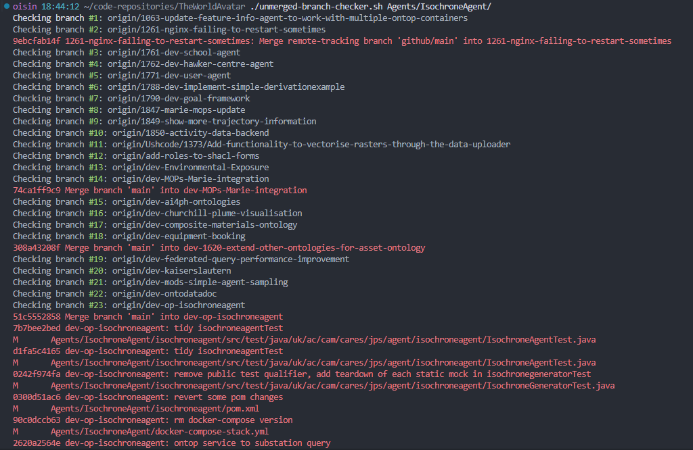

# Guide for migrating code to TheWorldAvatar repositories

1. Check out the main branch, and list all branches that haven't been merged:

   ```bash
   git branch -a --no-merge
   ```

2) Use the unmerged-branch-checker.sh script at the top level of the repository to list and speciffy a directory you want to check. Output looks like this
 
   
   
   The important lines are the red ones, which show changes to files not on `main`

3) Merge and clean up all branches wanted before the port.
4) Make a fresh clone of TWA repo.
5) Using git-filter-repo, which is now installed as a script on the branch, run:

    ```bash
     python3 git-filter-repo --path web/twa-vis-platform
     ```

   Further documentation on git-filter-repo and its extended capabilities [here](https://github.com/newren/git-filter-repo)

6) Create the new repository on Github (using the template repo if present), leave it empty (do not accept the Github suggestions of adding a README or License).
7) Set the new repo as the remote origin for the TWA clone with the rewritten history and filtered out directories.

   ```bash
   git remote add origin https://github.com/TheWorldAvatar/<newrepo>.git
   ```
8) Move the content of the filtered directory to the top of the repository.
9) Either pull the `LICENSE.txt`, `.gitattributes` and `.gitignore` files from the remote repo (if you used the template repo), or copy them from the original TWA repo.
   You may need to merge the `.gitignore` and `.gitattributes` files if the filtered directory already has them.
10)  Push any branches you want to keep to the new remote:
 
   ```bash
   git push -u origin main
   ```

11) Delete any branches that are not relevant.
