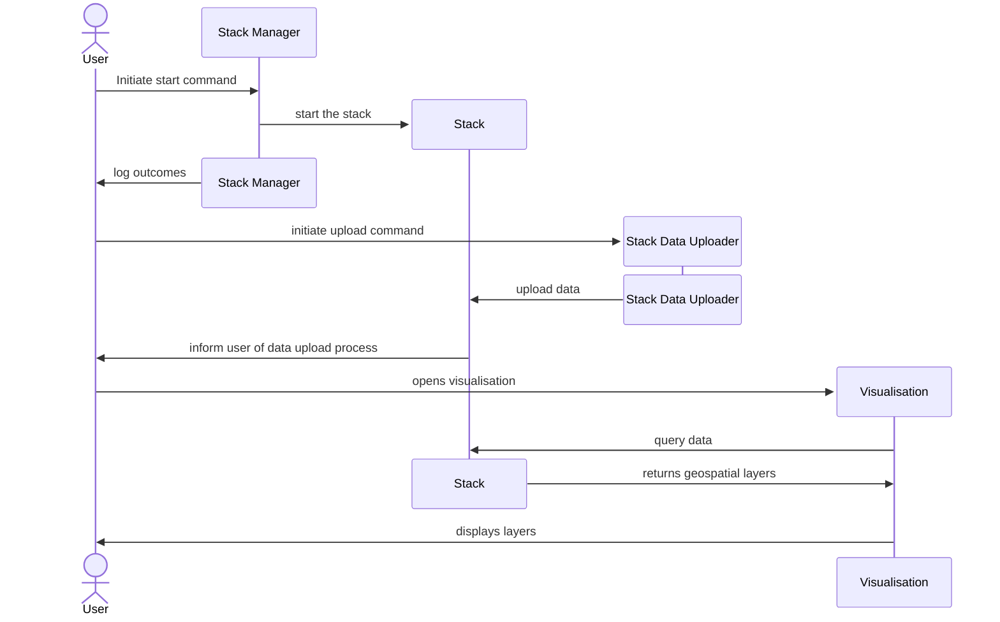

# Visualisation of Augmented UK

The augmented UK visualisation has been put together as a single stack with no requirements on any external services. Both the data required for the visualisation, and the visualisation itself are hosted within the stack instance. For more information on the stack, read the [documentation here](https://github.com/TheWorldAvatar/stack/tree/main/stack-manager).

This directory contains the documentation, configuration files, and associated scripts for a visualisation window into the base world of The World Avatar (focusing on assets within the United Kingdom). Whilst other data and capabilities related to the project may exist elsewhere in The World Avatar, this documentation only covers the steps needed to acquire, upload, and visualise data used in the deployed visualisation currently available from [The World Avatar's website](https://theworldavatar.io).

This documentation was written in July of 2024. The data available from the listed sources may have changed since this time, hopefully the processes are still applicable to any new data sets.

## 1. Workflow

In order to run this visualisation, users must have a running stack with the required data, as well as a visualisation container (running the **new `twa-vf` version 5**). The visualisation container may be deployed on the stack or as a standalone container. The overall workflow for setting this visualisation is as described below:

## 2. Stack deployment

### 2.1 Data sources

Data for this visualisation has been gathered from the sources listed on the [Data](./docs/data.md) page; the original raw files, as well as any processed files, have also been archived at CMCL on the Pavilion file server. Hopefully this process is repeatable with future versions of these data sets, if not then the archived data can be used as a fall-back. If the visualisation is updated with future versions of these data, the raw and processed versions of said files should also be archived.

As part of a base world visualisation, more data sources will be added in future; as and when they are, they should be documented within the aforementioned page.

### 2.2 Dependent agents

#### Feature info agent

To support metadata for the visualisation, the related stack needs to also launch an instance of the [Feature Info Agent](https://github.com/cambridge-cares/TheWorldAvatar/tree/main/Agents/FeatureInfoAgent). The appropriate configuration file and query files have been created and need to be copied into the relevant directories.

### 2.3 Deploying the stack

Before following the deployment steps, please read the following section to get a better understanding of the workflow. Once the correct files for each data source have been acquired, we need to first spin up an instance of the stack (see [here](https://github.com/TheWorldAvatar/stack/tree/main/stack-manager) for details on how to do this). Once ready, we have to upload data using the [data uploader](https://github.com/TheWorldAvatar/stack/tree/main/stack-data-uploader) into a relational database. Please read the [uploader's documentation](https://github.com/TheWorldAvatar/stack/tree/main/stack-data-uploader) before commencing upload as this file will not detail the generic upload process.

With each data set come a number of pre-written associated files (configurations, queries, styles etc.). These files are documented along with their corresponding data source on the [Data](./docs/data.md) page.

_Deployment Steps_

N.B.:

- To get copies of the required data files, please see the data sections above or contact CMCL for archived copies.
- File paths are shortened for simplicity:
  - `/stack-manager/.../` : `TheWorldAvatar/Deploy/stacks/dynamic/stack-manager`
  - `/stack-data-uploader/.../` : `TheWorldAvatar/Deploy/stacks/dynamic/stack-data-uploader`

1. As usual, ensure that `geoserver_password` and `postgis_password` secrets are in the `stack-manager/inputs/secrets` folder. If you require the visualisation on the same stack instance, add the `mapbox_username` and `mapbox_api_key` secrets as well, which should be retrieved from your mapbox account.
2. Copy the main stack manager config, `./inputs/config/manager/augmented-uk.json` to `/stack-manager/inputs/config/`.
3. Copy the `./inputs/config/manager/fia-queries` folder to `/stack-manager/inputs/data/`.
4. Run the stack manager in the usual way at port 38383 with `./stack.sh start augmented-uk 38383` from the `/stack-manager/` folder. Ensure all the containers spin up properly.
5. Copy _all_ the contents of the `./inputs/config/uploader/config` folder to `/stack-data-uploader/inputs/config/` (you can just delete the target config folder and replace it with the one here).
6. Similarly, copy _all_ the contents of the `./inputs/config/uploader/data` folder to `/stack-data-uploader/inputs/data/`.
7. Add the data files as specified in according to the [data documentation](./docs/data.md). The links for each should also now be in the relevant subdirectory of `/stack-data-uploader/inputs/data/`.
8. Run the stack data-uploader in the usual way with `./stack.sh start augmented-uk` run from the `/stack-data-uploader/` folder. Check the logs and ensure that data uploads properly. This will take a while.
9. Once completed, log into the GeoServer web dashboard and preview the layers (and feature locations within them) to verify if the uploading is successful.

Stopping the stack (including the option to remove existing volumes), can be done by using the `stack.sh` script within the `scripts` directory; the name of the created stack will be `augmented-uk`.

## 3. Visualisation deployment

The project has now been updated to use the new `twa-vf` version 5. The `uploads` directory contains the files required to start a web visualisation using the docker image. As with all TWA-VF visualisations, the `data.json` file defines the data to be loaded on the visualisation, and in what grouping. Users running the visualisation in a new location may need to adjust the URLs listed in this file.

For more information on how visualisations are created and configured using the TWA-VF, please read its [documentation page](https://github.com/cambridge-cares/TheWorldAvatar/tree/main/web/twa-vis-platform).

The visualisation can either be deployed as part of the same stack deployed [above](#23-deploying-the-stack) or as a standalone Docker container. Please read the respective sections for the required steps for either deployment method. By default, the steps will pull the Docker image directly from the online repository. But if you encounter any issues, you **may** build a local copy of the `twa-vf` Docker image. If so, please run the `docker compose build` command from within the `/web/twa-vis-platform/` directory.

### 3.1 Standalone deployment 

N.B.:
- File paths are shortened for simplicity:
  - `/twa-vis-platform/.../` : `TheWorldAvatar/web/twa-vis-platform`

1. Ensure the stack is running with the data required
2. Copy the contents of `./uploads` to `twa-vis-platform/uploads`
3. Add the `mapbox_username` and `mapbox_api_key` files to `/web/twa-vis-platform` containing your mapbox credentials
4. Run `docker compose up` from `twa-vis-platform` to start the standalone viz container
5. Check the container logs and ensure that the visualisation has been built and deployed. This will take a couple of minutes
6. Once ready, confirm the visualisation is working by visiting `localhost:3000/`

### 3.2 Stack deployment 

1. Ensure that you have added a `mapbox_username` and `mapbox_api_key` secrets to the `stack-manager/inputs/secrets` folder. If not, please remove the stack and add these secrets before restarting the stack
2. Modify `/stack-manager/inputs/config/augmented-uk.json` to include a visualisation service by adding `visualisation` to the list of services under `includes` (next to `feature-info-agent`). Add the following mapping `"vis-files": "uploads"` under `volumes` below the `fia-queries` line.
3. Add the service spec file `./inputs/config/manager/visualisation.json` to `/stack-manager/inputs/config/services`.
4. Copy the contents of `./uploads` to `/stack-manager/inputs/data/uploads`
5. Run the stack manager with `./stack.sh start augmented-uk 38383` from the `/stack-manager/` folder
6. Augmented UK should be available at `localhost:38383/visualisation` after a few minutes

## Support

For any support in reproducing this visualisation, please contact the CMCL support team.

## Screenshot

