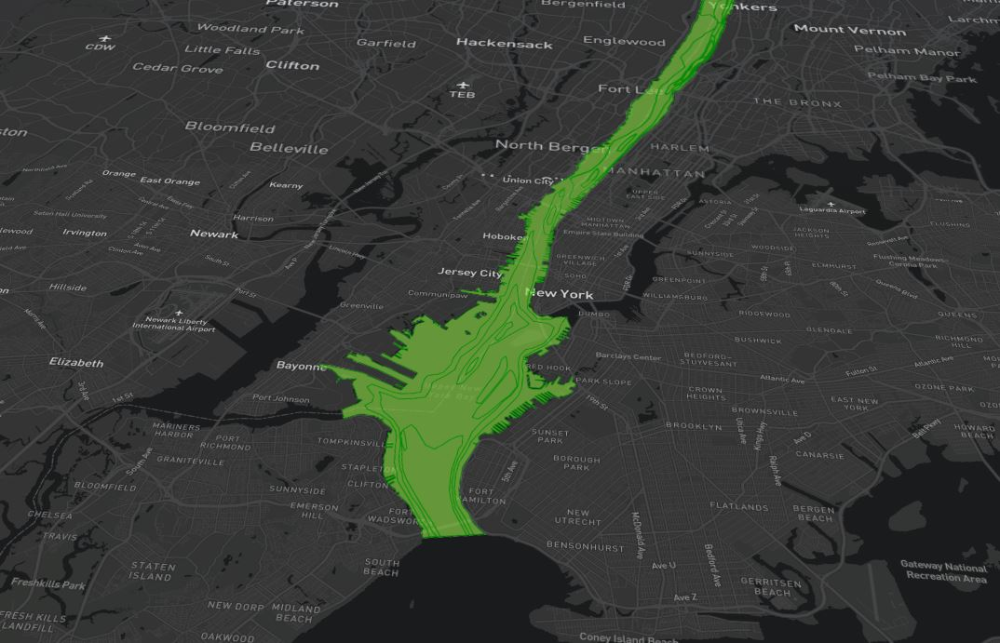

# Example CesiumJS Visualisation

This example visualisation has been put together to demonstrate the intended use of the centralised Digital Twin Visualisation Framework (DTVF). This framework has been designed to make it easier for users not experienced with Typescript (or the mapping libraries) to quickly & easily put together a new Digital Twin visualisation. It is intended for developers to use this example visualisation to gain an understanding of the DTVF before attempting to create their own visualisation; to do that, this example can be copied and used as a starting point.

It is recommended that you read the through the [DTVF Overview](../docs/overview.md) and [Working with CesiumJS](../docs/cesium.md) sections of the documentation before playing around with this example.

 

## Sample Data

A small amount of sample data has been committed to demonstrate the power of the DTVF to visualise different data types. Please do not make changes to the sample data without consulting the original developer. At the time of writing, the sample data sets include:

- **New York**:
  - Tiled 3D buildings, loaded from a remote CMCL server.
  - 2D river data from a WMS endpoint provided by Cornell University.
  - Sample tile sets to demonstrate clipping planes.
  - No metadata or timeseries present in this data set.

It's also worth noting that with this example visualisation, no stack or FeatureInfoAgent is running, hence these is no support for dynamic metadata or timeseries is available. This is something that we plan to work on in future.

 

## Building the Image

The `docker` folder contains the required files to build a Docker Image for the example visualisation. This uses the `dtvf-base-image` image as a base then adds the contents of the `webspace` directory to a volume mounted at `/var/www/html` within the container.

- Files to be hosted must be contained within the `webspace` directory.
- A valid Mapbox username and API token must be provided.
- A connection to the internet is required to contact remote resources and use the mapping libraries.

Once the requirements have been addressed, the image can be built using the below commands, run from within this directory.

- To build the Image:
  - `docker compose -f ./docker/docker-compose.yml build --force-rm`
- To generate a Container (i.e. run the Image):
  - `docker compose -f ./docker/docker-compose.yml up -d --force-recreate`

 

## Images

 

 

 <em>City scale data set.</em>   

 

 

 <em>2D data from WMS endpoint.</em>   

 

 

 <em>Example clipping plane.</em>   

