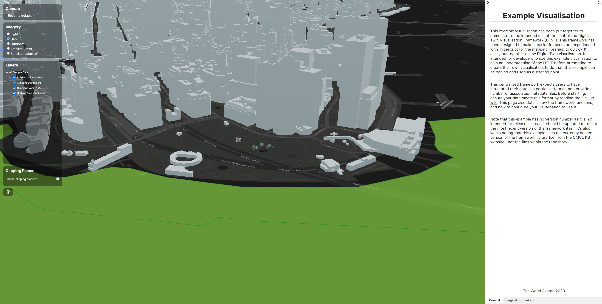
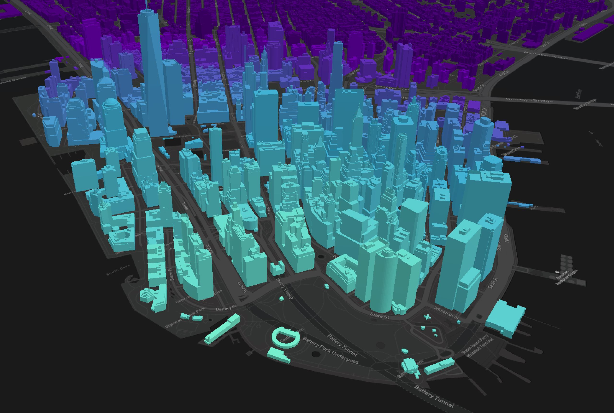
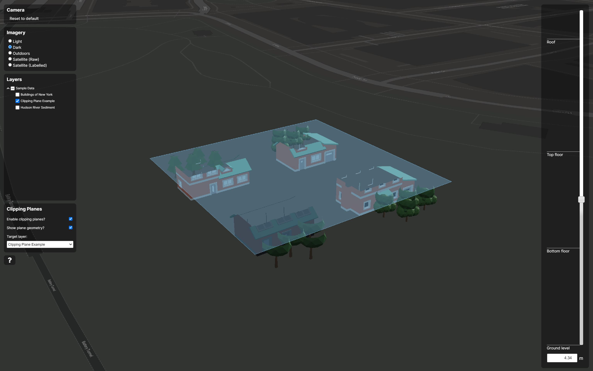

# Example Visualisation (Cesium)

This example visualisation has been put together to demonstrate the intended use of the centralised Digital Twin Visualisation Framework (DTVF). This framework has been designed to make it easier for users not experienced with Typescript (or the mapping libraries) to quickly & easily put together a new Digital Twin visualisation. It is intended for developers to use this example visualisation to gain an understanding of the DTVF before attempting to create their own visualisation; to do that, this example can be copied and used as a starting point.

It is recommended that you read the [Digital Twin Visualisations](https://github.com/cambridge-cares/TheWorldAvatar/wiki/Digital-Twin-Visualisations) page of the GitHub wiki before continuing with this document. It's also worth noting that this example uses version 3.5.1 of the DTVF, hosted on a remote CMCL server and not the raw TypeScript files within the library directory.



## Restrictions

It should be noted that this example uses the CesiumJS library, and makes no use of Cesium's premium offering, Cesium ion. Use of Cesium ion, or the features it offers, for commercial or funded educational use is prohibited without a paid-for licence.

At the time of writing, this means that anything that requires the use of a Cesium ion API key should be avoided (this has been confirmed by Cesium's support team). To be fully sure no premium features are being used, it is suggested that no API key is even used within the code. Premium features to be avoided include the following:

- Using the satellite imagery provided by Cesium
- Using the terrain elevation provided by Cesium

Alternatives to this paid-for features are detailed below. For more details read their licencing page [here](https://cesium.com/platform/cesium-ion/pricing/).

## Mapping Capabilities

Unlike the DTVF capabilities with the 2D mapping provider (Mapbox), not all Cesium JS features are supported within the DTVF. This is because Cesium JS requires explicit method calls for each type of data, rather than the more generic approach of passing in JSON configuration objects.

At the time of writing, the following 3D data formats are supported within the DTVF:

- KML files:
  - One, or more, KML files can be loaded but **cannot** be tiled. This means that the visualisation will generally handle total KML data up to ~100MB. Any more and performance suffers enough that other formats should likely be used.
- glTF files:
  - One, or more, non-tiled glTF or glB files.
- WMS endpoint:
  - 2D data can be loaded from WMS endpoints.
- 3D tiles:
  - 3D tiles can be loaded via their JSON index file. See the [Cesium 3D Tiles page](https://cesium.com/why-cesium/3d-tiles/) for more details.

Additional formats, provided they are supported by Cesium JS, can be added but will require development resource from the team at CMCL. Get in touch with them for details.

At the time of writing, client-side styling is limited to 3D tilesets and must be expressed in literal JSON objects using [Cesium's styling API](https://cesium.com/learn/cesiumjs-learn/cesiumjs-3d-tiles-styling/). More complex style options for 3D data should be baked into the associated model files, whilst all styling for 2D data (provided via WMS) should be carried out on the server (more information on server-side styling can be found [here](https://docs.geoserver.org/stable/en/user/styling/index.html)).

## Configuration

Configuration for the visualisation is provided via a number of local JSON files. Each of these is detailed below.

- `data.json`:
  - This required file contains a hierarchal specification of data groups. Each group can either house sub-groups, or individual data sources and layers for display. The structure of these groups defines the layer selection tree to the left of the visualisation. The required format for this file (when specifying 3D data) is listed below.

- `settings.json`:
  - This required file contains global settings (i.e. not specific to data sets) for the visualisation as a whole. Items like the map's starting location, available imagery layers, and fields available for feature searching are set here. For more details please see the [GitHub wiki page](https://github.com/cambridge-cares/TheWorldAvatar/wiki/Digital-Twin-Visualisations). 

- `icons.json`:
  - This optional file is used to list any image files required by the mapping library. Each image is specified with a unique name and a URL to the image file (which can be local or remote).

- `links.json`:
  - This optional file is used to provide links to additional resources; if present these are shown in the side panel of the visualisation.

In addition to these JSON files, areas of the `index.html` file can also be adjusted to change the default side panel content of the visualisation. Please note however that not all areas of this file are configurable, some HTML elements are required by the framework and had to be setup here rather than dynamically injected by the framework itself. Areas that are considered configurable are clearly commented within the HTML file.

Please note that the `index.html` file also required users to input their Mapbox API key, this is so that the terrain imagery can be pulled from Mapbox's free API rather than using imagery from Cesium ion (which would require a licence).
### Credentials 

In addition to the aforementioned configuration files, two additional files are required to house a Mapbox username and associated API key. Note these are required, even in Cesium visualisations, as the base map imagery is still provided by Mapbox.

To set these two files, either create and populate `mapbox_username`, and `mapbox-api-key` files within the hosted webspace, or use the stack infrastructure to provide these as Docker secrets. You can learn more about the latter by reading [the stack's documentation](https://github.com/cambridge-cares/TheWorldAvatar/tree/main/Deploy/stacks/dynamic/stack-manager).

Once present, these files are queried by the DTVF, loading in the required credentials. Note that previous versions of the DTVF required these parameters to be set within each visualisation's `index.html` file, this is no longer required (see the example visualisations to learn about the new format).

### Data Specification File

The `data.json` file is a core configuration file for the visualisation and defines what data is loaded and shown, so it's worth explaining its formatting a little. Each node represents a group of data. Each group can contain data sources and layers and/or sub-groups. The hierarchy of these groups is completely up to the writer of the file and is used to build the selection tree within the visualisation. The `name` parameter specifies the group's user-facing name, and the `stack` parameter is the base URL for the stack containing that group's metadata (note that if not using the metadata, this parameter can be any old URL).

Each group can then contain a number of `sources`, representing individual data files/endpoints that will be loaded into memory/queried by the mapping library. Each source node requires a unique `id` parameter, this is used within the DTVF to keep track of sources. In addition to `sources`, each group can define a number of `layers`. These are the visual representations of the aforementioned sources. Whilst Cesium JS does not have a internal division between data sources and visual representations, this approach is still used within the configuration file for consistency with other mapping providers.

Each group can also (optionally) contain an `expanded` boolean field. If set to false, then this group (and all of its children) will be collapsed by default within the selectable layers tree; any other value, or no field at all, will default to expanded. Note that this does not affect the default selection state of individual layers.

#### Sources

Source nodes need to provide a unique `id` field, a `type` field (`kml|gltf|wms|tiles`), and a `uri` field pointing towards the data file to be loaded. Some types of sources also require additional parameters:

- For `gltf` sources, an additional `position` field is required.
  - The `position` field is a three value array of the form `[longitude, latitude, height]`.
- For `wms` sources, additional `wmsLayer`, `transparency`, and `format` fields are required.
- For `tiles` sources, optional `position` and `rotation` fields can also be set.
  - The `position` field is a three value array of the form `[longitude, latitude, height]`.
  - The `rotation` field requires the `position` field to be present, and is a three value array of the form `[roll, pitch, heading]`. Cesium defines Roll as the rotation about the positive X axis, Pitch as the rotation about the negative Y axis, and Heading as the rotation about the negative Z axis

#### Layers

Layer nodes also need to provide a unique `id` field, a `source` field (listing the id of the source to use), and an public facing `name` field to use within the selection tree. Note that the `name` field can be shared with other layers, these entries will be combined into a single tree selection. A `visibility` field with values of `visible|none` can also be added to change the default selection state of that layer.

Layers can also optionally include an integer `order` field (which defaults to 0 if not specified). Before visualising, all layers (across all groups) are sorted by their order from lowest to highest; this allows users to specify the Z order of their data, regardless of grouping.

Layer nodes for 3D tileset sources can also specify a `style` object defining a data-driven expression to change the visual look of features or to filter out specific ones. Note that this only supports a basic styling system that can be expressed within literal JSON keys & values, more complex styling should be carried out within the actual model files. For details on how to write a Cesium style expression, see their [web page](https://cesium.com/learn/cesiumjs-learn/cesiumjs-3d-tiles-styling/) detailing the process. In addition, the example TWA Cesium visualisation shows a style used to color buildings based on their distance from a point, and how to filter out a specific building based on one of its properties.

Note that, at the time of writing, all `source` and `layer` nodes must be within a `group` (i.e. data cannot be loaded unless within a group), and a single top-level group must exist (i.e. the `data.json` file must be a JSON object, rather than a JSON array).

For developers creating their first visualisation, it is recommended to take a copy of this example and play around with the `data.json`, perhaps changing the hierarchy and/or getting comfortable with the Mapbox styling format. 

<p align="center">

</p>

### Global Settings & Advanced Features

Configuration settings for features not specifically tied to an individual mapping library can be read on the [GitHub wiki](https://github.com/cambridge-cares/TheWorldAvatar/wiki/DTVF:-Settings), features specific to CesiumJS are detailed in the sections below.

These features currently include:

- [Changing the available (and default) map imagery](https://github.com/cambridge-cares/TheWorldAvatar/wiki/DTVF:-Settings#map-imagery)
- [Overriding expected feature property names](https://github.com/cambridge-cares/TheWorldAvatar/wiki/DTVF:-Settings#feature-fields)
- [Defining custom attribution text](https://github.com/cambridge-cares/TheWorldAvatar/wiki/DTVF:-Settings#attribution)

#### Map Position

The default position of the map can be specified via the start field of the settings file. The specific fields within this node differ depending on the map provider; an example the CesiumJS version can be seen below. Note that these settings represent the position of the camera itself, not what it is looking at. In this Cesium JS case, the opacity of the globe itself can also be set here.

```json
"start": {
    "center": [7.621435, 49.180285, 50],
    "heading": 90,
    "pitch": -45,
    "roll": 0.0,
    "opacity": 0.5
}
```

#### Terrain Elevation

Terrain elevation data can also be provided via use of a `terrain` variable in the `settings.json` file. The value this variable is passed directly to a new [CesiumTerrainProvider](https://cesium.com/learn/cesiumjs/ref-doc/CesiumTerrainProvider.html) instance, as such users need to ensure that their settings conform with the CesiumJS API.

An example specification of terrain elevation is shown below. Note that in this case, the data is pulled from quantized mesh tiles provided by [MapTiler](https://cloud.maptiler.com/), a service that is **not permitted for commercial use** without a paid-for licence.

```json
"terrain": {
    "url": "https://api.maptiler.com/tiles/terrain-quantized-mesh-v2/?key=API_KEY",
    "requestVertexNormals": true
}
```

#### Clipping Planes

For 3D tileset sources, clipping planes can also be added that allow the user to effectively slice the model, revealing its interior at a specific height; Cesium has an online example of this [here](https://sandcastle.cesium.com/?src=3D%20Tiles%20Clipping%20Planes.html); a demonstration of this feature has also been added to this example visualisation.

To enable clipping planes, within the specification of a 3D tileset layer in the `data.json` file, add a `clipping` object to specify the height range (above sea level, in metres), and an optional array of labelled increments; this can be done for as many tilesets as the developer requires. An example of the specification format is shown below:

```json
  "clipping": {
        "min": 0,
        "max": 10,
        "start": 10,
        "labels": {
            "0": "Ground level",
            "2.9": "Bottom floor",
            "5.78": "Top floor",
            "9.14": "Roof"
        }
    }    
```

There are a few caveats to mention however:
- This feature is only supported on 3D tileset sources.
- Cesium only seems to support clipping planes on the _entire_ tileset.
- The size of the clipping plane is based on the bounds of the tileset itself.
- The feature can currently only be active on one tileset at any given time.
- If adding planes to an existing visualisation, ensure the version of DTVF JS and CSS files used in the `index.html` file are _at least_ 3.4.0.
- If adding planes to an existing visualisation, ensure the version of Cesium JS and CSS files used in the `index.html` file are _at least_ 1.105.

<p align="center">
    
</p>

## Sample Data

A small amount of sample data has been committed to demonstrate the power of the DTVF to visualise different data types. Please do not make changes to the sample data without consulting the original developer. At the time of writing, the sample data sets include:

- **New York**:
  - Tiled 3D buildings, loaded from a remote CMCL server.
  - 2D river data from a WMS endpoint provided by Cornell University.
  - No metadata or timeseries present in this data set.
  - Styling based on distance from Castle Clinton
  - Filtering to hide the Whitehall Ferry terminal

It's worth noting that with this sample data, no stack is running so no support for dynamic metadata or timeseries is available. This is something that we plan to work on in future, no true generic solution exists for this so far.

## Building the Image

The `docker` folder contains the required files to build a Docker Image for the example visualisation. This uses the `dtvf-base-image` image as a base then adds the contents of the `webspace` directory to a volume mounted at `/var/www/html` within the container.

- Files to be hosted must be contained within the `webspace` directory.
- A valid Mapbox API token must be provided in your `index.html` file.
- A connection to the internet is required to contact remote resources and use the mapping libraries.

Once the requirements have been addressed, the image can be built using the below methods. If changing the visualisation, you'll need to rebuild and rerun the Docker image after and adjustments, or setup a Docker bind mount so that local changes are reflected within the container.

- To build the Image:
  - `docker-compose -f ./docker/docker-compose.yml build --force-rm`
- To generate a Container (i.e. run the Image):
  - `docker-compose -f ./docker/docker-compose.yml up -d --force-recreate`

## Troubleshooting

For details on common issues/questions that may appear when using Cesium JS, please see the dedicated [Troubleshooting](https://github.com/cambridge-cares/TheWorldAvatar/wiki/DTVF:-Troubleshooting) page on the GitHub wiki.
