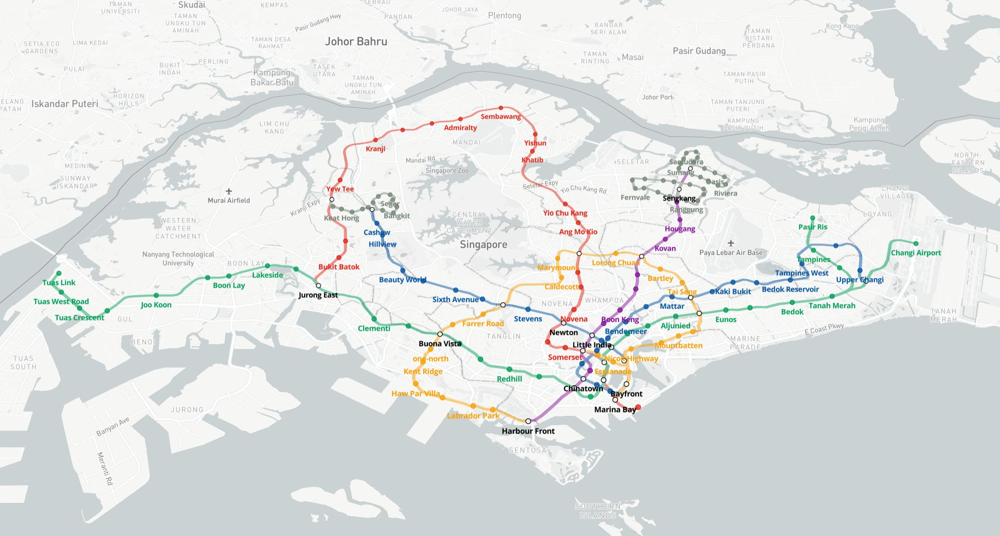

# Example Visualisation (Mapbox)

This example visualisation has been put together to demonstrate the intended use of the centralised Digital Twin Visualisation Framework (DTVF). This framework has been designed to make it easier for users not experienced with Typescript (or the mapping libraries) to quickly & easily put together a new Digital Twin visualisation. It is intended for developers to use this example visualisation to gain an understanding of the DTVF before attempting to create their own visualisation; to do that, this example can be copied and used as a starting point.

It is recommended that you read the [Digital Twin Visualisations](https://github.com/cambridge-cares/TheWorldAvatar/wiki/Digital-Twin-Visualisations) page of the GitHub wiki before continuing with this document. It's also worth noting that this example uses version 3.5.0 of the DTVF, hosted on a remote CMCL server and not the raw TypeScript files within the library directory.



## Mapping Capabilities

The DTVF supports a number of different data formats and representations, in the case of 2D data (visualised by Mapbox, as in this example), anything that is supported by the Mapbox GL JS library is supported through the DTVF. Rather than detailing these here, please review the [Sources](https://docs.mapbox.com/mapbox-gl-js/style-spec/sources/) page of the Mapbox website for supported data formats, and the [Layers](https://docs.mapbox.com/mapbox-gl-js/style-spec/layers/) page for supported visual representation types. The [Mapbox examples page](https://docs.mapbox.com/mapbox-gl-js/example/) also provides a very detailed set of examples that display each of the features Mapbox provides, it's well worth looking through it.

As the Mapbox API is primarily configured via JSON objects, the DTVF supports passing these through from the `data.json` configuration file. This means that the majority of features supported by Mapbox (e.g. Source and Layer configuration, Filter Expressions) are already supported. At the time of writing however, use of the Lighting, Fog, and Projection features are unsupported (these can be added if there is a desire).

Note that when serving data via a WMS endpoint, via a service like GeoServer, styling can actually be done on the server side. Whilst this is required for some data formats, like rastered images, we recommend serving data using the Mapbox Vector Tiles format so that styling can be done via the client-side library (solely as this is better documented).

## Configuration

Configuration for the visualisation is provided via a number of local JSON files. Each of these is detailed below.

- `data.json`:
  - This required file contains a hierarchal specification of data groups. Each group can either house sub-groups, or individual data sources and layers for display. The structure of these groups defines the layer selection tree to the left of the visualisation. The required format for this file is listed below.

- `icons.json`:
  - This optional file is used to list any image files required by the mapping library. Each image is specified with a unique name and a URL to the image file (which can be local or remote). Adding "-sdf" to the icon's file name will ensure that the DTVF registers the image as an [SDF icon](https://docs.mapbox.com/help/troubleshooting/using-recolorable-images-in-mapbox-maps/) within Mapbox, enabling dynamic color changing (providing that the icon has been setup correctly).

- `links.json`:
  - This optional file is used to provide links to additional resources; if present these are shown in the side panel of the visualisation.

In addition to these JSON files, areas of the `index.html` file can also be adjusted to change the default side panel content of the visualisation. Please note however that not all areas of this file are configurable, some HTML elements are required by the framework and had to be setup here rather than dynamically injected by the framework itself. Areas that are considered configurable are clearly commented within the HTML file.

### Data Specification File

The `data.json` file is the core configuration file for the visualisation and defines what data is loaded and shown, so it's worth explaining it's formatting a little. Each node represents a group of data. Each group can contain data sources and layers and/or sub-groups. The hierarchy of these groups is completely up to the writer of the file and is used to build the selection tree within the visualisation. The `name` parameter specifies the group's user-facing name, and the `stack` parameter is the base URL for the stack containing that group's metadata (note that if not using the metadata, this parameter can be any old URL). Note that the `name` field can be shared with other layers, these entries will be combined into a single tree selection.

Each group can also (optionally) contain an expanded boolean field. If set to false, then this group (and all of its children) will be collapsed by default within the selectable layers tree; any other value, or no field at all, will default to expanded. Note that this does not affect the default selection state of individual layers.

#### Sources

Each group can then contain a number of `sources`, representing individual data files/endpoints that will be loaded into memory/queried by the mapping library. Each source node requires a unique `id` parameter, this is used within the DTVF to keep track of sources. Other than that, any parameters added to the source node will be passed directly to the Mapbox API, this means that developers can refer to the [Sources](https://docs.mapbox.com/mapbox-gl-js/style-spec/sources/) page of Mapbox for details on what to include.

#### Layers

In addition to `sources`, each group can define a number of `layers`. These are the visual representations of the aforementioned sources, each source can have multiple layers. Again, each layer requires a unique `id` parameter, but further elements are passed directly to Mapbox so the [Layers](https://docs.mapbox.com/mapbox-gl-js/style-spec/layers/) page of their documentation can be referred too for details. This includes use of the filter expressions to refine which features are shown within each layer.

Layers can also optionally include an integer `order` field (which defaults to 0 if not specified). Before visualising, all layers (across all groups) are sorted by their order; this allows users to specify the Z order of their data, regardless of grouping.

For developers creating their first visualisation, it is recommended to take a copy of this example and play around with the `data.json`, perhaps changing the hierarchy and/or getting comfortable with the Mapbox styling format.


### Global Settings & Advanced Features

Configuration settings for features not specifically tied to an individual mapping library can be read on the [GitHub wiki](https://github.com/cambridge-cares/TheWorldAvatar/wiki/DTVF:-Settings), features specific to Mapbox are detailed in the sections below.

These features currently include:

- [Changing the available (and default) map imagery](https://github.com/cambridge-cares/TheWorldAvatar/wiki/DTVF:-Settings#map-imagery)
- [Overriding expected feature property names](https://github.com/cambridge-cares/TheWorldAvatar/wiki/DTVF:-Settings#feature-fields)
- [Defining custom attribution text](https://github.com/cambridge-cares/TheWorldAvatar/wiki/DTVF:-Settings#attribution)

#### Map Position

The default position of the map can be specified via the start field of the settings file. The specific fields within this node differ depending on the map provider; an example the Mapbox version can be seen below.

```json
"start": {
    "center": [60, 37],
    "zoom": 2,
    "bearing": 0,
    "pitch": 45
}
```

#### Feature Filtering

When using the Mapbox implementation, a rudimentary ability to filter/search for individual locations has been added. Accessed via the CTRL+F keyboard shortcut, this feature allows users to hide all locations that do not match some input search term. Properties from the geospatial data (i.e. not any dynamically loaded metadata) can be used as targets for the search; the example Mapbox visualisation contains an example of this (primarily focussed on the Cambridge Colleges data set).

It is worth noting that, at the time of writing, the filter will apply to all locations across all layers currently available on the map. Additionally, any clustering of locations (normally enabled by configuring the source object within the data configuration file) will be temporarily disabled whilst the search controls are active; this is to avoid the situation in which matching locations are hidden because they were clustered (and clustered locations will almost always fail the filter match as they contain very little information on what individual features they contain).

To enable this functionality within your visualisation, a special `search` node needs to be added to your `settings.json` file. This node should be a JSON array of objects, each object defining: `description`, the user facing name of the parameter that can be filtered on/searched for; `property`, the name of the actual property within the geospatial data; and `type`, which must be `string|number|boolean` and represents the type of property.

An example snippet of the `settings.json` file defining search parameters is shown below.

```json
"search": [
    {
        "description": "Name",
        "property": "name",
        "type": "string"
    },
    {
        "description": "Year Founded",
        "property": "founded",
        "type": "number"
    },
    {
        "description": "Undergraduates Admitted?",
        "property": "undergraduates",
        "type": "boolean"
    }  
]
```

## Sample Data

A small amount of sample data has been committed to demonstrate the power of the DTVF to visualise different data types. Please do not make changes to the sample data without consulting the original developer. At the time of writing, the sample data sets include:

- **Cambridge**:
  - Based in and around Cambridge, this data set mimics a single stack that contains data on college locations and buildings.
  - The colleges layer demonstrates how clustering can be achieved.
  - No metadata or timeseries present in this data set.
- **Singapore**:
  - Based in Singapore, this data set includes details of rail lines and stations.
  - Shows examples of setting up data-driven styling within the `data.json` file.
  - No metadata or timeseries present in this data set.
- **India**:
  - Based in India, this data set shows rastered locations of Aqueducts and Canals
  - This data is pulled from a public WMS endpoint provided by Stanford University.
  - No metadata or timeseries present in this data set.

In most deployed visualisations, an online stack of microservices will provide data endpoints through which data can be queried/loaded onto the visualisation. In this example, no online stack is used, solely to remove a lengthy prerequisite step. Instead, sample data in GeoJSON files have been added (to be hosted by the visualisation's web server) and, in one case, a community provided WMS endpoint connected to. In production, it is advised that all data is loaded into a geospatial data provider (like GeoServer) and a WMS endpoint used; local files can be utilised but then do not offer the optimisation and caching of services like GeoServer. For more information on how to do this, see the README for the [Stack Data Uploader](https://github.com/cambridge-cares/TheWorldAvatar/tree/main/Deploy/stacks/dynamic/stack-data-uploader).

## Building the Image

The `docker` folder contains the required files to build a Docker Image for the example visualisation. This uses the `dtvf-base-image` image as a base then adds the contents of the `webspace` directory to a volume mounted at `/var/www/html` within the container.

- Files to be hosted must be contained within the `webspace` directory.
- A valid Mapbox API token must be provided in your `index.html` file.
- A connection to the internet is required to contact remote resources and use the mapping libraries.

Once the requirements have been addressed, the image can be built using the below methods. If changing the visualisation, you'll need to rebuild and rerun the Docker image after and adjustments, or setup a Docker bind mount so that local changes are reflected within the container.

- To build the Image:
  - `docker-compose -f ./docker/docker-compose.yml build --force-rm`
- To generate a Container (i.e. run the Image):
  - `docker-compose -f ./docker/docker-compose.yml up -d --force-recreate`
