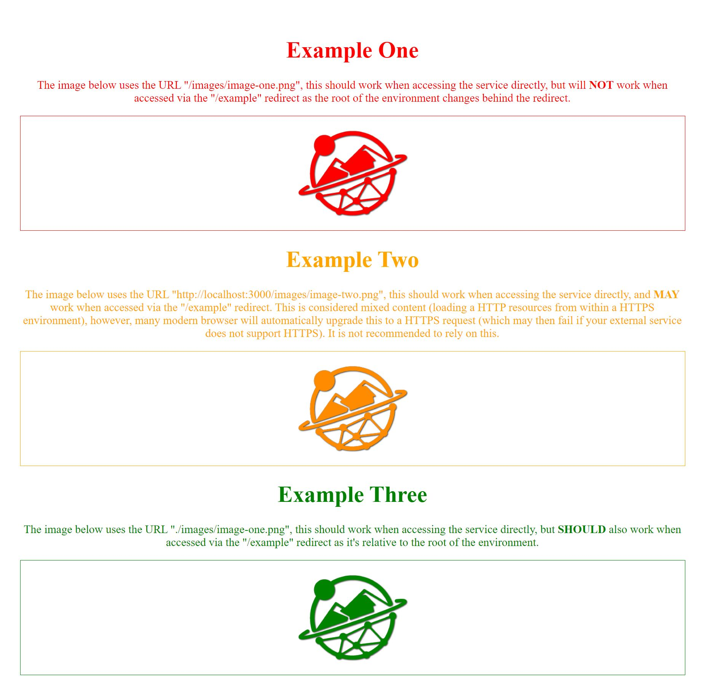
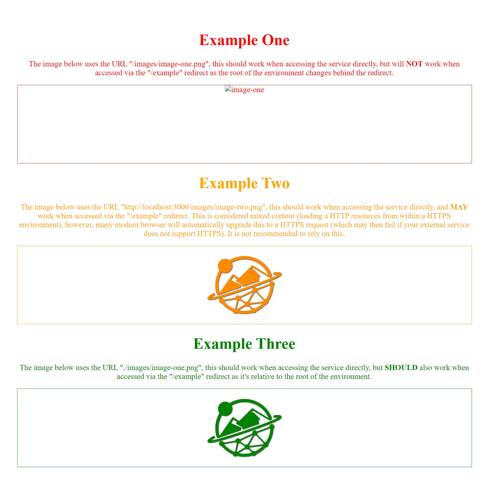

# TWA: Web Documentation

This directory contains some useful documentation and examples relating to information and best practices when hosting TWA content on the web.

Note that these documentation pages are a constant work in progress, and will be updated regularly. Any suggestions or requests for further documentation should be sent to CMCL, who will in turn add more documentation/examples as required.

## TWA Website

The TWA project has a publicly facing website located at [https://theworldavatar.io](https://theworldavatar.io). This is site was created by, and it hosted at, CMCL in Cambridge. It runs from Docker containers using standard [Wordpress](https://wordpress.com/) installations, behind a single reverse proxy created using [NGINX](https://www.nginx.com/). Two versions of the site are hosted at once; production (available by the aforementioned URL), and development (accessed using the `dev.` subdomain).

For more details on how the TWA website was created and hosted, see the [repository here](https://github.com/cmcl-io/theworldavatar.io). Note that this is a private repository created by CMCL, you'll need their permission to access it.

### Making changes

As mentioned above, the TWA website has two installations; production and development. The standard workflow for making changes is to modify the content, update any installed plugins/themes, then review changes all within the development environment. Once this is done, checked and agreed upon, then the scripts available on the CMCL server can be executed to push to production and make the changes live. Note that whilst anyone can make changes to the development site, at the time of writing only CMCL are able to run the "push-to-production" process.

Whilst the "push-to-production" scripts have been worked on to make them as seamless as possible, the logical routines and data transfers they perform are not simple. As such, it's possible that things go wrong during the push process; in this case, a developer at CMCL will have to manually update the files/databases to correct the issues or rollback to a previous backup. This means that as much time as possible should be given for this process; for example, requesting a new set of pages to be added "before my very important seminar tomorrow" is only asking for disaster.

> [!CAUTION]
> Making changes directly to the production version of the site violates this workflow. Changes made this way will be overwritten the next time development is pushed to production.

Members from across the 4Cs are invited to make changes on the development site providing the above workflow is followed and changes are discussed with CMCL (just to keep them up to date if nothing else). Access to the Wordpress CMS for the development site can be arranged by contacting CMCL; house rules and tips for updating content can be found via the [TWA Internal](https://theworldavatar.io/internal) pages on the site (password available from CMCL).

## Redirecting to external services

Another common method of dissemination is host your own content within a publicly available Docker container made available on systems like [DigitalOcean](https://www.digitalocean.com/). Admins at CMCL can then add a redirect to the TWA website's reverse proxy so that the container is available from a URL such as `https://theworldavatar.io/demos/my-new-service`. These redirects need to be chosen carefully so they don't conflict with the pages hosted by the Wordpress CMS.

It is worth noting however that just because you've set up your container's web content, and it looks functional and pretty, it may not work correctly behind the redirect without additional changes. Depending on how you've written your web content, the URLs you've used for your image/CSS/JS files may no longer resolve when behind the redirect.

### Fixing your URLs

There are a number of ways URLs can be constructed, only some of these will work when accessing your container directly **and** when it's accessed behind a redirect.

**Absolute URLs (with domain)**: 
URLs written using an absolute format staring with your container IP (i.e. `http://127.0.0.1:3000/images/image.png`). This may cause issues when running behind a redirect as the TWA website uses HTTPS links, and will then be trying to load unprotected HTTP content from these links (something that is frowned upon by modern browsers).

**Absolute URLs (without domain)**: 
URLs that are written absolute but without the domain name (i.e. `/images/image.png`). This will only work when accessing the container directly, when behind a redirect the root of the website has changed and will no longer resolve. For example, if your service is hosted using the example redirect above, that image URL will resolve to `https://theworldavatar.io/images/image.png`, which will result in a file-not-found error.

**Relative URLs**: 
URLs that are written relative to the root of the site (i.e. `./images/image.png`). If your content is served from the root of your container (i.e. from `container-ip:3000` rather than `container-ip:3000/content`), which is recommended, then these URLs should resolve as they're routed through the redirect. As an example, the image URL listed and the redirect should above would resolve to `https://theworldavatar.io/demos/my-new-service/images/image.png`, which should find your image correctly.

As an extra note, it is worth testing if your URLs require an ending slash (`/`) character to function. URLs with trailing slashes are not equivalent to those without, and depending on your service's NGINX configuration, may not return the same content.

### Testing your URLs

Within the `url-testing` directory, there's a small example NGINX service configured to run as a local Docker container that will simulate the TWA reverse proxy so that you can access your new service container through a mocked HTTPS redirect and test these URLs.

To run it, follow the below steps:

* Create an `.env` file within the `url-testing` directory.
* Add the URL of your container to that file in the below format:
  * `URL=http://1.2.3.4/3838`
* Run the `start.sh` script from the `url-testing` directory.
* Visit `http://localhost/redirect/` to see your container as it will appear behind a redirect.

> [!NOTE]
> You may find that accessing the redirect in your browser shows a "Your connection is not private" error. This is expected as we're creating a fake (self-signed) SSL certificate to emulate HTTPS locally. You should be able safely dismiss and continue to test your URLs via the redirect.

### Example

The committed `docker-compose.yml` file also spins up a simple web server in its own container hosting some static content to display an example of which URL types will and won't work. You can access this container directly from `http://localhost:3000` or via the provided redirect at `https://localhost/example`; switching between to two should showcases the difference in URLs.

Accessed directly         |  Accessed via redirect
:-------------------------:|:-------------------------:
  |  

## Redirect scope

It's worth noting here that as we have an easily editable, nice-looking CMS for the website (Wordpress), we expect all static content to be added directly to the website so it's well integrated and managed. We do not recommmend that people host static web content (i.e. unchanging text & images) within their containers we redirect to. The containers should ideally just host the interactive demo/agent/data endpoint. In the few cases were static content _must_ be added to the container, effort should be made to ensure it fits within the visual theme of the main website.,

## Redirect persistance

Adding a redirect to theworldavatar.io should provide users with an unchanging, maintained, publically accessible link to their service that can be used in presentations and publications. Note however that as this website is an ongoing, in-development environment, **we do not guarantee that redirects will be maintained** beyond a resonable age (~6 months), or that they will not be changed to avoid collisions with other services/pages.

> [!CAUTION]
> Redirects may be changed, or go offline, at any time. Whilst we endevour not to change them, no guarantees are made. 
