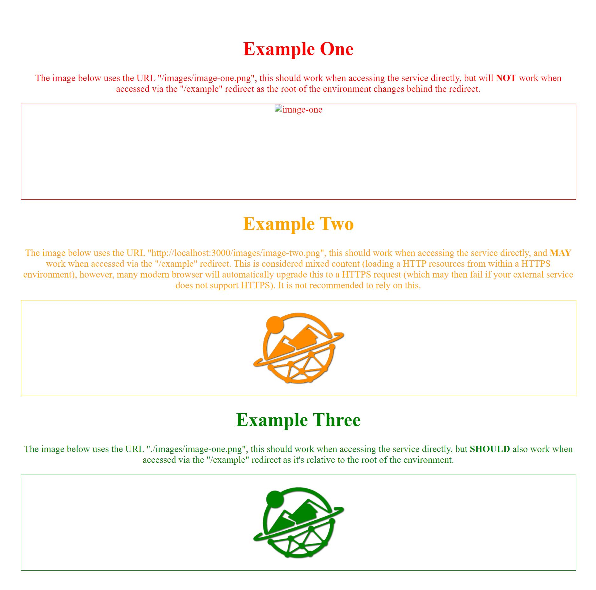

# Redirect testing

Within this directory, there's a small example NGINX service configured to run as a local Docker container that will simulate the TWA reverse proxy so that you can access your new service container through a mocked HTTPS redirect and test these URLs.

To run it, follow the below steps:

* Create an `.env` file within the `url-testing` directory.
* Add the URL of your container to that file in the below format:
  * `URL=http://1.2.3.4/3838`
* Run the `start.sh` script from the `url-testing` directory.
* Visit `http://localhost/redirect/` to see your container as it will appear behind a redirect.

> [!NOTE]
> You may find that accessing the redirect in your browser shows a "Your connection is not private" error. This is expected as we're creating a fake (self-signed) SSL certificate to emulate HTTPS locally. You should be able safely dismiss and continue to test your URLs via the redirect.

### Example

The committed `docker-compose.yml` file also spins up a simple web server in its own container hosting some static content to display an example of which URL types will and won't work. You can access this container directly from `http://localhost:3000` or via the provided redirect at `https://localhost/example`; switching between to two should showcases the difference in URLs.

Accessed directly         |  Accessed via redirect
:-------------------------:|:-------------------------:
  |  
