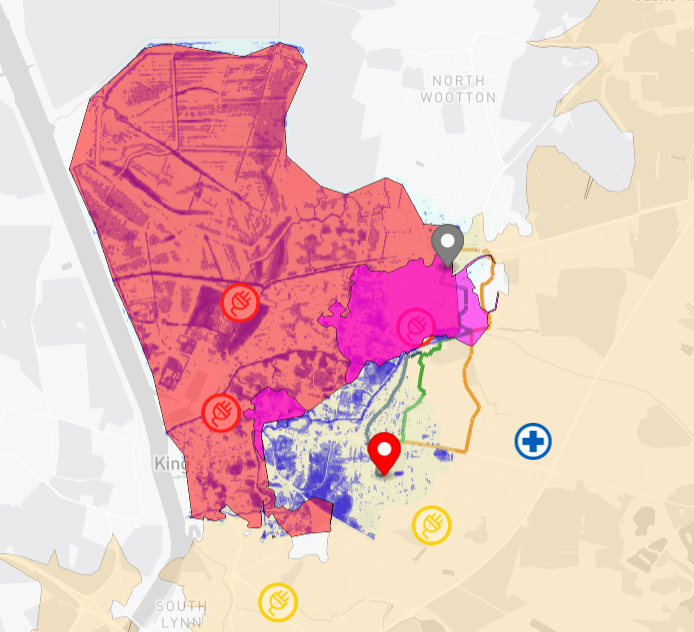

# Kings Lynn Flood Routing Digital Twin Visualisation Framework (TWA-VF)
This visualization serves as a proof of concept, leveraging knowledge graph technology for: 
1) Flood routing for vehicles with various water depth wading capability. 
2) Isochrone mapping from points of interest, highlighting unreachable area and population.
3) Travelling Salesman Problem for fastest route to restore flooded power stations. 
4) Road network sensitivity analysis - before and after flood. 

This visualisation uses result of 
1) [IsochroneAgent](https://github.com/cambridge-cares/TheWorldAvatar/tree/main/Agents/IsochroneAgent)
2) [TravellingSalesmanAgent](https://github.com/cambridge-cares/TheWorldAvatar/tree/main/Agents/TravellingSalesmanAgent)
3) [NetworkAnalysisAgent](https://github.com/cambridge-cares/TheWorldAvatar/tree/main/Agents/NetworkAnalysisAgent)

The instantiated data is visualised using the TWA Visualisation Framework [TWA-VF](../twa-vis-framework) version `4.1.2`. 



## Deployment
### Replacing the agent configuration file
On this same directory run, replace `STACK-NAME` with your stack-manager name.
```
./copy.sh start <STACK-NAME>
```

### Spinning up stack-manager
Copy all relevant [config](stack-manager-inputs/config/) and [data](stack-manager-inputs/data) files into the stack's [input](https://github.com/cambridge-cares/TheWorldAvatar/tree/main/Deploy/stacks/dynamic/stack-manager/inputs) folder. Spin up the stack-manager.

Modify the bindmounts of the agents [config](stack-manager-inputs/config/) before spining up the stack-manager.

### Uploading the data
Upload data following [stack-data-uploader-inputs](stack-data-uploader-inputs) using [stack-data-uploader](https://github.com/cambridge-cares/TheWorldAvatar/tree/main/Deploy/stacks/dynamic/stack-data-uploader). Relevant files need to be placed in each of the folders, with the source to retrieve detailed in the [README](stack-data-uploader-inputs/data/kingslynn/README.md).

### Running the agent
To begin running the agents, on this same directory, run the command below while replacing `STACK-NAME` with your stack-manager name.
```
./stack.sh start <STACK-NAME>
```

## Accessing the visualisation
Visualization can be seen at [http://localhost:3838/visualisation](http://localhost:3838/visualisation)

<!-- Links -->
[FeatureInfoAgent]: https://github.com/cambridge-cares/TheWorldAvatar/tree/main/Agents/FeatureInfoAgent
[index.html]: webspace/index.html
[data.json]: /DTVF/data.json
