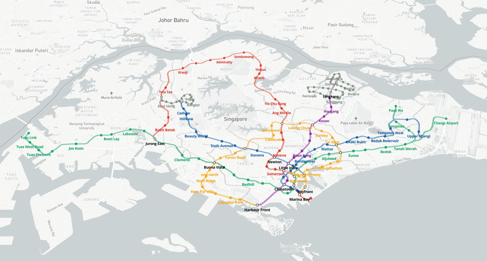
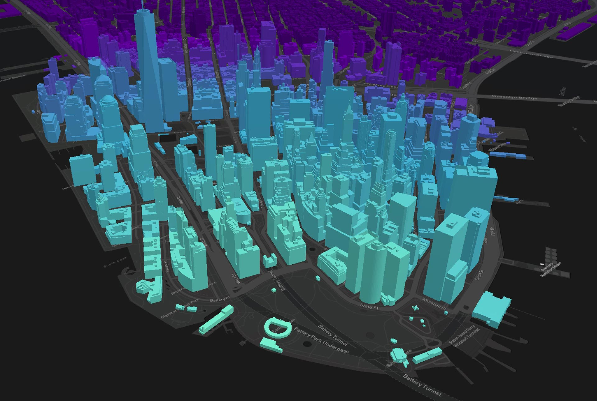

# TWA Visualisation Framework

A central framework for TWA Visualisations (the TWA Visualisation Framework, or TWA-VF) has been created so that in most cases, the process of creating a new visualisation to display pre-generated data is as simple as possible. The goal is that a developer who is inexperienced with Typescript (or the JavaScript libraries we're using) can get a reasonable visualisation of the data by simply ensuring the data meets a set format and providing some basic configuration files.

The current, working version of the TWA-VF is defined in the `library/VERSION` file.

## Contents

Documentation for the TWA-VF is spread across a number of files, and is broken down into the following sections.

* [Overview](./docs/overview.md)
  * _Provides a high level overview on the TWA-VF._
* [Change Log](./library/CHANGELOG.md)
  * _History of changes and requirements for each version._ 
* [Development](./library/README.md)
  * _Information for developers of the TWA-VF._
* [Working with Mapbox](./docs/mapbox.md)
  * _Generating layers and handling interactions with [Mapbox](https://www.mapbox.com/)._
* [Working with Cesium](./docs/cesium.md)
  * _Generated layers and handling interactions with [CesiumJS](https://cesium.com/platform/cesiumjs/)._
* [Advanced features](./docs/advanced.md)
  * _Enabling and configuring more advanced features._
* [Tutorials](./docs/tutorials.md)
  * _Tutorials for creating new visualisations._
* [Example](./example/README.md)
  * _A quickly-bootable example that can be used as a sandbox._
* [Troubleshooting](./docs/troubleshooting.md)
  * _Solutions to common issues and questions._ 

## Examples

 

 <em>Example of 2D data on a Mapbox visualisation.</em>   

 

 <em>Example of 3D data on a CesiumJS visualisation.</em>

