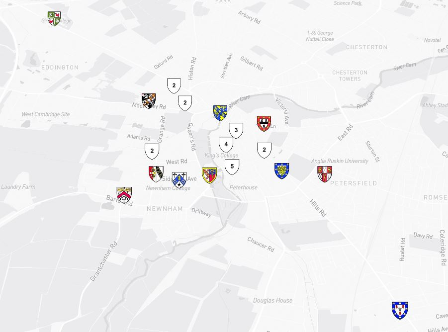
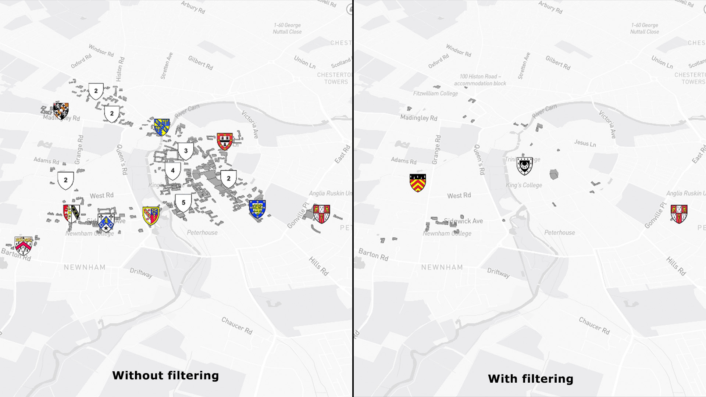
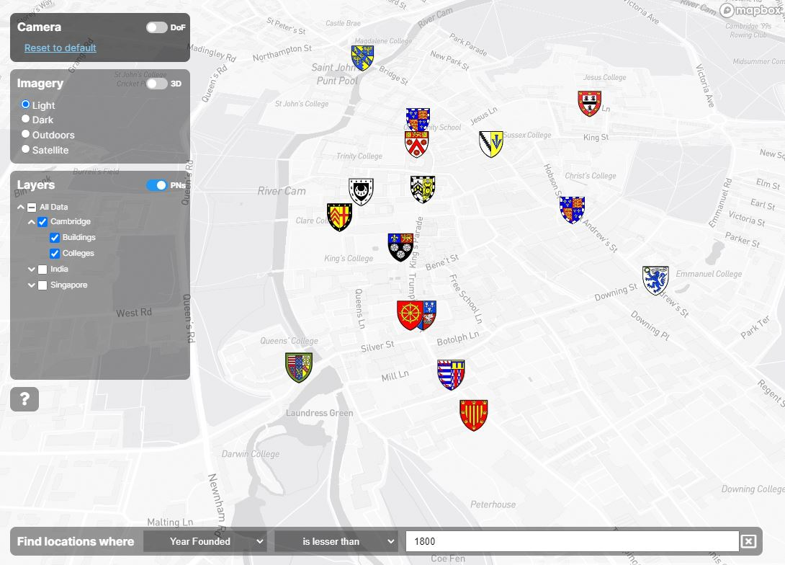

# Advanced Mapbox features

This pages details some of the more advanced Mapbox-specific features that can be enabled and configured through the TWA-VF.

<br/>

## Clustering

When using a GeoJSON source of point location, users can enable the cluster function to group nearby points into a single group. An example of clustering can be seen in [this Mapbox example](https://docs.mapbox.com/mapbox-gl-js/example/cluster/).

To enable this, simply add the relevant cluster parameters (matching the Mapbox API) to the desired `source` object within the visualisation's `data.json` file.

```json
 {
    "id": "my-source",
    "type": "geojson",
    "data": "data/my-data-file.geojson",
    "cluster": true,
    "clusterMaxZoom": 15,
    "clusterRadius": 30
}
```

<br/>
<p align="center">
 
</p>
<p align="center">
 <em>Example of point clustering.</em><br/><br/><br/>
</p>

<br/>

## Filters

In the Mapbox style API, a filter is a property at the layer level that determines which features should be rendered in a style layer. Filters are written as expressions, which give you fine-grained control over which features to include: the style layer only displays the features that match the filter condition that you define.

In the TWA-VF's `data.json` file, the `filter` parameter can be added to any Mapbox layer. You can read more about Mapbox's expression syntax on [their help page](https://docs.mapbox.com/mapbox-gl-js/style-spec/expressions).

```json
{
    "id": "my-layer",
    "name": "My Layer",
    "source": "my-source",
    "type": "symbol",
    "filter": ["in", "Hall", ["get", "name"]],
    ...
},
```

<br/>
<p align="center">
 
</p>
<p align="center">
 <em>Example of location filtering.</em><br/><br/><br/>
</p>


<br/>

## Searching

When using the Mapbox implementation, a rudimentary ability to search for individual locations has been added. Accessed via the CTRL+F keyboard shortcut, this feature allows users to hide all locations that do not match some input search term. Properties from the geospatial data (i.e. not any dynamically loaded metadata) can be used as targets for the search; the example Mapbox visualisation contains an example of this (primarily focussed on the Cambridge Colleges data set).

It is worth noting that, at the time of writing, the filter will apply to all locations across all layers currently available on the map. Additionally, any clustering of locations (normally enabled by configuring the source object within the data configuration file) will be temporarily disabled whilst the search controls are active; this is to avoid the situation in which matching locations are hidden because they were clustered (and clustered locations will almost always fail the filter match as they contain very little information on what individual features they contain).

To enable this functionality within your visualisation, a special `search` node needs to be added to your `settings.json` file. This node should be a JSON array of objects, each object defining: `description`, the user facing name of the parameter that can be filtered on/searched for; `property`, the name of the actual property within the geospatial data; and `type`, which must be `string|number|boolean` and represents the type of property.

An example snippet of the `settings.json` file defining search parameters is shown below.

```json
"search": [
    {
        "description": "Name",
        "property": "name",
        "type": "string"
    },
    {
        "description": "Year Founded",
        "property": "founded",
        "type": "number"
    },
    {
        "description": "Undergraduates Admitted?",
        "property": "undergraduates",
        "type": "boolean"
    }  
]
```

<br/>
<p align="center">
 
</p>
<p align="center">
 <em>Example of feature searching</em><br/><br/><br/>
</p>

<br/>

## Using IRIs in expressions

The visualisation framework now provides a methodology for users to include the IRIs of hovered/selected features in their style and filter expressions. Within a single style parameter (or filter), simply use one of (using both is not currently supported) the placeholder strings, `"[HOVERED-IRI]"` or `"[SELECTED-IRI]"`. When a change in the hovered or selected feature is made, the framework will automatically update these expressions with the literal string value of the IRI. This allows for the creation of styles that can visually highlight a feature when the mouse is over it, or show highlights around selected features. See the [UK Base World Visualisation](https://github.com/cambridge-cares/TheWorldAvatar/tree/main/web/uk-base-world) for an example of this.

**Note:** this of course requires your features to have an `iri` parameter with their metadata.

## Mapbox controls

As of version 4.5 of the `twa-vf`, three control sets are included by default. These are:

* Scale Control (bottom right indicator of current map scale in metres and kilometres)
* Geolocator (a button in the bottom right to display current location of the user)
* Zoom, pitch and compass controls in the top right

All of these controls can be disabled by the following respective flags in `settings.json`

```json
"showNavigationControl": false,
"showMapScale": false,
"showGeolocateControl": false```
