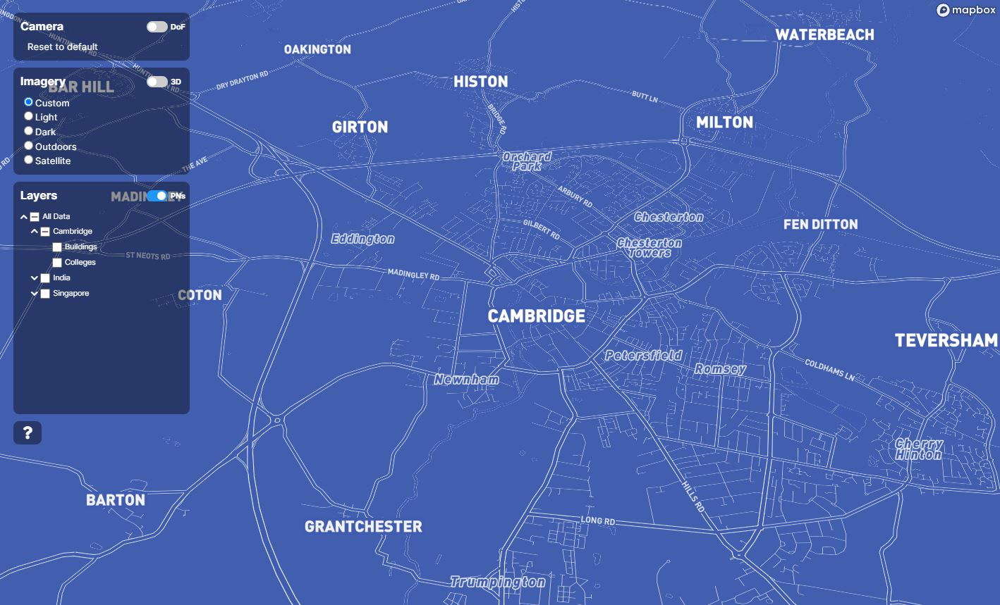

# Advanced features

This section of the documentation details advanced features (that is, features beyond the simple display of raw data) offered through the TWA-VF.

Features applicable to all mapping providers are detailed here, whereas features specific to Mapbox can be read in the [Advanced Mapbox features](./advanced-mapbox.md) page, and those specific to CesiumJS in the [Advanced CesiumJS features](./advanced-cesium.md) page.

<br/>

## Custom map imagery

By default, a number of base imagery layers are provided by the framework; these are the Light, Dark, Outdoors, and Satellite styles provided by Mapbox, and can be used within Mapbox and CesiumJS visualisations.

However, these options can be overridden by adding an `imagery` node to the visualisation's `settings.json` file. As Mapbox allows the creation and publication of custom imagery (see the [Mapbox Studio](https://www.mapbox.com/mapbox-studio) offering on how to create and publish these), users can select to use their custom Mapbox layers rather than the ones provided by default.

If present, this node should contain a list of key-value pairs in which the key is the user displayed name of the imagery layer, and the value its Mapbox style URL. Additionally, a `default` entry can be added to set the pre-selected imagery used when first loading the map.

Note that, at the time of writing, only imagery created and published by the Mapbox Studio feature can be utilised here.

```json
"imagery": {
    "Custom": "mapbox://styles/[ACCOUNT]/[STYLE-ID]",
    "Light": "mapbox://styles/mapbox/light-v11",
    "Dark": "mapbox://styles/mapbox/dark-v11",
    "Outdoors": "mapbox://styles/mapbox/outdoors-v12",
    "Satellite": "mapbox://styles/mapbox/satellite-streets-v12",
    "default": "Custom"
}
```

<br/>
<p align="center">
 
</p>
<p align="center">
 <em>An example of custom base imagery.</em><br/><br/><br/>
</p>

<br/>

## Feature fields

Elements such as the pop-up content shown when hovering over a feature require each location to have built in `name` and `description` parameters.

By default, these fields within the data need to be named `name` and `description`; however, if the data uses fields with other names then you can remap these by using a `fields` node within the `settings.json` file. An example of using different fields in place of the `name` and `description` is shown below.

```json
"fields": {
    "name": "full_id",
    "description": "operator"
}
```

<br/>

## Setting interaction level

Each layer with a visualisation can independently specify the allowed level of mouse interaction. Using the optional `"interactions"` layer parameter, users can set one of four possible values: `"all"`, `"click-only"`, `"hover-only"`, and `"none"` (with `"all"` being the default if unspecified). See the [UK Base World Visualisation](https://github.com/cambridge-cares/TheWorldAvatar/tree/main/web/uk-base-world) for example usage of this parameter.

<br/>

## Attribution

If users wish, or are required, to show attributions for their data, then a HTML string can be added to the `settings.json` file under the `attribution` parameter. When present, this will display a collapsible attributions box in the lower left of the visualisation.

<br/>

**Note:** this control does not offer a lot of space for textual content and should probably be avoided. An alternative is to update your `index.html` file with a new tab of static HTML content that can detail your attributions/acknowledgements.

<br/>

## Dashboards

Where applicable, the TWA-VF can now display a link to an associated analytics dashboard. To add this link, simply set the `dashboard` parameter in the visualisation's `settings.json` file to the dashboard's URL.

## Styling

Be sure to use the latest twa-vf version in your visualisations to benefit from the latest styling improvements. The animations in the side panel require including the `manager.getPanelHandler().addWaveAnimation();` javascript function somewhere in your `index.html` file.
`
