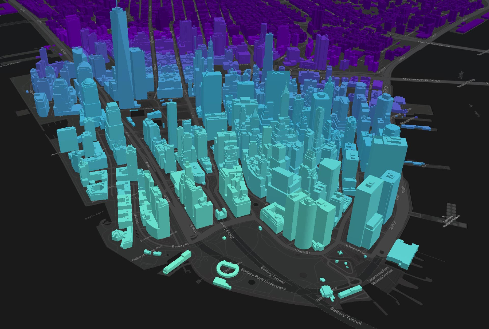

# Working with CesiumJS

The TWA-VF supports a number of different data formats and representations; in the case of 3D data, a range of features offered by [CesiumJS](https://cesium.com/platform/cesiumjs/) are supported through the TWA-VF. 

Unlike the Mapbox library, the CesiumJS library does not support specification of data in JSON format. Data and styling options must be loaded by direct method calls. As such, not every piece of functionality in CesiumJS has been integrated so that it can be used via the TWA-VF's configuration files. Basic visualisation of a number of data formats has been enabled, and requests can always be made to add support for other features.

CesiumJS is the primary visualisation provider for 3D building data within The World Avatar. It has a number of useful features, but can be difficult to get to grips with. If possible, it's recommended that users create TWA-VF visualisations using Mapbox, rather than CesiumJS, unless display of 3D building data is required.

<br/>

## Cesium offerings

It's worth noting that the Cesium company provide a number of different product offerings. To avoid a common misunderstanding, the difference between "CesiumJS" and "Cesium ion" is detailed below.

**CesiumJS:**
* Used by the TWA-VF.
* Free, client-side, JavaScript library.
* Does not require any API key or authentication.
* Provides basic functionality to display and style 3D data.
* Provides no map imagery or terrain elevation data.

**Cesium ion:**
* Not used by the TWA-VF or the wider TWA.
* Extension to the CesiumJS library.
* Premium offering, requires payment for commercial or funded-education use.
* Requires an API key.
* Provides map imagery and terrain elevation data.
* Provides a set of example data files.
* Cloud based services allow remote data hosting, format conversion, automatic tiling etc.

At the time of writing, anything that requires the use of a Cesium ion API key should be avoided (this has been confirmed by Cesium's support team). To be fully sure no premium features are being used, it is suggested that no API key is even used within the code.

Alternatives to these paid-for features (such as how to get map imagery and terrain elevations) are detailed below or in the [Advanced features](./advanced.md) section.

<br/>

## Features and restrictions

CesiumJS makes a wide range of features available through the TWA-VF, the native version of many of these can be see through their extensive [Sandcastle](https://cesium.com/learn/cesiumjs-sandcastle/) page. However, as with any tool, a number of restrictions can also be found.

**Features:**
* Supports a wide range of 3D data formats.
* Styling can be dynamically determined by properties of the data.
* Can use externally provide map imagery & elevation data.

**Restrictions:**
* High learning curve, lack of documentation.
* Very GPU intensive.
* Cannot plot 2D vector data.
* Elevation & map imagery locked behind pay-wall.

<br/>

## Cesium sources

A source provides map data that Cesium can use in conjunction with a style to render a visual representation of that data. Note that CesiumJS itself has no concept of the separation of data sources and layers. However, this has been maintained across all mapping providers support by the TWA-VF to ease the learning curve, and provide a more general way of creating visualisations.

CesiumJS supports a wide range of 3D data formats. At the time of writing, those supported by the TWA-VF include:

| Format      | Description |
| ----------- | ----------- |
| KML      | Format used by Google Earth. Multiple KML files can be added, but cannot be tiled.       |
| glTF   | Standard for 3D scenes & models. Multiple glTF/glB files can be added, but not tiled using this format.       |
| WMTS   | Tiled raster data provided by a [WMTS](https://en.wikipedia.org/wiki/Web_Map_Tile_Service) endpoint.   |
| 3D Tiles   | Standard for tiled data, can use a variety of model formats for data files.     |

Specifying a CesiumJS source in the `data.json` file is relatively easy, simply add JSON objects to the relevant group's `sources` node. As CesiumJS does not support the specification of data in JSON format, the below format is one exclusive to the TWA-VF. 

| Parameter   | Purpose |
| ----------- | ------- |
| id | (Required) Internal ID for the data source, needs to be unique within the group. |
| type | (Required) Type of data file, options are `kml`, `gltf`, `glb`, `wms`, `tiles`. |
| uri | (Required) Location of the data file or (for `wms`) the root of the WMTS endpoint. |
| position | (Optional) Three value array of [longitude, latitude, height]. Only supported for `glTF`, `glB`, and `tiles` data types.|
| rotation | (Optional) Three value array of [roll, pitch, heading]. Only supported for `glTF`, `glB`, and `tiles` data types. |
| wmsLayer | (Required for `wms` sources) ID of layer to use. |
| transparency | (Required for `wms` sources) Boolean to enable/disable transparency. |
| format | (Required for `wms` sources) WMTS image format. |
| backFaceFulling | (Optional for `tiles` sources) When true, back face culling is determined by the glTF material's doubleSided property; when false, back face culling is disabled. |

The `id` parameter is used as an internal ID for the source. Note that it should be unique within the source's group, but does not need to be unique across all groups.

Note for the optional `position` and `rotation` parameters: All heights in CesiumJS are defined in metres above sea level, and CesiumJS defines "roll" as the rotation about the positive X axis, "pitch" as the rotation about the negative Y axis, and "heading" as the rotation about the negative Z axis.

Additional parameters can be added to sources to enable some advanced features, these will be detailed in the [Advanced Features](./advanced.md) section of the documentation.

<br/>

## Cesium layers

A layer provides the specifications on how to display a data source on a map. Each layer can only draw data from a single source, but a multiple layers can connect to the same source.

CesiumJS has no concept of the separation between sources and layers, but this distinction is enforced for all uses of the TWA-VF so that configs can be created more generally. Parameters for the layer objects are detailed below.

| Parameter   | Purpose |
| ----------- | ----------- |
| id | (Required) Internal ID for the layer, must be unique within group. |
| name | (Required) User facing name of the layer. When shared with other layers in the group, entries will be combined in the layer tree. |
| source | (Required) ID of the source to pull data from. |
| clickable | (Optional, default is true) Boolean for whether the layer should be interactable. |
| treeable | (Optional, default is true) Boolean for whether the layer should be shown in the tree. |
| visibility | (Optional, default is visible) Option for whether the layer is initially visible, can be "visible" or "none". |
| style | (Optional) JSON object defining a data driven style. |

Advanced features can be enabled through the use of layer styling. These will be detailed in the [Advanced Features](./advanced.md) section of the documentation.

<br/>

## Settings

The `settings.json` configuration file defines global settings. These are often linked to the behaviour of the visualisation itself rather than the data present within it.

The default location of the Cesium map can be set using the below format in the `settings.json` file. Further uses of the settings file will be detailed in the [Advanced Features](./advanced.md) section.

```json
"start": {
    "center": [-74.022, 40.698, 400],
    "heading": 50,
    "pitch": -30,
    "roll": 0.0
}
```

<br/>

## Example visualisation

An example CesiumJS visualisation has been committed to repository to act both as an example, and a template for users putting together new visualisations.

You can find the visualisation, along with documentation of how it was put together, in the [example-cesium-vis](../example-cesium-vis/) directory.

<br/>
<p align="center">
 
</p>
<p align="center">
 <em>Part of the example CesiumJS visualisation.</em><br/><br/><br/>
</p>