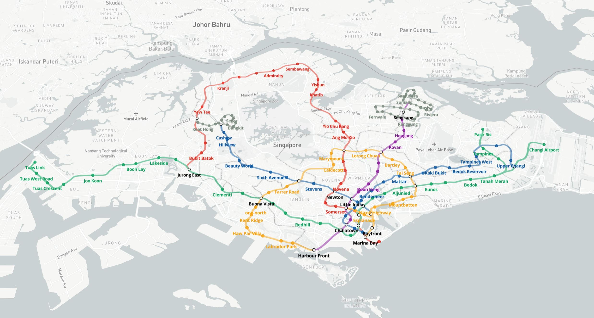

# Working with Mapbox

The TWA-VF supports a number of different data formats and representations; in the case of 2D data, the majority of features offered by the [Mapbox GL JS library](https://docs.mapbox.com/mapbox-gl-js/api/) are supported through the TWA-VF. 

As the Mapbox API is primarily configured via JSON objects, the TWA-VF supports passing these through from the `data.json` configuration file. This means that the majority of features supported by Mapbox (e.g. source and layer configuration, filter expressions) are already supported. At the time of writing however, use of the lighting, fog, and projection features are unsupported (these can be added if there is a desire).

Mapbox is the primary visualisation provider for 2D geographic data within The World Avatar. It has a number of useful features, and is very easy to customise. As such, it's recommended that users create TWA-VF visualisations using Mapbox, rather than CesiumJS, unless display of 3D data is required.

<br/>

## Features and restrictions

Mapbox makes a wide range of features available through the TWA-VF, the native version of many of these can be see through their extensive [Examples](https://docs.mapbox.com/mapbox-gl-js/example/) page. However, as with any tool, a number of restrictions can also be found.

**Features:**
* Supports a wide range of data formats.
* Full control of data styling.
* Styling can be dynamically determined by properties of the data.
* Full mobile support.
* Well organised documentation.
* Can extrude 2D polygons into basic 3D shapes.

**Restrictions:**
* Cannot plot true 3D data.
* Learning curve on customisation.
* Not necessarily free.

<br/>

## Mapbox sources

A source provides map data that Mapbox can use in conjunction with a style to render a visual representation of that data. Mapbox supports a number of different 2D data source formats. At the time of writing, these include:

| Format      | Description |
| ----------- | ----------- |
| vector      | Must be in Mapbox Vector Tile format.       |
| raster   | Tiled raster data.        |
| raster-dem   | Raster DEM data, only supports [Mapbox Terrain-DEM](https://docs.mapbox.com/help/getting-started/mapbox-data/#mapbox-terrain-dem).        |
| geojson   | For [GeoJSON](https://geojson.org/) files.        |
| image   | Standard image files (png, jpg, gif etc.).        |
| video   | Standard video files (mp4, webM etc.).        |

Any of these data sources can be specified in the `data.json` configuration file, using the JSON parameters detailed on Mapbox's [Sources](https://docs.mapbox.com/mapbox-gl-js/style-spec/sources/) page.

Specifying a Mapbox source in the `data.json` file is relatively easy, simply add JSON objects to the relevant group's `sources` node. The JSON object defining the source follows the Mapbox API format, with the addition of an `id` parameter.

The `id` parameter is used as an internal ID for the source. Note that it should be unique within the source's group, but does not need to be unique across all groups.

Additional parameters can be added to sources to enable some advanced features, these will be detailed in the [Advanced Features](./advanced.md) section of the documentation.

### Building the WMS URL

To pull data directly from [GeoServer](https://geoserver.org/), users will need to able to set the source's target as the URL of a WMS endpoint provided by Geoserver.

These URLs take the following form:

```
https://[GEOSERVER]/[WORKSPACE]/wms?service=WMS&request=GetMap&layers=[LAYER]&bbox={bbox-epsg-3857}&width=256&height=256&srs=EPSG:3857&format=[FORMAT]
```

Note that the `bbox` parameter is using a placeholder string, this is important. Using literal values here will tell Mapbox to load the same tile of data, regardless of where the user pans the map to. When we use this placeholder, Mapbox will automatically populate it with the bounding box of the map the user is currently viewing (you can see these literal outgoing values in your browser's network inspector).

Parameters are detailed in the following table, elements in braces are automatically populated by Mapbox at runtime. Note that the projection here is the projection for display, rather than the original data; we almost always want to display in EPSG:3857, as this is the default that Mapbox uses.

| Parameter | Description | Example |
| --------- | ----------- | ------- |  
| [GEOSERVER] | Location of GeoServer instance. | `my-website.com/geoserver` |
| [WORKSPACE] | Name of the GeoServer workspace containing the target data. | `my-workspace` |
| [LAYER] | Full name of the GeoServer layer. | `my-workspace:my-layer` |
| [FORMAT] | Display format for the data. | `image/png` |

<br/>

## Mapbox layers

A layer provides the specifications on how to display a data source on a map. Each layer can only draw data from a single source, but a multiple layers can connect to the same source.

Mapbox supports a number of different layer formats, use the table below to identify the best layer type to express your data.

| Type      | Description |
| --------- | ----------- |
| background | Covers the map with a background pattern. |
| fill | Filled (optionally stroked) polygons. |
| line | Stroked polylines. |
| symbol | Renders custom icons at locations. |
| raster | Displays a provided raster image. |
| circle | Draws (optionally stoked) circles at locations. |
| fill-extrusion | Extrudes 2D polygons into basic 3D shapes. |
| heatmap | Renders a range of colors to represent point density. |
| hillshade | Renders DRM data on the client-side. |

Specifying a layer within the `data.json` file closely follows the [Mapbox layer format](https://docs.mapbox.com/mapbox-gl-js/style-spec/layers/), with the addition of a few TWA-VF specific parameters. Required parameters, and TWA-VF specific ones are detailed in the table below.

| Parameter   | Purpose |
| ----------- | ------- |
| id | (Required) Internal ID for the layer, must be unique within group. |
| name | (Required) User facing name of the layer. When shared with other layers in the group, entries will be combined in the layer tree. |
| source | (Required) ID of the source to pull data from. |
| order | (Optional, default is 0) Integer for the layer's global order. Zero is closest to the map's base imagery. |
| clickable | (Optional, default is true) Boolean for whether the layer should be interactable. |
| treeable | (Optional, default is true) Boolean for whether the layer should be shown in the tree. |
| visibility | (Optional, default is visible) Option for whether the layer is initially visible, can be "visible" or "none". |

Advanced features can be enabled through the use of layer styling, multiple layers, or layer filters. These will be detailed in the [Advanced Features](./advanced.md) section of the documentation.

<br/>

## Generating icons

Icons for Mapbox visualisations can be generated by the graphics tool of the developer's choice. 
Unfortunately, vector graphics are not supported so icons must be generated as PNG or JPG files (we recommend creating the initial icons as vectors, then rasterising them to PNG files).

Icon size can be anything as Mapbox provide a style parameter that allows scaling later on (although you'll see higher quality results if you export your icons in their final size and use a scaling factor of 1.0 within Mapbox).

Mapbox also supports a system called [SDF Icons](https://docs.mapbox.com/help/troubleshooting/using-recolorable-images-in-mapbox-maps/). 
These are effectively PNG icons that only contains transparency and a single colour; when used it allows Mapbox to dynamically change the colour of icons based on their dynamic styling system. 
As SDF icons are loaded slightly differently to regular ones, any icons you wish to be treated as SDF icons will need `-sdf` added to their file name.

Icons can be uploaded to and served by GeoServer via the [stack-data-uploader](../../../Deploy/stacks/dynamic/stack-data-uploader/README.md#staticgeoserverdata).

<br/>

## Settings

The `settings.json` configuration file defines global settings. These are often linked to the behaviour of the visualisation itself rather than the data present within it.

The default location of the Mapbox map can be set using the below format in the `settings.json` file. Further uses of the settings file will be detailed in the [Advanced Features](./advanced.md) section.

```json
"start": {
    "center": [60, 37],
    "zoom": 2,
    "bearing": 0,
    "pitch": 45
}
```

<br/>

## Example visualisation

An example Mapbox visualisation has been committed to repository to act both as an example, and a template for users putting together new visualisations.

You can find the visualisation, along with documentation of how it was put together, in the [example-mapbox-vis](../example-mapbox-vis/) directory.

<br/>
<p align="center">
 
</p>
<p align="center">
 <em>Part of the example Mapbox visualisation.</em><br/><br/><br/>
</p>
