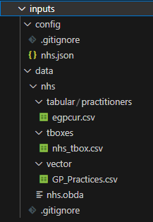
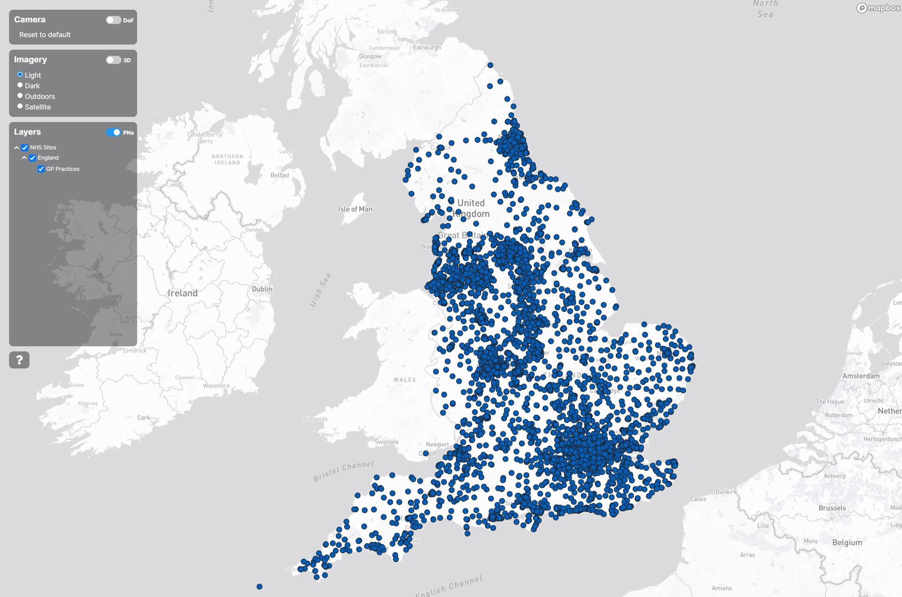
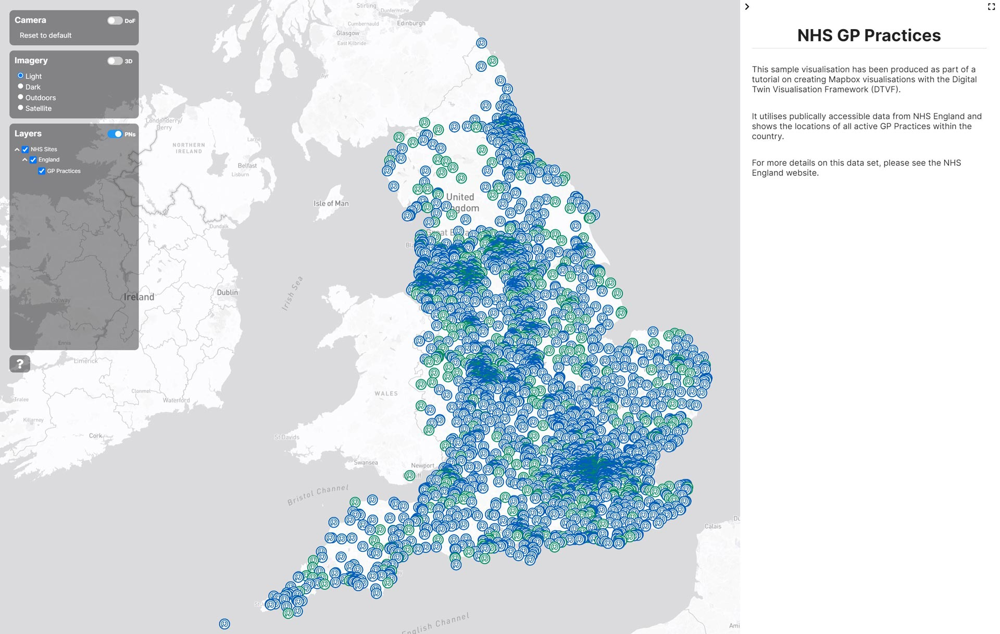
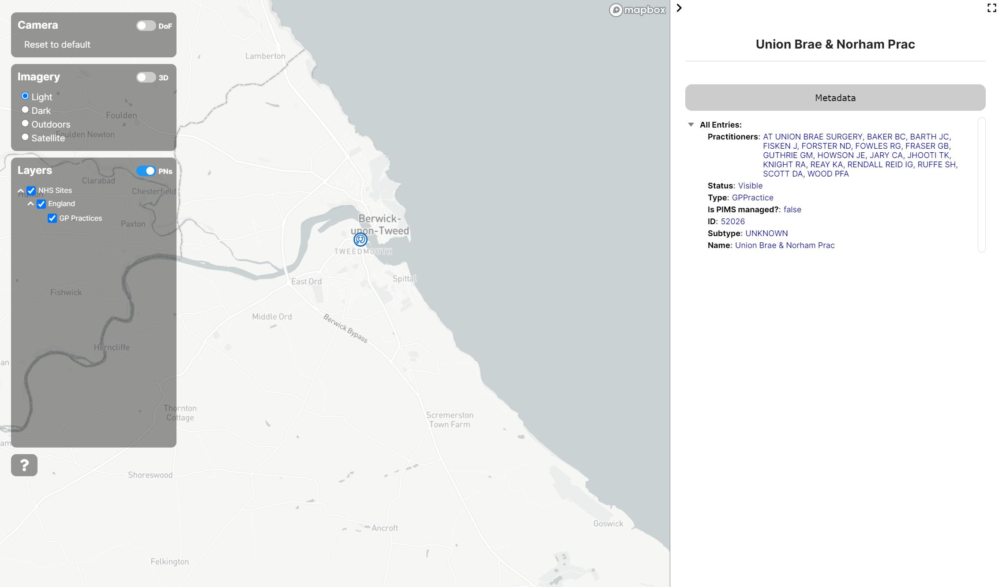
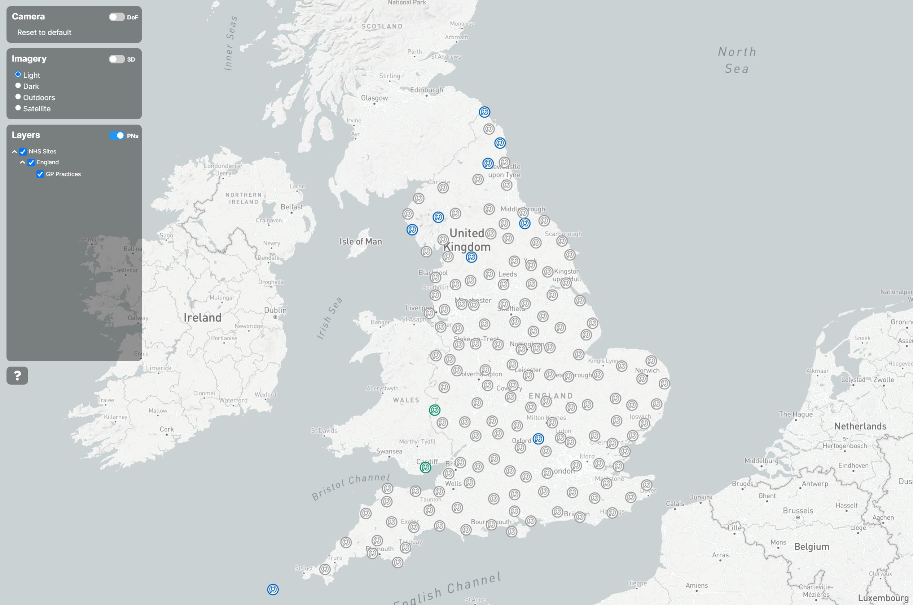

# Creating a Mapbox visualisation

This document is a step-by-step tutorial for the entire process of gathering, hosting, and displaying data within a TWA-VF Mapbox visualisation. It is **highly** recommended that users new to the TWA-VF run through the entire tutorial before attempting to create their own visualisation.

Any issues with the tutorial, questions, or suggestions, should be send via email to the CMCL team.

<br/>

## Identifying a data source

The first step in creating any visualisation is to identify the data relevant to the use case. In this tutorial, we don't have a predetermined use case, so we're just going to go with the loosely defined goal of "plotting data related to the environment/climate change, infrastructure, or public health".

The UK's National Health Service (NHS) offers a wide range of data on the latter that is free to use for commercial use.

<br/>

## Gathering data

In this case, we'll be grabbing the following data sets from the [NHS Website Datasets](https://www.nhs.uk/about-us/nhs-website-datasets/) and [NHS Digital](https://digital.nhs.uk/services/organisation-data-service/export-data-files/csv-downloads) sites.

* `NHS Website Datasets` -> `GP and GP practice related data` -> `GP Practices`
* `NHS Digital` -> `GP and GP practice related data` -> `GP Practitioners`
  
Download these and save/extract them on your local machine. The `GP Practices` data set should include a headered CSV file, and the `GP Practitioners` ZIP of an unheadered CSV and a PDF.

<br/>

## Processing the raw data

Before we can use the data we've downloaded, we need to clean it up a little to ensure it is consistent, and supports the use of Ontop. Carry out these steps to get the data into a reasonable shape:

**1. Change the delimiter:**<br/>
* The `GP Practices` CSV uses the `¬` character as the delimiter, we'll need to change this to use a standard comma (`,`).
* We'll also want to ensure that each token in the CSV is surrounded by double-quote characters (`"`).

**2. Add headings to CSV file:**<br/>
* The CSV from the NHS Digital website does not contain headers, so we'll also need to add those.
* Note that you'll need to be careful that your CSV editing software doesn't remove the double-quotes (MS Excel is notorious for this).
* For convenience's sake, the headings used when testing this tutorial were as follows:

```json
"OrganisationCode","Name","NationalGrouping","HighLevelHealthGeography","AddressOne","AddressTwo","AddressThree","AddressFour","AddressFive","Postcode","OpenDate","CloseDate","StatusCode","OrganisationSubTypeCode","ParentOrganisationCode","JoinParentDate","LeftParentDate","Telephone","","","","AmendedRecordIndicator","","CurrentCareOrganisation","","",""
```

As an example, the first few lines of the cleaned up CSV file should look similar to the below:

```json
"OrganisationID","OrganisationCode","OrganisationType","SubType","OrganisationName","OrganisationStatus","IsPimsManaged","Address1","Address2","Address3","City","County","Postcode","Latitude","Longitude"
"46946","C83036","GP practice","UNKNOWN","Gosberton Medical Centre","Visible","FALSE","Lowgate","Gosberton","Spalding","Lincs","","PE11 4NL","52.86989212","-0.159257933"
"46947","A83023","GP practice","UNKNOWN","Stanley Medical Group","Visible","FALSE","Stanley Primary Care Centre","Clifford Road","Stanley","Stanley","Durham","DH9 0AB","54.87003326","-1.69803834"
"46948","A82006","GP practice","UNKNOWN","Appleby Medical Practice","Visible","FALSE","The Riverside Building","Chapel Street","","Appleby in Westmorland","Cumbria","CA16 6QR","54.57808685","-2.492977619"
```

**3. Fix funky characters:**<br/>
These raw CSV files also contain some strange characters that aren't supported in UTF-8. You'll need to run the [provided bash script](./resources/nhs.sh) with the locations of the files as arguments to replace the strange characters with supported ones and encoded the files as UTF-8. Alternavitly, you can also do this in Excel.

    ./nhs.sh GPPractices.csv egpcur.csv

<br/>

## Writing an ontology

As an example, a very simple sample NHS ontology has been put together to describe the concepts within this tutorial's data set. This ontology has been created as a CSV file, and uploaded via the use of the [TBox Generator](https://github.com/cambridge-cares/TheWorldAvatar/tree/main/JPS_BASE_LIB/src/main/java/uk/ac/cam/cares/jps/base/converter), see the Stack Data Uploader's documentation for more details on how to upload it.

A copy of the simple ontology used can be seen below as well as in the TWA repository [here](./resources/nhs.csv).

```csv
Source,Type,Target,Relation,Domain,Range,Quantifier,Comment,Defined By,Label
OntoNHS,TBox,http://theworldavatar.com/ontology/health/nhs.owl,https://www.w3.org/2007/05/powder-s#hasIRI,,,,,,
OntoNHS,TBox,1,http://www.w3.org/2002/07/owl#versionInfo,,,,,,
OntoNHS,TBox,Sample ontology for General Practitioners within the NHS>,http://www.w3.org/2000/01/rdf-schema#comment,,,,,,
Asset,Class,,,,,,Generic NHS asset.,http://theworldavatar.com/ontology/health/nhs.owl,
GPPractice,Class,Asset,IS-A,,,,GP site.,http://theworldavatar.com/ontology/health/nhs.owl,
Practitioner,Class,Asset,IS-A,,,,General Practitioner.,http://theworldavatar.com/ontology/health/nhs.owl,
```

<br/>

## Writing a data mapping

In theory, we _could_ now write an agent to read these CSVs, convert them into triples, then push them into a Knowledge Graph like [Blazegraph](https://blazegraph.com/).

However, this is a significant amount of work for data that is static, and we have no current plans to add to. Instead, we can use a service called [Ontop](https://ontop-vkg.org/) along with a mapping file to create a Virtual Knowledge Graph. This will allow us to directly query the data with SPARQL as if it had been loaded into a Triplestore.

An example mapping file that (just) covers the data used in this tutorial, can be seen below and also found in the TWA repository [here](./resources/nhs.obda).

```
[PrefixDeclaration]
nhs:        http://theworldavatar.com/ontology/health/nhs.owl#
geo:        http://www.opengis.net/ont/geosparql#
rdf:        http://www.w3.org/1999/02/22-rdf-syntax-ns#
rdfs:       http://www.w3.org/2000/01/rdf-schema#
owl:        http://www.w3.org/2002/07/owl#

[MappingDeclaration] @collection [[
mappingId       nhs-asset
target          nhs:Asset rdfs:subClassOf owl:Class .
source          SELECT 1

mappingId       nhs-gp-practice
target          nhs:gp/{id} a nhs:GPPractice ;
                    nhs:hasId {id}^^xsd:string ;
                    nhs:hasName {name}^^xsd:string ;
                    nhs:hasCode {code}^^xsd:string ;
                    nhs:hasLocation nhs:asset/{id}/location ;
					nhs:isPIMSManaged {is_pims_managed}^^xsd:boolean ;
                    nhs:hasType {type}^^xsd:string ;
					nhs:hasSubtype {subtype}^^xsd:string ;
					nhs:hasStatus {status}^^xsd:string .
                nhs:asset/{id}/location a geo:Location ;
                    geo:hasJSON {loc}^^xsd:string ;
                    geo:hasWKT "<http://www.opengis.net/def/crs/EPSG/0/4326> {wkt}"^^geo:wktLiteral ;
                    geo:hasEasting {loc_easting}^^xsd:string ;
                    geo:hasNorthing {loc_northing}^^xsd:string ;
                    geo:hasLat {loc_lat}^^xsd:string ;
                    geo:hasLon {loc_lon}^^xsd:string .
source          SELECT "OrganisationID" AS id , 
                "OrganisationName" as name ,
				"SubType" as subtype ,
                "OrganisationCode" as code ,
				"OrganisationStatus" as status ,
				"IsPimsManaged" as is_pims_managed ,				
                ST_AsGeoJSON(geom) as loc ,
                ST_AsText(geom) as wkt ,
                ST_X(ST_Transform(geom,27700)) as loc_easting ,
                ST_Y(ST_Transform(geom,27700)) as loc_northing ,
                "Longitude" as loc_lon ,
                "Latitude" as loc_lat ,
                'GPPractice' AS type 
                FROM "nhs_gp_practices"

mappingId       nhs-gp-practitoner
target          nhs:practitoner/{id} a nhs:Practitioner ;
                    nhs:hasId {id}^^xsd:string ;
                    nhs:hasName {name}^^xsd:string ;
                    nhs:hasType {type}^^xsd:string ;
					nhs:hasGrouping {grouping}^^xsd:string ;
                    nhs:hasHighLevelHealthGeography {high_level_health_geography}^^xsd:string ;
                    nhs:hasParentCode {parent_code}^^xsd:string .
source          SELECT "OrganisationCode" AS id , 
                "Name" as name ,
				"NationalGrouping" as grouping ,
				"HighLevelHealthGeography" as high_level_health_geography ,		
                "ParentOrganisationCode" as parent_code ,		
                'Practitioner' AS type 
                FROM "nhs_gp_practitioners"                       
]]
```

<br/>

## Uploading the data

To upload the data so that it can be accessed as a Virtual Knowledge Graph, and stored as geospatial data in PostGIS, we first need to write a configuration file for [The Stack Data Uploader](https://github.com/cambridge-cares/TheWorldAvatar/tree/main/Deploy/stacks/dynamic/stack-data-uploader). Information on how to write the file, where to place it, then upload the data can be see on the data uploader's page.

An example configuration file that covers all three CSVs used in tutorial, can be seen below and also found in the TWA repository [here](./resources/nhs.json).

```json
{
    "database": "postgres",
    "workspace": "twa",
    "datasetDirectory": "nhs",
    "skip": false,
    "dataSubsets": [
        {
            "type": "tboxcsv",
            "name": "nhs_tbox",
            "skip": false,
            "subdirectory": "tboxes"
        },
        {
            "type": "vector",
            "skip": false,
            "schema": "public",
            "table": "nhs_gp_practices",
            "subdirectory": "vector",
            "ogr2ogrOptions": {
                "layerCreationOptions": {
                    "GEOMETRY_NAME": "geom",
                    "SEPARATOR": "TAB"
                },
                "sridIn": "EPSG:4326",
                "sridOut": "EPSG:4326",
                "inputDatasetOpenOptions": {
                    "X_POSSIBLE_NAMES": "Longitude",
                    "Y_POSSIBLE_NAMES": "Latitude"
                }
            },
            "geoServerSettings": {
                "virtualTable": {
                    "name": "nhs_gp_practices_extended",
                    "sql": "SELECT geom, 'gp' AS type, \"OrganisationName\" as name, CONCAT('http://theworldavatar.com/ontology/health/nhs.owl#gp/', \"OrganisationID\") as iri FROM nhs_gp_practices",
                    "escapeSql": false,
                    "geometry": {
                        "name": "geom",
                        "type": "Point",
                        "srid": 4326
                    }
                }
            }
        },
        {
            "type": "tabular",
            "skip": false,
            "schema": "public",
            "table": "nhs_gp_practitioners",
            "subdirectory": "tabular/practitioners"
        }
    ],
    "mappings": [
        "nhs.obda"
    ]
}
```

Once you have all your data and configuration files copied into the place the stack-data-uploader expects, this should leave your file tree looking something like the below image.

<br/>
<p align="center">
    
</p>
<p align="center">
    <em>Expected structure for stack-data-uploader files.</em><br/><br/><br/>
</p>

<br/>

## Testing the upload

Once the stack-data-uploader has run, without reporting any errors, we should check that the data has reached all the places we need it to.

### Previewing in GeoServer

Firstly, we can check that the geospatial data has reached GeoServer by accessing its web login (`[WHEREVER-YOUR-STACK-IS]/geoserver/web`). After logging in, you _should_ then be able to see the locations of GP Practices in England via the Layer Preview function.

### Running a sample SPARQL query

We can also check that the data has reached the Virtual Knowledge Graph created by Ontop. After accessing the Blazegraph web page for you stack, run the following queries to check that the data is all present. Note that the below example queries assume the local stack is named `NHS-STACK`, update this string if your stack is named differently.

</br>

**Counting GP Practices:**
```
prefix rdfs: <http://www.w3.org/2000/01/rdf-schema#>
prefix rdf:  <http://www.w3.org/1999/02/22-rdf-syntax-ns#>
prefix nhs:  <http://theworldavatar.com/ontology/health/nhs.owl#>

SELECT (COUNT(?s) as ?Practices) WHERE {
	SERVICE <http://NHS-STACK-ontop:8080/sparql> {
		?s nhs:hasType "GPPractice" .
	}
}
```
This counts the number of sites with the type `GPPractice`; the returned number _should_ match the number of rows in the previously downloaded CSV (in testing, this was ~6800).

</br>

**Counting GP Practitioners:**
```
prefix rdfs: <http://www.w3.org/2000/01/rdf-schema#>
prefix rdf:  <http://www.w3.org/1999/02/22-rdf-syntax-ns#>
prefix nhs:  <http://theworldavatar.com/ontology/health/nhs.owl#>

SELECT (COUNT(?s) as ?Practitioners) WHERE {
	SERVICE <http://NHS-STACK-ontop:8080/sparql> {
		?s nhs:hasType "Practitioner" .
	}
}
```
This counts the number of sites with the type `Practitioner`; the returned number _should_ match the number of rows in the previously downloaded CSV (in testing, this was ~110,000).

</br>

## Creating a visualisation

At this point, all the data we require should be hosted online either in geospatial form (via GeoServer and PostGIS), or in triples (queryable via Ontop). We should now be able to create a simple visualisation.

If you haven't already, it's worth reading through the [Overview](./overview.md) and [Working with Mapbox](./mapbox.md) sections of the TWA-VF documentation before continuing past this point.

**1. Spinning up a blank visualisation:**<br/>

The first step here is to spin up an empty visualisation. When creating a new visualisation, it is recommended that the committed example visualisation is used.

To that end, copy the [example Mapbox visualisation](../example-mapbox-vis/) (the one containing the `run.sh` and `docker-compose.yml` files) to a new directory (of your choice) on your local machine. Using the README file within, you should be able to then spin up a docker container hosting the visualisation.

If you then access the visualisation (usually at `localhost`), you should see the example visualisation along with its sample data in Cambridge, India, and Singapore.

**2. Updating the configuration file:**<br/>

To show our new NHS data, we'll need to clear the visualisation's `data.json` file of its contents before we work on it. We can also delete the `data` subdirectory from the `webspace` directory, and the `links.json` file.

Within the `data.json` file, we'll add a single group named "NHS Sites" with no sources and no layers. Within this group, we'll then nest another group named "England" with a single source and a single layer.

The source node will pull the locations of GP practices from Geoserver as vector data using the WMTS standard. The [Working with Mapbox](./mapbox.md) section contains details on how to build the correct URL to get this data.

The layer we will give the user-facing name "GP Practices" and for the time being, will simply link to the source and draw a blue circle at each of the GP practice locations.

At this point, your `data.json` should look something like the below.

```json
{
    "name": "NHS Sites",
    "groups": [
        {
            "name": "England",
            "sources": [
                {
                    "id": "gp-source",
                    "type": "vector",
                    "tiles": [
                        "http://localhost:38383/geoserver/ows?service=WMS&version=1.1.0&request=GetMap&layers=twa:nhs_gp_practices&bbox={bbox-epsg-3857}&width=256&height=256&srs=EPSG:3857&format=application/vnd.mapbox-vector-tile"
                    
                    ]
                }
            ], 
            "layers": [
                {
                    "id": "gp-layer",
                    "name": "GP Practices", 
                    "source": "gp-source",
                    "source-layer": "nhs_gp_practices",
                    "type": "circle",
                    "paint": {
                        "circle-radius": 5,
                        "circle-color": "#005EB8",
                        "circle-stroke-color": "#231f20",
                        "circle-stroke-width": 1
                    }
                }
            ]
        }
    ]
}
```

**3. Updating the settings file:**<br/>

At this point, you may also want to update the visualisation's `setting.json` file to start the visualisation in a better location and at an appropriate zoom level to see all of England. Copy and paste the below into the `settings.json` file before refreshing the visualisation.

```json
{
    "start": {
        "center": [-2, 53],
        "zoom": 6,
        "bearing": 0,
        "pitch": 0
    }
}
```

**4. Checking the visualisation:**<br/>

At this point, you should have a visualisation that looks like the below image. Note that even at this stage, you can hover over a location to show its name and click on it to view some of the static, in-built data from the PostGIS table.

<br/>
<p align="center">
 
</p>
<p align="center">
 <em>First stage of a Mapbox visualisation.</em><br/><br/><br/>
</p>

**5. Adding some icons:**<br/>

To add a little pizzazz, let's update the visualisation to use some pre-created icons for the GP Practices rather than a boring circle.

Before Mapbox can make use of icons, they need to be registered. With the TWA-VF, this is as easy as updating the `icons.json` file to add the name of the icon and its URL.

Copy the sample [GP icon file](./img/gp-icon.png) into the visualisation's `data` directory, then empty the existing `icons.json` file and register it as a new image.

```json
{
	"gp-icon": "data/gp-icon.png"
}
```

We'll then need to update the `gp-layer` layer in our `data.json` file to change it from drawing circles to loading icons. An in-depth look at the styling format Mapbox uses can be seen in [their documentation](https://docs.mapbox.com/mapbox-gl-js/style-spec/layers/#symbol).

```json
{
    "id": "gp-layer",
    "name": "GP Practices", 
    "source": "gp-source",
    "source-layer": "nhs_gp_practices",
    "type": "symbol",
    "layout": {
        "icon-size": 0.33,
        "icon-allow-overlap": true,
        "icon-ignore-placement": true,
        "icon-image": "gp-icon"
    }
}
```

**6. Data driven styling:**<br/>

For the sake of demonstrating the feature, we can also update the layer to use some data-driven styling. Just to show off, we'll update the layer to use a slightly different icon (green rather than blue) for any GP Practice with the word "practice" (regardless of case) in its name.

Copy the sample [GP Practice icon file](./img/gp-icon-practice.png) into the visualisation's `data` directory, then update the icon registry to register the icon under the name `gp-icon-practice`. For more information on style expressions, read Mapbox's page [here](https://docs.mapbox.com/mapbox-gl-js/style-spec/expressions/).

```json
  {
    "id": "gp-layer",
    "name": "GP Practices", 
    "source": "gp-source",
    "source-layer": "nhs_gp_practices",
    "type": "symbol",
    "layout": {
        "icon-size": 0.33,
        "icon-allow-overlap": true,
        "icon-ignore-placement": true,
        "icon-image": [
            "case",
            ["in", "practice", ["downcase", ["get", "name"]]],
            "gp-icon-practice",
            "gp-icon"
        ]
    }
}
```

**7. Updating the default content:**<br/>

We can also update the default content in the side panel to better explain the purpose of our new visualisation. This can be done by updating the sections marked as `CUSTOMISABLE` in our visualisation's `index.html` file.

Feel free to update the side panel content, saving the `index.html` file, then refreshing the visualisation to see the changes.

**8. Reviewing the visualisation:**<br/>

At this point, we've shown how to acquire, clean, map, upload, then visualise a new data set using The Stack and the TWA-VF. This constitutes the envisioned, basic use of the TWA tools to display data. By reading more of the available TWA documentation, users can learn how to add more data sets, produce more complex styling, and build more interactive visualisations.

<br/>
<p align="center">
 
</p>
<p align="center">
 <em>Mapbox visualisation with data-driven styling.</em><br/><br/><br/>
</p>

## Enabling some advanced features

### Using the FeatureInfoAgent

The optional [FeatureInfoAgent (FIA)](https://github.com/cambridge-cares/TheWorldAvatar/tree/main/Agents/FeatureInfoAgent) acts as a single access point for the TWA-VF to query for both meta and time series data of an individual feature (i.e. a single geographical location) before displaying the response within the side panel of the visualisation.

We'll now show how to use the FIA to allow the retrieval of additional metadata when selecting an individual GP Practice from our tutorial map. Before carrying out this stage, it is recommended to read the FIA documentation.

**1. Configuring the FIA:**<br/>

First we'll need to update the FIA's `fia-config.json` file to add a mapped query for the `http://theworldavatar.com/ontology/health/nhs.owl#GPPractice` class (which is what we've listed GP Practices under). We'll only need an entry for the `metaFile` in this case, for now we can name the file `gp-practices.sparql`.

Within this `gp-practices.sparql` file, we'll need to write a SPARQL query to get whatever metadata we want to display for the selected GP Practices. This could be anything we've uploaded to Ontop, from more data on the GP Practices, or a list of the practitioners working there. 

Read the FIA documentation, along with the training material on writing SPARQL queries before constructing your query as FIA queries need to return their data in a set format. For brevity's sake, the query used when testing this tutorial is written below, but can also be downloaded as a [file here](./resources/gp-practices.sparql).

```
prefix rdfs: <http://www.w3.org/2000/01/rdf-schema#>
prefix rdf:  <http://www.w3.org/1999/02/22-rdf-syntax-ns#>
prefix nhs:  <http://theworldavatar.com/ontology/health/nhs.owl#>

SELECT ?Property (GROUP_CONCAT(?tmp; separator=", ") AS ?Value) WHERE {
    SERVICE [ONTOP] {
        {
            BIND("Name" AS ?Property )
            [IRI] nhs:hasName ?tmp .
        } UNION {
            BIND("ID" AS ?Property )
            [IRI] nhs:hasId ?tmp .
        } UNION {
            BIND("Type" AS ?Property )
            [IRI] nhs:hasType ?tmp .
        } UNION {
            BIND("Subtype" AS ?Property )
            [IRI] nhs:hasSubtype ?tmp .
        } UNION {
            BIND("Status" AS ?Property )
            [IRI] nhs:hasStatus ?tmp .
        } UNION {
            BIND("Is PIMS managed?" AS ?Property )
            [IRI] nhs:isPIMSManaged ?tmp .
        } UNION {
            BIND("Practitioners" AS ?Property )
            [IRI] nhs:hasCode ?parent_code .
            ?practitoner nhs:hasParentCode ?parent_code .
            ?practitoner nhs:hasName ?tmp .
        }
    }
} GROUP BY ?Property
```

**2. Running the FIA:**<br/>

Now that we've configured the FIA to register a metadata query for IRIs with the `http://theworldavatar.com/ontology/health/nhs.owl#GPPractice` class, we can spin the agent up within our stack.

For information on how to restart the stack with the FIA agent, please see the [Stack Manager](https://github.com/cambridge-cares/TheWorldAvatar/tree/main/Deploy/stacks/dynamic/stack-manager) documentation.


**3. Configuring the visualisation:**<br/>

We should now have the FIA configured and running within our stack, ready to serve metadata. First however, we need to make a small change to our visualisation's `data.json` file to point it towards our FIA instance.

Within the "NHS Sites" group, we can add a `stack` parameter with the base URL of our stack (this is usually `http://localhost:38383` if running locally). The TWA-VF will then append the information required by the FIA when the user selects a location anywhere within that group's data (or within the data of its sub-groups).

```json
{
    "name": "NHS Sites",
    "stack": "http://localhost:38383",
    "groups": [
        ...
    ]
}
```

**4. Viewing the metadata:**<br/>

Once the FIA is configured and running, and we've added the `stack` parameter to our data group in the visualisation's config file, we can then select a location on the map to view its metadata. THe TWA-VF will automatically contact the FIA running within the group's stack, passing the selected location's IRI. The class of the location is first determined, then if a matching entry in the FIA's config exists, the corresponding query will be run (via federation across all Blazegraph endpoints).

In our example, the FIA should return some very simple metadata on the selected GP Practice and the Practitioners that are based there. With changes to our SPARQL query, we could add more complex information here (provided it still meets the format expected by the FIA of course).

<br/>
<p align="center">
 
</p>
<p align="center">
 <em>Mapbox visualisation with metadata.</em><br/><br/><br/>
</p>

<br/>

### Clustering locations

Plotting an individual icon for each individual GP Practices leads to a cluttered map of overlapping images. With Mapbox, we can group nearby locations in a single point using a feature called "clustering". It should be noted however that Mapbox does not support clustering of vector type data, only raw GeoJSON; luckily for us, GeoServer can provide the visualisation with the vector data in the form of a GeoJSON string using the [WFS standard](https://www.ogc.org/standard/wfs/).

**1. Switching the source type:**<br/>

The first order of business is to change the specification of our vector source, into a GeoJSON one. Take a look at Mapbox's [Sources](https://docs.mapbox.com/mapbox-gl-js/style-spec/sources/) page for details on the syntax, but this should result in a configuration that looks like the below. As we're no longer using vector data (which can contain multiple internal layers), we will also need to remove the `source-layer` parameter from our corresponding layer configuration.

```json
{
    "id": "gp-source",
    "type": "geojson",
    "data": "http://localhost:38383/geoserver/ows?service=WFS&version=1.1.0&request=GetFeature&typeName=twa:nhs_gp_practices&outputFormat=application/json"
}
```

**2. Enabling clustering:**<br/>

Mapbox's clustering feature can be enabled by adding a few parameters to the source object; again, their Sources page lists the possible cluster settings. For our case, update your source's configuration to match the below.

```json
{
    "id": "gp-source",
    "type": "geojson",
    "data": "http://localhost:38383/geoserver/ows?service=WFS&version=1.1.0&request=GetFeature&typeName=twa:nhs_gp_practices&outputFormat=application/json",
    "cluster": true,
    "clusterRadius": 30
}
```

**3. Styling the clusters:**<br/>

After this change, you will notice that few locations appear on our map. However, you should be able to see that these are actually just isolated locations (i.e. not close enough to other locations to cluster), rather than grouped close-by ones. To see the grouped features, we'll need to add another layer to display them. This can easily be done by adding a new layer, using the same source, and a filter parameter that only shows locations with a `point_count` parameter (something that Mapbox automatically adds on clustered groups of features). For our example, we'll use a new icon (found [here](./img/gp-icon-cluster.png)) to represent clustered of locations.

Update your configuration to look like the below then refresh the visualisation.

```json
"layers": [
    {
        "id": "gp-layer",
        "name": "GP Practices", 
        "source": "gp-source",
        "type": "symbol",
        "filter": [
            "!",
            ["has", "point_count"]
        ],
        "layout": {
            "icon-size": 0.33,
            "icon-allow-overlap": true,
            "icon-ignore-placement": true,
            "icon-image": [
                "case",
                ["in", "practice", ["downcase", ["get", "name"]]],
                "gp-icon-practice",
                "gp-icon"
            ]
        }
    },
    {
        "id": "gp-layer-cluster",
        "name": "GP Practices", 
        "source": "gp-source",
        "type": "symbol",
        "filter": [
            "has", "point_count"
        ],
        "layout": {
            "icon-size": 0.33,
            "icon-allow-overlap": true,
            "icon-ignore-placement": true,
            "icon-image": "gp-icon-cluster"
        }
    }
]
```

After refreshing the visualisation, you should now be able to see the clustered locations (in grey). As you zoom in, you should also be able to see them separate into their distinct individual (coloured) locations.

<br/>
<p align="center">
 
</p>
<p align="center">
 <em>Clustered locations.</em><br/><br/><br/>
</p>


## Conclusion

Hopefully this tutorial has explained the basics of the TWA-VF, with the power to quickly add, and configure distributed data sources. If there are any questions, concerns, or suggestions, please get in touch with the CMCL team.