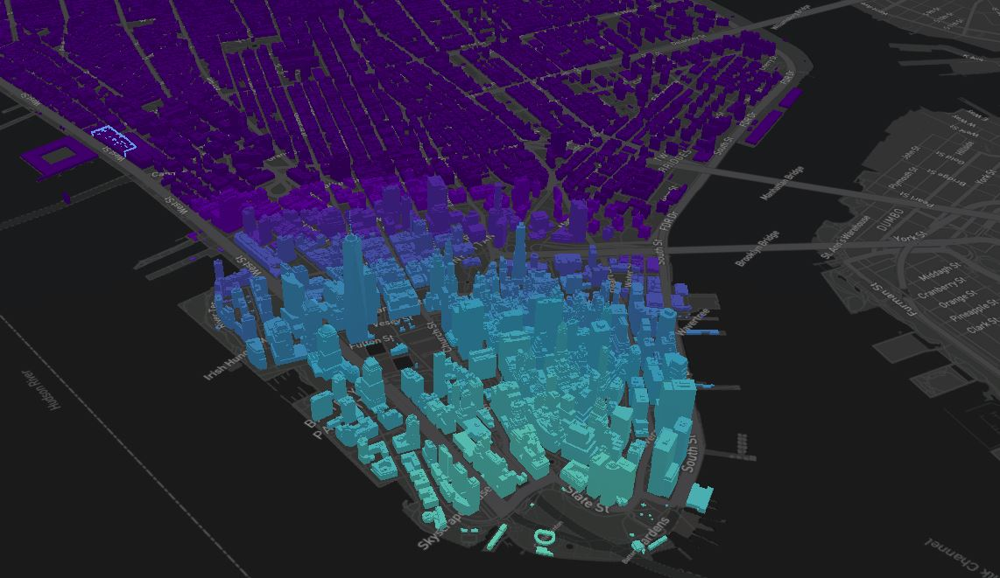
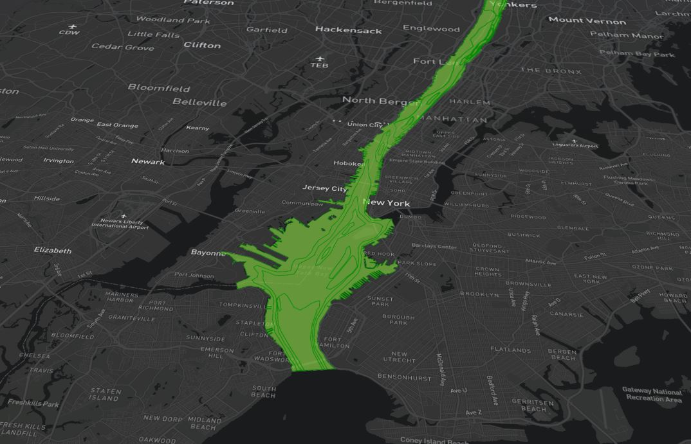
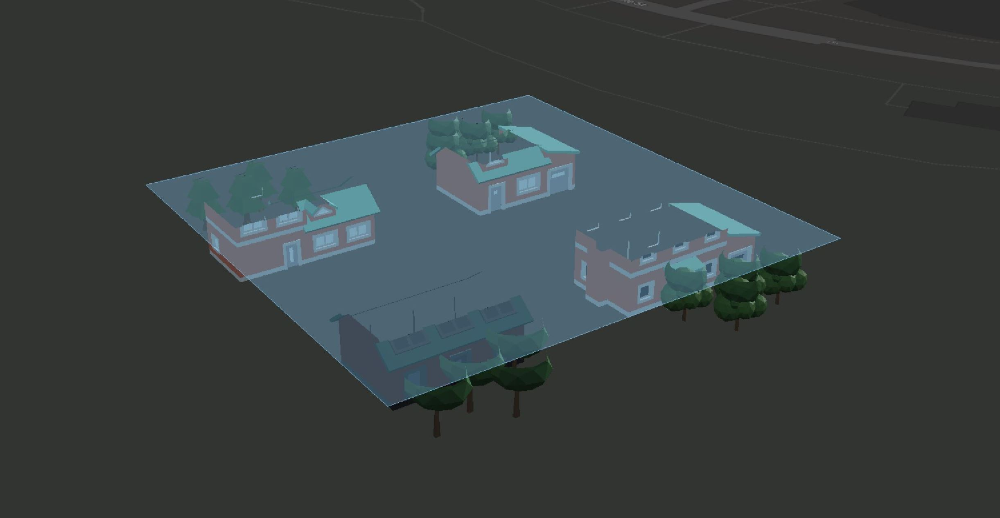

# Example CesiumJS Visualisation

This example visualisation has been put together to demonstrate the intended use of the centralised TWA Visualisation Framework (TWA-VF). This framework has been designed to make it easier for users not experienced with Typescript (or the mapping libraries) to quickly & easily put together a new TWA visualisation. It is intended for developers to use this example visualisation to gain an understanding of the TWA-VF before attempting to create their own visualisation; to do that, this example can be copied and used as a starting point.

It is recommended that you read the through the [TWA-VF Overview](../docs/overview.md) and [Working with CesiumJS](../docs/cesium.md) sections of the documentation before playing around with this example.

 

## Sample Data

A small amount of sample data has been committed to demonstrate the power of the TWA-VF to visualise different data types. Please do not make changes to the sample data without consulting the original developer. At the time of writing, the sample data sets include:

* **New York**:
  * Tiled 3D buildings, loaded from a remote CMCL server.
  * 2D river data from a WMS endpoint provided by Cornell University.
  * Sample tile sets to demonstrate clipping planes.
  * No metadata or time series present in this data set.

It's also worth noting that with this example visualisation, no stack or FeatureInfoAgent is running, hence there is no support for dynamically loaded meta or time series data. This is something that we plan to work on in future.

 

## Running the visualisation

The `docker-compose.yml` file contains the required configuration to build a Docker image for the example visualisation. This uses the `ghcr.io/cambridge-cares/twa-vf` image as a base then adds the contents of the `webspace` directory to a volume mounted at `/var/www/html` within the container (allowing the built in Apache HTTP server to host those files).

Once the requirements below have been addressed, the example visualisation image can be launched using the `run.sh` script. The `run.sh` script optionally accepts a `TAG=[TAG]` argument that allows the user to specify which version of the TWA-VF base image should be used to run the visualisation; if no tag is passed, then the current contents of the `../library/VERSION` file are used. This may require a copy of the TWA-VF to be built locally or pulled from the registry before running the script.

### Requirements

* Files to be hosted must be contained within the `webspace` directory.
* A valid Mapbox username and API token must be provided (still required in Cesium visualisations).
* A connection to the internet is required to contact remote resources and use the mapping libraries.
* Build the TWA-VF locally or pull a pre-built TWA-VF image from the GitHub registry.

 

## Images

 

 

 <em>City scale data set.</em>   

 

 

 <em>2D data from WMS endpoint.</em>   

 

 

 <em>Example clipping plane.</em>   

